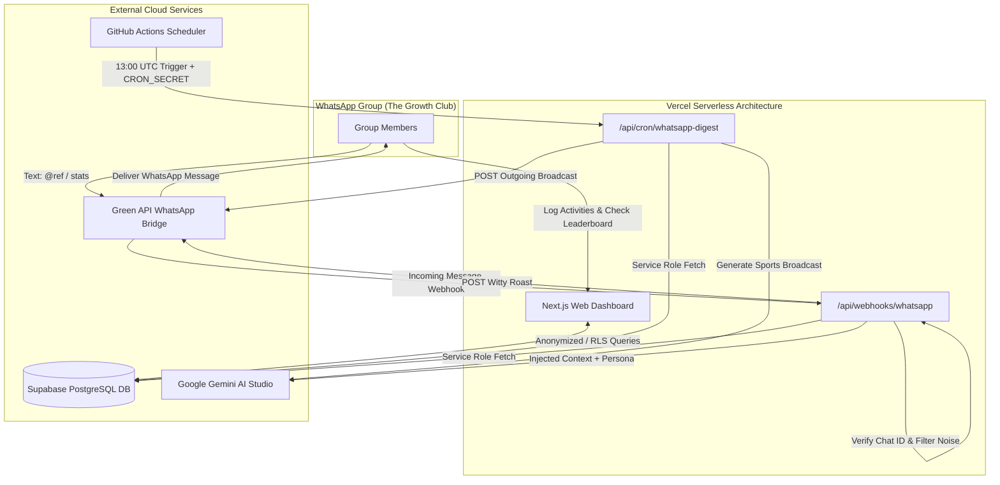

# Beyond Yesterday: The Growth Club

<p align="center">
  
  
  
  
  
</p>

---

## 🎯 The Growth Club Philosophy
**Beyond Yesterday** is a mobile-first workout tracking and competitive dashboard built for friend groups, sports clubs, teams, and families. It empowers members to log activities, view real-time scores, and compete on a dynamic leaderboard. 

To prevent slacking, it integrates **The Referee**—an automated, AI-driven WhatsApp agent that sends daily morning sports broadcasts and provides real-time banter and stat tracking directly inside the group chat.

---

## 🚀 Key Systems & Architecture

### 1. PIN-Based Authentication Scoping (Kiosk Auth)
- The app operates on a "Kiosk Auth" model. Users enter a personal 4-digit PIN matched against their profile within a specific group.
- **Session Scoping:** Successful login decodes and sets an HTTP-only secure cookie `app_session` storing the `userId` and `groupId`. All queries and mutations are dynamically scoped to this session's `groupId` to enforce tenancy boundaries.

### 2. Dual-Mode Activity Logging Engine
- **AI Assist Mode:** Powered by Google Gemini (`gemini-3.5-flash` via `@ai-sdk/google`). Extracts structured `{ metric_slug, value, unit }` from freeform natural language text (e.g. *"Ran 5.2 miles in 45m"*).
- **Manual Log Mode:** Default structured forms. Supports standard numerical metrics and endurance/time-based metrics (which render a distance field and a structured **[ HH ] [ MM ] [ SS ]** duration picker). Total seconds are compressed and appended to the comment block.

### 3. Targeted Peer-Review Verification Lifecycle
- **Everyday Auto-Verification:** Basic logging metrics (such as `long_run`, `weight`, `highest_steps`, `marathon`, `catan_wins`, etc.) bypass the voting queue and auto-verify to `'verified'` immediately upon insertion.
- **Extreme Feats Gate:** High-profile logs (`car_top_speed` and `most_beers`) are inserted with `status = 'pending'`.
- **Peer Voting:** Pending logs require **3 approvals** from other group members to transition from `'pending'` to `'verified'` (which triggers XP rewards). Peer approvals are logged in the `log_votes` table.

### 4. Wearables Auto-Sync Engine & Google Fit Integration
- **Google Fit integration:** End-to-end OAuth flow (`/api/wearables/connect/google` and `/api/wearables/callback/google`) linking Google accounts to profile rows, saving the `refresh_token` securely.
- **Automated Sync Cron:** Runs via `/api/cron/sync-wearables`. Refreshes access tokens and aggregates steps, sleep hours, and resting heart rates (min daily BPM fallback) into the database, setting them directly to `'verified'` to update scoreboard states.

---

## 🗺️ High-Level System Architecture



---

## 📊 Database Schema (Supabase PostgreSQL 15)

### Core User Directory
- **`groups`:** `id` (UUID PK), `name` (text), `invite_code` (text unique), `created_at` (timestamptz).
- **`profiles`:** `id` (UUID PK), `full_name` (text), `nickname` (text), `email` (text), `pin` (varchar 4), `avatar_url` (text), `telegram_user_id` (text unique), `total_xp` (int), `current_level` (int), `created_at` (timestamptz).
- **`group_members`:** `user_id` (UUID FK), `group_id` (UUID FK), `joined_at` (timestamptz). *Composite PK: (user_id, group_id).*

### Activity & Ingestion
- **`metric_logs`:** `id` (UUID PK), `user_id` (UUID FK), `group_id` (UUID FK), `metric_slug` (text), `value` (numeric), `unit` (text), `status` (text pending|verified|rejected), `evidence_url` (text), `caption` (text), `logged_at` (timestamptz).
- **`log_votes`:** `id` (UUID PK), `log_id` (UUID FK), `user_id` (UUID FK), `cast_at` (timestamptz). *Unique constraint: (log_id, user_id).*

### Wearables Data Integration
- **`wearable_connections`:** `id` (UUID PK), `user_id` (UUID FK unique), `provider` (text), `access_token` (text), `refresh_token` (text), `token_expires_at` (timestamptz), `last_synced_at` (timestamptz), `created_at` (timestamptz).
- **`wearable_steps`:** `id` (UUID PK), `connection_id` (UUID FK), `logged_date` (date unique), `value` (int), `updated_at` (timestamptz).
- **`wearable_sleep`:** `id` (UUID PK), `connection_id` (UUID FK), `logged_date` (date unique), `value` (numeric), `updated_at` (timestamptz).
- **`wearable_resting_hr`:** `id` (UUID PK), `connection_id` (UUID FK), `logged_date` (date unique), `value` (int), `updated_at` (timestamptz).

---

## 🛠️ Technology Stack
- **Frontend & Routing:** Next.js 16 (App Router, Turbopack)
- **Database:** Supabase Cloud (PostgreSQL 15, Row Level Security, pg_cron)
- **AI Processing:** Google Gemini (`gemini-3.5-flash` via `@ai-sdk/google` provider)
- **Data Visualization:** Apache ECharts (`echarts`, `echarts-for-react`)
- **Styling:** Tailwind CSS, Vanilla CSS

---

## 💻 Local Development Workflow

### 1. Install dependencies
```bash
npm install
```

### 2. Configure Environment Variables
Create a `.env.local` file from the provided template:
```bash
cp .env.local.example .env.local
```
Fill in the following variables:
```env
NEXT_PUBLIC_SUPABASE_URL="https://your-project-ref.supabase.co"
NEXT_PUBLIC_SUPABASE_ANON_KEY="your-anon-key"
SUPABASE_SERVICE_ROLE_KEY="your-service-role-key"
TELEGRAM_BOT_TOKEN="your-telegram-bot-token"
GEMINI_API_KEY="your-gemini-api-key"
GOOGLE_GENERATIVE_AI_API_KEY="your-gemini-api-key-if-different"

# Green API WhatsApp Gateway
GREEN_API_INSTANCE_ID="your-green-api-instance-id"
GREEN_API_TOKEN="your-green-api-token"
WHATSAPP_GROUP_ID="your-whatsapp-group-chat-id"

# Secrets
SESSION_SECRET="your-secure-jwt-signing-key-32-chars"
CRON_SECRET="your-cron-secret-token"
NEXT_PUBLIC_APP_URL="http://localhost:3000"
TELEGRAM_WEBHOOK_SECRET="your-telegram-webhook-secret-token"
```

### 3. Start the dev server
```bash
npm run dev
```
The dashboard is now running at `http://localhost:3000`.
