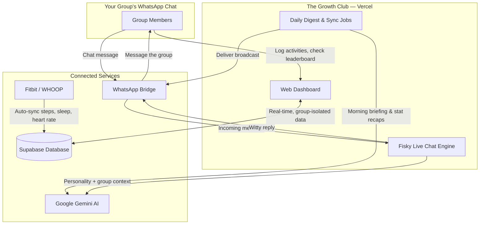

<div align="center">

# 🏆 The Growth Club

### The competitive fitness dashboard your group chat has been missing.

**Log it. Prove it. Flex it.** Turn your friend group, gym crew, or family fitness challenge into a living leaderboard — with an AI hype-man that lives in your WhatsApp group and never lets anyone slack off quietly.

<p align="center">
  
  
  
  
  
  
  
</p>

</div>

---

## ✨ Why groups love it

No spreadsheets. No "did you actually run that?" arguments. No bot that forgets your name. The Growth Club is built to make friendly competition effortless — and a little savage.

| | |
|---|---|
| 🔥 **Instant Leaderboards** | Every logged activity updates group rankings in real time — steps, workouts, sleep, custom challenges, all of it. |
| 🤖 **Fisky, Your AI Hype-Man** | An AI persona that lives inside your WhatsApp group — cheering wins, roasting the lazy, and keeping the chat alive 24/7. |
| ⌚ **Auto-Sync Wearables** | Connect a Fitbit or WHOOP once and stop manually logging steps, sleep, and heart rate forever. |
| 🗳️ **Peer-Verified Bragging Rights** | Big claims ("I hit 120 mph!") get put to a group vote before they count — no more unverified flexing. |
| 🎙️ **Speak It, Don't Type It** | Tell the app what you did in plain English ("ran 5 miles in 40 minutes") and AI turns it into a clean logged entry. |
| 👑 **Full Admin Control** | Group owners get a real console — manage members, edit logs, tune the AI's personality, and run the show. |
| 🔐 **Kiosk-Style Login** | Tap your name, punch in your PIN, you're in. Built for a shared family tablet or a phone passed around at the gym. |
| 🌙 **Never Miss a Beat** | Daily morning briefings, streak tracking, and end-of-day recaps land straight in the group chat automatically. |

---

## 🚀 The Experience

### Log anything, your way
Type it like you'd text a friend — *"ran 5.2 miles in 45 minutes"* — and the AI extracts the metric, value, and unit automatically. Prefer structure? Use the manual form with built-in duration pickers for time-based challenges. Either way, it's logged in seconds.

### Compete without the drama
Everyday activities post straight to the leaderboard. But when someone claims a record-breaking feat, the group gets final say — three peer approvals turn a claim into a verified, XP-earning win. Bragging rights, earned.

### Fisky: the bot that keeps your group chat alive
Fisky isn't a boring reminder bot. It drops a morning briefing with the day's stats, jumps into chat with real banter, and can be aimed at anyone with a custom roast, hype speech, or challenge — tuned to whatever tone your group vibes with. Every group can fully customize Fisky's personality, vocabulary, and running jokes.

### Wearables that just work
Connect once, forget about it. **Fitbit** (via Google Health Connect — covers every Fitbit model, from the Inspire up to the Charge 6) and **WHOOP** (every generation — 3.0, 4.0, 5.0, MG) sync automatically in the background, feeding steps, sleep, and resting heart rate straight into the scoreboard. No manual entry, no forgetting to log a rest day.

### A dashboard that actually looks good
Clean cards, bold typography, a signature neon accent, and charts that make your progress genuinely satisfying to look at — on desktop, tablet, or the phone in your pocket.

### An admin console with real teeth
Group owners aren't stuck guessing. Reset a forgotten PIN, edit or verify a log, deactivate a member who left the group, retune Fisky's slang and personality per member, or manage the metrics your group actually cares about — all from one settings panel.

---

## 🗺️ How it all connects



---

## 🎨 Design Language

The Growth Club follows a clean, confident visual system:

- **Bright, airy canvas** — off-white backgrounds that keep the focus on your data, not the chrome.
- **Crisp white cards** with subtle borders and soft shadows — no murky dark panels.
- **Signature neon accent** (`#CEFF00`) for highlights, active states, and the moments worth celebrating.
- **Bold, confident typography** — dark, high-contrast headers with muted supporting text.

---

## 🛠️ Built On

Modern, reliable, production-grade tooling under the hood:

- **Next.js 16** (App Router + Turbopack) for a fast, modern web experience
- **Supabase (PostgreSQL)** for real-time, secure, group-isolated data
- **Google Gemini** via the Vercel AI SDK for natural-language logging and Fisky's personality
- **Apache ECharts** for the data visualizations
- **Tailwind CSS v4** for the design system
- **WHOOP API** and **Google Health Connect (Fitbit)** for automatic wearable sync

---

## 💻 Getting Started Locally

### 1. Install dependencies
```bash
npm install
```

### 2. Configure environment variables
Copy the template and fill in your own credentials (Supabase, Gemini, WhatsApp, Fitbit/WHOOP OAuth, etc.):
```bash
cp .env.example .env.local
```

### 3. Start the dev server
```bash
npm run dev
```
Your dashboard is now live at `http://localhost:3000`. 🎉


