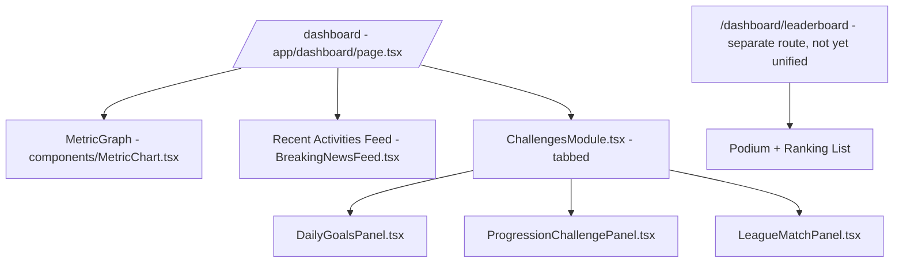

# 01 — Architecture & App Structure

> **Last updated:** 2026-07-19
> **System**: The Growth Club
> **Framework**: Next.js 16.2.10 (App Router, React 19.2.4)
> **Runtime**: Vercel Serverless Functions (Node.js, Edge-compatible)
> **Database**: Supabase (PostgreSQL + Row Level Security)
> **AI Provider**: Google Gemini via Vercel AI SDK (`@ai-sdk/google`)

### Revision Log
| Date | Commit | Sections Touched | Summary |
|---|---|---|---|
| 2026-07-18 | fa4c8bb | §2, §3, §4, §6, §9 (new) | Reflect proxy.ts (Next 16 replacement for middleware.ts); correct JWT TTL 24h and cookie sameSite=strict; add proxy.ts to directory tree; add route tree table, boundary reasons, state/revalidation section, and typed core-domain block per Part 4.1. |
| 2026-07-19 | (Dashboard & Challenges spec decomposition) | §11 (new) | Added §11 documenting the **planned** (not yet implemented) unified Dashboard + Challenges module layout — see `Findings_and_Recommendations.md` "## Dashboard & Challenges Implementation" for the full task breakdown (DASH-01..DASH-30). |
| 2026-07-19 | (Documentation audit) | §1 diagram, §3, §4.1, §7, §8, §11, §12 (new) | Removed all stale Telegram references (integration was fully removed from the codebase in an earlier pass). Updated §11 from "planned" to **implemented** (Challenges Module shipped: Daily Goals, Progression, Leagues). De-duplicated §8's cron table — now points to 09_ as the single source of truth. Added §12 documenting the Streak/Badge system, Personal Profile page, and PWA shell (all shipped, previously undocumented). |

---

## 1. High-Level Architecture

```
┌──────────────────────────────────────────────────────────────────────┐
│                         VERCEL (Hosting)                            │
│  ┌─────────────┐  ┌──────────────┐  ┌────────────────────────────┐ │
│  │  Next.js     │  │  API Routes  │  │  Vercel Cron Jobs          │ │
│  │  App Router  │  │  /api/…      │  │  (vercel.json schedules)   │ │
│  └──────┬──────┘  └──────┬───────┘  └────────────┬───────────────┘ │
│         │                │                        │                 │
│         │  Server Actions (RSC)                   │                 │
│         ▼                ▼                        ▼                 │
│  ┌──────────────────────────────────────────────────────────────┐   │
│  │                    lib/supabase/server.ts                     │   │
│  │  createClient()  → anon key + x-group-id header (RLS)       │   │
│  │  createAdminClient() → service_role key (bypasses RLS)       │   │
│  └──────────────────────────┬───────────────────────────────────┘   │
└─────────────────────────────┼───────────────────────────────────────┘
                              │
                              ▼
┌──────────────────────────────────────────────────────────────────────┐
│                    SUPABASE (PostgreSQL + Storage)                   │
│  ┌────────────┐ ┌────────────┐ ┌───────────────┐ ┌──────────────┐  │
│  │  profiles   │ │ metric_logs│ │ memories      │ │ chat_history │  │
│  │  groups     │ │ log_votes  │ │ memory_comments│ │ system_settings│
│  │  group_members│ metrics_config│ wearable_*  │ │ bot_persistent_│
│  └────────────┘ └────────────┘ └───────────────┘ └──state─────────┘│
└──────────────────────────────────────────────────────────────────────┘
                              │
                              ▼
┌──────────────────────────────────────────────────────────────────────┐
│                    EXTERNAL SERVICES                                 │
│  ┌──────────────┐  ┌──────────────┐  ┌──────────────────────────┐  │
│  │ Google Gemini │  │ Green API    │  │ Google Health API v4 /   │  │
│  │ (AI SDK)      │  │ (WhatsApp)   │  │ WHOOP API v2 (Wearables) │  │
│  └──────────────┘  └──────────────┘  └──────────────────────────┘  │
│  ┌──────────────┐                                                   │
│  │ web-push      │  │ (PWA push notifications, VAPID)              │
│  └──────────────┘                                                   │
└──────────────────────────────────────────────────────────────────────┘
```

---

## 2. Authentication Model — Kiosk Pattern

- **No Supabase Auth**. No `auth.users` table. Profiles are plain UUIDs in `public.profiles`.
- Identity is carried via HTTP-only cookie `app_session` containing a signed JWT.
- JWT payload: `{ userId, groupId, groupName, userName }` (source: `lib/session.ts` L20-25)
- Signing: `jose` library, HS256, secret from `SESSION_SECRET` env var (min 32 chars).
- Cookie config: `httpOnly: true`, `secure: true` in production, `sameSite: 'strict'`, `maxAge: 86400` (24 h — `SESSION_TTL_SECONDS = 60 * 60 * 24`), `path: '/'` (source: `lib/session.ts` L75-82)
- **Primary guard: `proxy.ts` at repo root** — Next.js 16 [Request Proxy/Interception Boundary](https://nextjs.org/docs) that replaces the deprecated `middleware.ts` convention. Matcher `/dashboard/:path*` (proxy.ts L44). Verifies JWT with `jose.jwtVerify()`; on any failure (missing cookie, missing secret, expired, tampered) redirects to `/` and clears the invalid cookie via `response.cookies.set(SESSION_COOKIE, '', { maxAge: 0, path: '/' })`. (source: `proxy.ts` L15-42)
- **Fallback guard**: `DashboardLayout` calls `decodeSession()` and `redirect('/')` on null result — protects against misconfigured matcher. (source: `app/dashboard/layout.tsx` L23-28)
- Login flow: PIN entry on landing page → `loginWithPersonalPinAction(groupId, pin)` server action → sets `app_session` cookie + mirrors JWT to `localStorage['kiosk_session']` for cross-tab restore. (source: `app/actions/auth.ts` L93-201)
- Auto-restore: on landing page mount, `restoreSessionAction(localStorage['kiosk_session'])` re-issues the httpOnly cookie if the stored token still verifies. (source: `app/page.tsx` L83-105; `app/actions/auth.ts` L371-384)

---

## 3. Directory Tree (Key Paths Only)

```
thegrowthclub/
├── proxy.ts                    # Next.js 16 Request Proxy (replaces middleware.ts); matcher /dashboard/:path*
├── app/
│   ├── layout.tsx              # Root layout (Geist font, metadata)
│   ├── page.tsx                # Landing page (kiosk auth, PIN login, signup — 'use client')
│   ├── signup/page.tsx         # Legacy route — client-side redirect to /?tab=signup
│   ├── dashboard/
│   │   ├── layout.tsx          # Fallback auth gate, sidebar, mobile nav (server component)
│   │   ├── page.tsx            # Main dashboard (chart, feed, pills, Challenges module — server component)
│   │   ├── leaderboard/page.tsx # Leaderboard page (server component)
│   │   ├── memories/page.tsx  # Photo memories gallery (server component)
│   │   ├── gang/              # Group roster + streak badge (page.tsx server + GangClient.tsx client)
│   │   └── wearables/page.tsx # Wearables connection page (server component)
│   ├── profile/[userId]/page.tsx # Personal profile: photo, name, per-metric personal bests (server component)
│   ├── settings/
│   │   └── metrics/page.tsx    # God Mode admin panel entry (server component)
│   ├── actions/
│   │   ├── auth.ts            # Signup, login, PIN, group management
│   │   ├── ingest.ts          # NL → structured metric via Gemini
│   │   ├── admin.ts           # Admin tools (lore, avatar, user mgmt)
│   │   ├── vote.ts            # Peer verification voting engine
│   │   ├── metrics.ts         # CRUD for metric_definitions
│   │   ├── memories.ts        # Photo upload, comments, soft-delete
│   │   ├── gang.ts            # Roster fetcher (incl. streak_count)
│   │   ├── logDirect.ts       # Manual metric log (no AI)
│   │   ├── cheer.ts           # Social cheer stub
│   │   ├── dailyGoals.ts      # Daily Goals challenge module
│   │   ├── progression.ts     # Progression Challenges module
│   │   ├── leagues.ts         # Leagues (team match) module
│   │   └── wearables.ts       # Mock wearable connect/disconnect
│   └── api/
│       ├── webhooks/whatsapp/  # Green API → Fisky bot handler
│       ├── push/                # subscribe/send — web-push (PWA)
│       ├── cron/
│       │   ├── daily-whistle/  # Morning briefing broadcast
│       │   ├── ai-bookie/      # Monday prop bet broadcast (dormant, see 09_)
│       │   ├── sync-wearables/ # Google Health v4 + Whoop sync
│       │   ├── whatsapp-digest/# Midday digest broadcast (dormant, see 09_)
│       │   ├── reset-monthly-streaks/ # Monthly streak_count reset
│       │   └── monthly-summary/ # Monthly WhatsApp recap broadcast
│       └── wearables/
│           ├── connect/{google,whoop}/  # OAuth2 initiation
│           └── callback/{google,whoop}/ # OAuth2 callback
├── components/                 # 25+ React components
├── lib/
│   ├── session.ts             # JWT sign/decode, cookie config
│   ├── queries.ts             # Chart data + feed queries
│   ├── metrics.ts             # Static METRIC_PILLS config
│   ├── security.ts            # Timing-safe string compare
│   ├── whatsapp.ts            # Green API message sender
│   ├── audio.ts               # Client-side audio player
│   ├── supabase/
│   │   ├── server.ts          # createClient, createAdminClient
│   │   └── client.ts          # Browser-side Supabase client
│   └── ai/
│       ├── google.ts          # googleProvider singleton
│       └── prompts.ts         # Fisky system prompt builder
├── utils/
│   ├── geminiPool.ts          # Multi-key rotation + model cascade
│   └── slangRouter.ts        # Tone/gender → slang vocabulary
├── sql/
│   └── consolidated_schema.sql # Full DB schema (921 lines)
├── supabase/migrations/       # Numbered migration SQL files
├── vercel.json                # Cron schedules
├── next.config.ts             # Image remote patterns (wildcard)
└── package.json               # Dependencies
```

---

## 4. Server/Client Component Boundary

### 4.1 Route Tree

| Route Segment | Type | Render Mode | File |
|---|---|---|---|
| `/` | page | Client | `app/page.tsx` |
| `/signup` | page | Client (redirect to `/?tab=signup`) | `app/signup/page.tsx` |
| `/dashboard` | layout | RSC (server) | `app/dashboard/layout.tsx` |
| `/dashboard` | page | RSC (server) | `app/dashboard/page.tsx` |
| `/dashboard/leaderboard` | page | RSC (server) | `app/dashboard/leaderboard/page.tsx` |
| `/dashboard/gang` | page | RSC (server, delegates to `GangClient`) | `app/dashboard/gang/page.tsx` |
| `/dashboard/memories` | page | RSC (server, delegates to `MemoriesClientPage`) | `app/dashboard/memories/page.tsx` |
| `/dashboard/wearables` | page | RSC (server, delegates to `WearablesClientPage`) | `app/dashboard/wearables/page.tsx` |
| `/profile/[userId]` | page | RSC (server) | `app/profile/[userId]/page.tsx` |
| `/settings/metrics` | page | RSC (server, delegates to `SettingsClient`) | `app/settings/metrics/page.tsx` |
| `/api/webhooks/whatsapp` | route handler | POST — Node.js | `app/api/webhooks/whatsapp/route.ts` |
| `/api/push/subscribe` | route handler | POST + DELETE — Node.js | `app/api/push/subscribe/route.ts` |
| `/api/push/send` | route handler | POST (admin-only) — Node.js | `app/api/push/send/route.ts` |
| `/api/cron/*` | route handlers | GET + POST — Node.js | See [09_Cron_Services_and_Sync_Pipelines.md](09_Cron_Services_and_Sync_Pipelines.md) §0 for the full, current cron list — do not duplicate it here. |
| `/api/wearables/connect/{google,whoop}` | route handler | GET — Node.js | `app/api/wearables/connect/*/route.ts` |
| `/api/wearables/callback/{google,whoop}` | route handler | GET — Node.js | `app/api/wearables/callback/*/route.ts` |

### 4.2 Client Boundary — Every `'use client'` File

| File | Reason it cannot be RSC |
|---|---|
| `app/page.tsx` | Uses `useState`/`useEffect`/`useTransition`/`useRouter`, `localStorage`, `Audio`, `Confetti` animation. |
| `app/signup/page.tsx` | Uses `useRouter().replace()` on mount for redirect. |
| `app/dashboard/gang/GangClient.tsx` | Interactive roster with client-side sorting animation. |
| `components/AddActivityModal.tsx` | Dialog state, `useTransition`, form inputs, calls Server Actions. |
| `components/BreakingNewsFeed.tsx` | SWR-style live feed updates, vote button state. |
| `components/CheerButton.tsx` | Click handler + optimistic UI toast. |
| `components/Confetti.tsx` | Client-only canvas animation. |
| `components/DateRangeSelector.tsx` | Reads `useSearchParams`, updates URL via `useRouter().push()`. |
| `components/MemoriesClientPage.tsx` | File upload, base64 encoding, dialog state. |
| `components/MetricChart.tsx` | Wraps `echarts-for-react` which mounts a canvas. |
| `components/MetricPillSelector.tsx` | Reads `useSearchParams`, updates URL on pill click. |
| `components/MobileBottomNav.tsx` | `usePathname()` to highlight active tab. |
| `components/PeerReviewModal.tsx` | Dialog state + `useTransition` for vote submission. |
| `components/SettingsClient.tsx` | God Mode `sessionStorage` gate, forms, all admin Server Action calls. |
| `components/Sidebar.tsx` | `usePathname()` for active-link highlight; `localStorage.removeItem('kiosk_session')` on logout. |
| `components/SwitchUserButton.tsx` | `localStorage.removeItem` + calls `logoutAction()`. |
| `components/UserAvatar.tsx` | `useState` to swap to initials on image-load error. |
| `components/VoteButton.tsx` | Click handler + optimistic vote count update. |
| `components/WearablesClientPage.tsx` | Reads `useSearchParams` for `?connected=true` toast, connect/disconnect handlers. |
| `components/LiveAchievementTicker.tsx` | Marquee animation + SWR refetch (see file). |

### 4.3 Legacy Boundary Summary

| Layer | Component Type | Key Files |
|---|---|---|
| **Root Layout** | Server | `app/layout.tsx` |
| **Landing Page** | Client (`'use client'`) | `app/page.tsx` |
| **Dashboard Layout** | Server | `app/dashboard/layout.tsx` |
| **Dashboard Page** | Server (data fetching) | `app/dashboard/page.tsx` |
| **Chart** | Client | `components/MetricChart.tsx` (echarts-for-react) |
| **Feed** | Client | `components/BreakingNewsFeed.tsx` |
| **Sidebar** | Client | `components/Sidebar.tsx` |
| **Modal / Forms** | Client | `AddActivityModal.tsx`, `PeerReviewModal.tsx`, `SettingsClient.tsx` |
| **Pills / Selectors** | Client | `MetricPillSelector.tsx`, `DateRangeSelector.tsx` |
| **Vote Button** | Client | `VoteButton.tsx` |

Pattern: Server Components fetch data and pass serialized props. Client Components handle interactivity, calling Server Actions directly.

---

## 5. Supabase Client Factories

Defined in [server.ts](../lib/supabase/server.ts):

| Factory | Key Used | RLS Behavior | Header Injection |
|---|---|---|---|
| `createClient()` | `NEXT_PUBLIC_SUPABASE_ANON_KEY` | Enforced | Reads `app_session` cookie → injects `x-group-id` header into Supabase global headers |
| `createAdminClient()` | `SUPABASE_SERVICE_ROLE_KEY` | **Bypassed** | None |

- `createAdminClient()` attempts service role key first; falls back to anon key with empty `x-group-id` (source: [server.ts L42-68](../lib/supabase/server.ts#L42-L68))
- RLS policies use `current_setting('request.headers', true)::json->>'x-group-id'` for group isolation (source: [consolidated_schema.sql L684-748](../sql/consolidated_schema.sql#L684-L748))

---

## 6. Deployment Configuration

| Config | Value | Source |
|---|---|---|
| **Host** | Vercel | vercel.json |
| **Framework** | Next.js 16 | package.json |
| **Node.js Version** | [UNKNOWN — see 04_Security_and_Gap_Analysis.md] | |
| **Max Function Duration** | 60s (explicitly set on webhook + cron routes) | `export const maxDuration = 60` |
| **Images** | Wildcard remote patterns (`**` for all hosts) | [next.config.ts](../next.config.ts) |

---

## 7. Dependency Map

| Package | Version | Purpose |
|---|---|---|
| `next` | 16.2.10 | App Router framework |
| `react` / `react-dom` | 19.2.4 | UI rendering |
| `@supabase/supabase-js` | ^2.110.2 | Database client |
| `@supabase/ssr` | ^0.12.0 | Server-side Supabase cookie handling |
| `ai` | ^7.0.19 | Vercel AI SDK (generateText, generateObject) |
| `@ai-sdk/google` | ^4.0.11 | Gemini model provider |
| `jose` | ^6.2.3 | JWT sign/verify (HS256) |
| `zod` | ^4.4.3 | Schema validation (Gemini structured-output ingestion, signup form) |
| `web-push` | ^3.6.7 | PWA push notification dispatch (VAPID) |
| `framer-motion` | (see package.json) | Challenges module tier-change animation |
| `echarts` / `echarts-for-react` | ^6.1.0 / ^3.0.6 | Charting |
| `swr` | ^2.4.2 | Client-side data fetching |
| `lucide-react` | ^1.24.0 | Icon set |
| `shadcn` | ^4.13.0 | UI component primitives |
| `tailwindcss` | ^4 | CSS utility framework |
| `class-variance-authority` | ^0.7.1 | Component variant utility |

---

## 8. Cron Schedule

Full, current cron list (schedules, auth, active-vs-dormant status) lives in **[09_Cron_Services_and_Sync_Pipelines.md](09_Cron_Services_and_Sync_Pipelines.md) §0** — see that file, not a duplicate copy here. Source: [vercel.json](../vercel.json).

---

## 9. State Management & Cache Invalidation

### 9.1 URL Search Params as Reactive Triggers

The dashboard uses `?metric=<slug>&range=<value>` as the single source of truth for chart filtering. Server Component re-fetches on every navigation. (source: `app/dashboard/page.tsx` L84-88)

- `MetricPillSelector` and `DateRangeSelector` call `router.push()` to update the URL, which forces the RSC to re-fetch. (source: `components/MetricPillSelector.tsx`, `components/DateRangeSelector.tsx`)
- Defaults: `metric = 'top_golf'`, `range = '7d'`. If `range` param is absent, the server tries `7d` first and falls back to `all` if fewer than 2 data points return.

### 9.2 SWR Usage

- `swr@^2.4.2` is a declared dependency (package.json). Used inside client-only view components (e.g. LiveAchievementTicker, GangClient) for polling-style refetches.

### 9.3 `sessionStorage` / `localStorage` Flags

| Storage Key | Scope | Read/Write Sites | Purpose |
|---|---|---|---|
| `sessionStorage['god_mode_unlocked']` | Tab-scoped | `components/SettingsClient.tsx` L93 (read), L729 (set on PIN unlock), L694 (remove on logout) | **Client-side only** God Mode UI gate. Not enforced server-side; every admin Server Action independently uses the service-role Supabase client, so bypassing this flag in devtools grants UI access but not privilege escalation. |
| `localStorage['kiosk_session']` | Origin-scoped | `app/page.tsx` L83/138/215 (set on login, read on mount), `components/Sidebar.tsx` L127 (clear on logout), `components/SwitchUserButton.tsx` (clear) | Mirrors the httpOnly `app_session` JWT so a client-side reload can restore the session via `restoreSessionAction(token)`. Value is the same signed JWT stored in the cookie; it is verifiable but not decryptable without `SESSION_SECRET`. |\n\n### 9.4 `revalidatePath` Call Sites\n\nAll cache invalidations use `revalidatePath('/', 'layout')` unless noted.\n\n| Server Action | Path | Reason |\n|---|---|---|\n| `ingestActivity` | `('/', 'layout')` | New `metric_logs` row \u2192 feed + chart |\n| `logDirectActivity` / `logActivityManual` | `('/', 'layout')` | New `metric_logs` row |\n| `processVerificationVote` (approve or reject) | `('/', 'layout')` | Status transition + potential row deletion |\n| `deleteActivityAction` | `('/', 'layout')` | Log removal |\n| `adminEditLog` / `adminVerifyLog` / `adminDeleteLog` | `('/', 'layout')` | Admin log edits |\n| `uploadAndCreateMemoryAction` | `('/', 'layout')` | New memory row |\n| `addMemoryComment` | `('/', 'layout')` | New comment |\n| `deleteMemoryAction` | `('/', 'layout')` | Soft-delete memory |\n| `adminUploadAvatarAction` | `('/', 'layout')` | Profile avatar update |\n| `createMetricDefinition` / `adminUpdateMetricDefinition` / `adminDeleteMetricDefinition` / `adminToggleMetricHidden` | `('/settings/metrics')` + `('/dashboard')` + `('/dashboard/leaderboard')` | Metric pill list changes |\n| `adminUpdatePersistentMood` | `('/settings/metrics')` | Bot state changes |\n| `connectWearableAction` / `disconnectWearableAction` | `('/dashboard/wearables')` | Wearable connection state |\n\n---\n\n## 10. Session / Auth Sequence\n\n```mermaid\nsequenceDiagram\n    autonumber\n    actor User\n    participant Landing as \"/ (client)\"\n    participant Auth as \"loginWithPersonalPinAction (server action)\"\n    participant Cookie as \"HTTP-only cookie 'app_session'\"\n    participant Proxy as \"proxy.ts (Next 16)\"\n    participant Layout as \"dashboard/layout.tsx (RSC)\"\n    participant SB as \"createClient() \u2192 Supabase (anon key + x-group-id header)\"\n    participant PG as \"Postgres + RLS\"\n\n    User->>Landing: Select group, enter 4-digit PIN\n    Landing->>Auth: loginWithPersonalPinAction(groupId, pin)\n    Auth->>Auth: safeCompare(dbPin, inputPin) using service-role client\n    Auth->>Cookie: Set app_session=<JWT{userId, groupId, groupName, userName}>\n    Auth-->>Landing: { success:true, token }\n    Landing->>Landing: localStorage.setItem('kiosk_session', token)\n    Landing->>Layout: router.push('/dashboard')\n\n    Note over Proxy: Matcher '/dashboard/:path*' intercepts EVERY dashboard request\n    Layout-->>Proxy: (request)\n    Proxy->>Cookie: read app_session\n    Proxy->>Proxy: jose.jwtVerify(token, SESSION_SECRET)\n    alt Verification fails\n        Proxy-->>User: redirect('/') + clear cookie (maxAge:0)\n    else Verification passes\n        Proxy-->>Layout: NextResponse.next()\n        Layout->>Cookie: decodeSession() (fallback guard)\n        Layout->>SB: createClient() attaches x-group-id header\n        SB->>PG: SELECT ... (RLS enforces group_id = header value)\n        PG-->>SB: rows\n        SB-->>Layout: data\n        Layout-->>User: rendered page\n    end\n```\n\n**God Mode gating is client-only.** The `sessionStorage['god_mode_unlocked']` flag controls whether `SettingsClient.tsx` renders its admin console (L93, L729). It does NOT influence server-side behavior \u2014 admin Server Actions in `app/actions/admin.ts` and `app/actions/metrics.ts` unconditionally use `createAdminClient()` (service-role key) once the httpOnly `app_session` cookie is present and decodes. Any authenticated user who bypasses the client PIN gate can therefore call admin actions if they know the action's function signature. See `04_Security_and_Gap_Analysis.md` \u00a72.5.\n\n---\n\n## 11. Infrastructure Topology\n\n```mermaid\nflowchart TD\n    subgraph Vercel[\"Vercel (Serverless)\"]\n        Edge[\"proxy.ts (Next 16 Request Proxy)\"]\n        RSC[\"React Server Components<br/>/dashboard/*, /settings/*\"]\n        SA[\"Server Actions<br/>app/actions/*\"]\n        RH[\"Route Handlers<br/>app/api/*\"]\n        Cron[\"Vercel Cron Scheduler<br/>vercel.json\"]\n    end\n\n    subgraph Supabase[\"Supabase\"]\n        DB[(\"PostgreSQL 15+<br/>+ RLS via x-group-id header\")]\n        Storage[(\"Storage: memories bucket<br/>avatars bucket\")]\n    end\n\n    subgraph External[\"External services\"]\n        Gemini[\"Google Gemini<br/>gemini-2.0-flash-lite<br/>gemini-3.1-flash-lite\"]\n        Green[\"Green API<br/>WhatsApp Gateway\"]\n        GHealth[\"Google Health API v4<br/>health.googleapis.com/v4\"]\n        GOAuth[\"Google OAuth<br/>oauth2.googleapis.com\"]\n    end\n\n    User[\"Browser (kiosk PIN)\"] -->|HTTPS| Edge\n    Edge --> RSC\n    RSC --> SA\n    RSC --> DB\n    SA --> DB\n    SA --> Storage\n    SA --> Gemini\n    SA --> Green\n\n    Cron -->|GET Bearer CRON_SECRET| RH\n    RH --> DB\n    RH --> Gemini\n    RH --> Green\n    RH --> GHealth\n    RH --> GOAuth\n\n    Green -->|POST webhook| RH\n    TG -->|POST webhook| RH\n```\n\n---\n\n## 12. Core Domain Types\n\nReproduced verbatim from source. See `06_API_Routes_and_Server_Actions.md` for server-action-return shapes.\n\n### `AppSession` (source: `lib/session.ts` L20-25)\n\n```typescript\nexport type AppSession = {\n  userId:    string;\n  groupId:   string;\n  groupName: string;\n  userName:  string;\n};\n```\n\n### `Group` and `GroupProfile` (source: `app/actions/auth.ts` L34-46)\n\n```typescript\nexport type Group = {\n  id:          string;\n  name:        string;\n};\n\nexport type GroupProfile = {\n  id:        string;\n  full_name: string;\n  nickname?: string | null;\n  avatar_url: string | null;\n};\n```\n\n### `MetricLogRow` and `FeedRow` (source: `lib/queries.ts` L17-32, L217-227)\n\n```typescript\nexport type MetricLogRow = {\n  id: string;\n  user_id: string;\n  group_id: string;\n  metric_slug: string;\n  value: number;\n  unit: string;\n  status: 'pending' | 'verified' | 'rejected';\n  logged_at: string;\n  evidence_url: string | null;\n  profiles: {\n    full_name: string | null;\n    nickname:  string | null;\n    avatar_url: string | null;\n  };\n};\n\nexport type FeedRow = {\n  id: string;\n  user_id: string;\n  metric_slug: string;\n  value: number;\n  unit: string;\n  status: 'pending' | 'verified' | 'rejected';\n  logged_at: string;\n  profiles: { full_name: string | null; nickname: string | null; avatar_url: string | null };\n  log_votes?: { user_id: string }[];\n};\n```\n\n### `ChartPoint` / `ChartSeries` (source: `lib/queries.ts` L38-51)\n\n```typescript\nexport type ChartPoint = {\n  date:   string;\n  values: Record<string, number>;\n};\n\nexport type ChartSeries = {\n  userId:    string;\n  name:      string;\n  avatar_url: string;\n  color:     string;\n  points:    (number | null)[];\n};\n```\n\n### `GangProfile` (source: `app/actions/gang.ts` L7-14)\n\n```typescript\nexport interface GangProfile {\n  id: string;\n  full_name: string | null;\n  nickname: string | null;\n  avatar_url: string | null;\n  total_xp: number;\n  current_level: number;\n}\n```

---

## 11. Challenges Module (IMPLEMENTED)

The Challenges Module — Daily Goals, Progression Challenges, and Leagues — is built and mounted on `/dashboard` via `components/ChallengesModule.tsx` (tabbed: Daily Goals / Progression / Leagues), rendered from [app/dashboard/page.tsx](../app/dashboard/page.tsx). Backing Server Actions: [app/actions/dailyGoals.ts](../app/actions/dailyGoals.ts), [app/actions/progression.ts](../app/actions/progression.ts), [app/actions/leagues.ts](../app/actions/leagues.ts). Schema: migrations `0036_daily_goals.sql`, `0037_challenge_progression.sql`, `0038_leagues.sql` (see [07_Data_Modelling.md](07_Data_Modelling.md) §8 for full DDL). Admin assignment UI: `components/settings/ChallengesAdminPanel.tsx`.

**Not done** (open, tracked in `Findings_and_Recommendations.md` DASH-10/11/12/27): the ranking/podium view still lives on its own separate route (`/dashboard/leaderboard`, [app/dashboard/leaderboard/page.tsx](../app/dashboard/leaderboard/page.tsx)) rather than being unified onto `/dashboard` behind one shared filter controller. `MetricGraph` and the ranking section remain on two separate pages today.

### 11.1 Component Hierarchy (as built)



---

## 12. Streaks, Profile Page & PWA Shell (IMPLEMENTED)

### 12.1 Streak & Badge System

- Schema: `profiles.streak_count` (integer, default 0) + `profiles.last_reset_month` (text, `YYYY-MM`) — migration `0039_add_streak_to_profiles.sql`.
- Display: `components/StreakBadge.tsx` renders `formatStreakBadge(count)` (`lib/utils.ts`) — `"N 🔥"` if `count > 0`, else `"0 😂"` — as a circle badge bottom-right of the avatar in `GangClient.tsx` (the pre-existing level-number badge moved to bottom-left to make room).
- Reset: `app/api/cron/reset-monthly-streaks/route.ts`, scheduled 1st of each month — compares `last_reset_month` to the current `YYYY-MM` per profile and resets to 0 if different (idempotent).
- Monthly recap: `app/api/cron/monthly-summary/route.ts`, scheduled 1st of each month — summarizes the previous month's verified `metric_logs` per group and dispatches via WhatsApp (see [09_Cron_Services_and_Sync_Pipelines.md](09_Cron_Services_and_Sync_Pipelines.md) §5.2).

### 12.2 Personal Profile Page

- Route: `/profile/[userId]` → [app/profile/[userId]/page.tsx](../app/profile/%5BuserId%5D/page.tsx) (Server Component).
- Access: group-scoped — verifies the target `userId` is a `group_members` row in the caller's own `session.groupId` before rendering (never trusts the raw URL param alone).
- Content: centered avatar + name + level/streak badges, then a vertical table of personal bests (`MAX(value)` per metric slug, computed in application code from that user's verified `metric_logs`).
- Entry point: tapping any avatar in `GangClient.tsx` (Gang roster) navigates here.

### 12.3 PWA Shell

- `public/manifest.json` — name, icons, `display: standalone`, theme colors matching the app palette.
- `public/sw.js` — install/activate/fetch handlers (cache-first-then-network for the app shell), plus `push`/`notificationclick` handlers for web-push.
- `app/layout.tsx` — PWA metadata (`manifest`, `icons`, `appleWebApp`) and a `viewport` export (`viewportFit: 'cover'`, `themeColor`); `components/ServiceWorkerRegistration.tsx` registers `sw.js` on mount.
- Push notifications: `push_subscriptions` table (migration `0039`) + `app/api/push/subscribe/route.ts` (member registers their own device) + `app/api/push/send/route.ts` (admin-only test/utility send) using `web-push` + VAPID keys. iOS PWA push requires iOS 16.4+ and install-to-home-screen — the primary supported iOS experience today is install-to-home-screen, not push.

