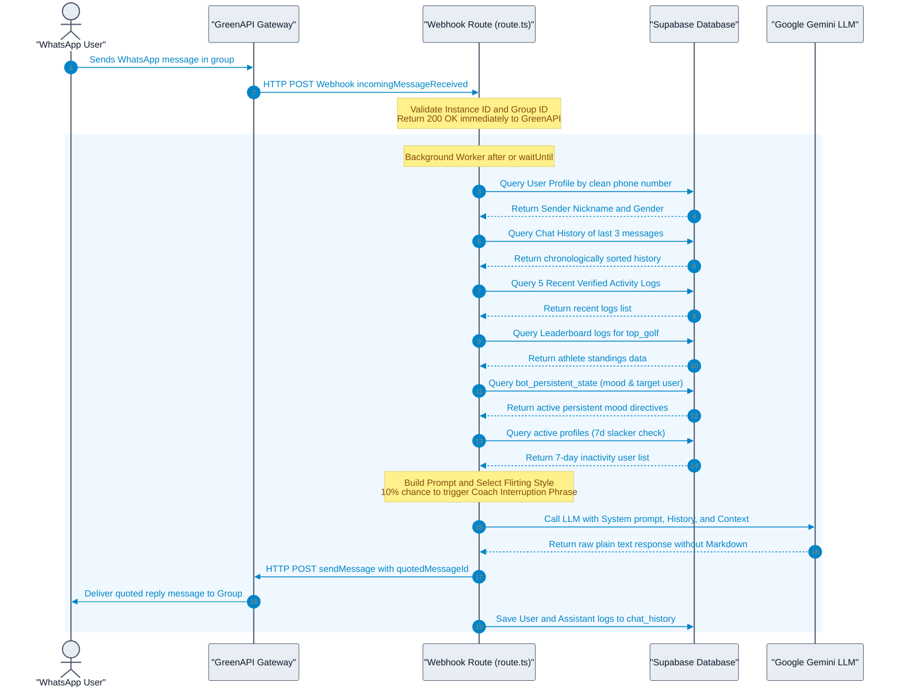
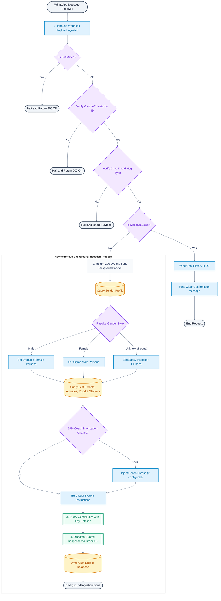

# 05 — WhatsApp Agent & Fisky Banter Engine

> **Last updated:** 2026-07-19
> **Service**: Conversational AI Banter Engine ("Fisky")
> **Integration Gateway**: Green API (JID-based message routing)
> **Asynchronous Process**: Executed via Next.js `after()` or `waitUntil()` background execution
> **Source of Truth**: [app/api/webhooks/whatsapp/route.ts](../app/api/webhooks/whatsapp/route.ts), [lib/ai/prompts.ts](../lib/ai/prompts.ts), [lib/whatsapp.ts](../lib/whatsapp.ts), [utils/slangRouter.ts](../utils/slangRouter.ts)

### Revision Log
| Date | Commit | Sections Touched | Summary |
|---|---|---|---|
| 2026-07-18 | fa4c8bb | §4.1 | Split rule 5: `CUSTOM_SYSTEM_RULES` (`lib/ai/prompts.ts` L6-16) tells the LLM to *use* comedy dialogues; the explicit "STRICTLY FORBIDDEN from Pushpa/RRR/Baahubali" clamp lives only in `adminTriggerPoke` (`app/actions/admin.ts` L246), which is the God-Mode broadcast prompt — NOT the normal Fisky reply prompt. |
| 2026-07-18 | (post-fa4c8bb) | §4.1, §4.2, §4.3, §4.4, §1 diagrams | Persona neutralized. `CUSTOM_SYSTEM_RULES` rewritten to remove Telugu-language / Hyderabadi-dialect / address-term / sentence-tag / movie-reference clauses. `adminTriggerPoke` prompt likewise neutralized. Interruption phrase moved to `COACH_INTERRUPTION_PHRASE` constant (ships empty). Docs updated to describe the new neutral surface. |
| 2026-07-18 | (sender-name consistency fix) | §3.1 | The phone-number-resolved `nickname` was already used in the system prompt, but the per-turn message content and `chat_history.sender_name` still used the raw WhatsApp push name — fixed to use the resolved nickname consistently in both places (falls back to the WhatsApp name only when no phone match exists). |

---

## 1. System Sequence Diagrams & Flowcharts

### 1.1 Ingestion Sequence Diagram

The following Mermaid sequence diagram illustrates the lifecycle of a message from the user's phone to the AI engine, database, and back to the group chat.



### 1.2 End-to-End Visual Ingestion Flowchart

This flowchart outlines the validation gates, database checks, asynchronous workers, and prompt modifiers involved in the webhook lifecycle.



### 1.3 Real-World Message Processing Trace (Concrete Example)

A concrete trace illustrating the flow of a male user's WhatsApp message inquiring about a run location.

```mermaid
%%{init: { 'theme': 'base', 'themeVariables': { 'primaryColor': '#F8FAFC', 'primaryTextColor': '#1b2b50ff', 'edgeLabelBackground': '#FFFFFF', 'lineColor': '#64748B' }}}%%
graph TD
    classDef step fill:#E0F2FE,stroke:#0284C7,stroke-width:1.5px,color:#0F172A;
    classDef payload fill:#FFF1F2,stroke:#F43F5E,stroke-width:1.5px,color:#0F172A;
    classDef db fill:#FEF3C7,stroke:#D97706,stroke-width:1.5px,color:#0F172A;
    classDef decision fill:#F3E8FF,stroke:#7C3AED,stroke-width:1.5px,color:#0F172A;
    classDef prompt fill:#ECFDF5,stroke:#059669,stroke-width:1.5px,color:#0F172A;
    classDef details fill:#F8FAFC,stroke:#64748B,stroke-width:1.5px,color:#0F172A;

    InputMsg["📱 Inbound Webhook Payload Details:<br/>• typeWebhook: 'incomingMessageReceived'<br/>• idMessage: 'XYZ1234567890ABCDEF'<br/>• senderData.sender: '919995551234@c.us'<br/>• senderData.chatId: '12036304381920@g.us'<br/>• messageData.extendedTextMessageData.text:<br/>  'Yo, where should I come for the run today?'"] --> CheckMute{"Filter 1: Mute check"}
    
    CheckMute --> F1Details["🔍 Filter 1 Logic & DB Queries:<br/>• Query table: 'system_settings' where key = 'bot_muted'<br/>• Check value: If value == 'true' -> returns status 'muted'<br/>• Output: Returns 200 OK immediately to halt GreenAPI retries"]
    
    CheckMute -- "False" --> CheckInst{"Filter 2: Instance ID validation"}
    CheckInst --> F2Details["🔍 Filter 2 Logic & Integrity Check:<br/>• Compares body.instanceData.idInstance to process.env.GREEN_API_INSTANCE_ID<br/>• Method: Uses secure constant-time safeCompare checks<br/>• Output: If mismatch -> Returns status 200 'Unauthorized instance'"]
    
    CheckInst -- "Valid" --> CheckChat{"Filter 3: Group & Message Type check"}
    CheckChat --> F3Details["🔍 Filter 3 Scope & Structure Check:<br/>• Checks if body.senderData.chatId matches target process.env.WHATSAPP_GROUP_ID<br/>• Checks if body.typeWebhook is strictly 'incomingMessageReceived'<br/>• Checks if body.messageData.typeMessage is 'textMessage' or 'extendedTextMessage'<br/>• Output: If mismatch -> Returns status 200 and ignores payload"]
    
    CheckChat -- "Valid" --> CleanMsg["4. Message Cleaning & Command Processing:<br/>• Parses incoming text defensively from available structure properties<br/>• Checks if message equals command '/clear' -> Wipes DB chat_history, sends WA confirmation, exits<br/>• Result Text: 'Yo, where should I come for the run today?'"]
    
    CleanMsg --> DbLookup[("5. User Profile DB Query:<br/>Query profiles table in Supabase<br/>where phone_number = '919995551234'")]
    DbLookup --> DbResult["Profile Data Resolved:<br/>• nickname: 'Nithin'<br/>• full_name: 'Nithin Reddy'<br/>• gender: 'MALE'"]
    
    DbResult --> GenderCheck{"6. Flirting Persona Selector"}
    
    GenderCheck -- "Sender is MALE" --> SetFemale["Adopt Dramatic Female Persona:<br/>• Exaggerated, dramatic heroine persona<br/>• Flirt aggressively with cheesy/cute pickup lines<br/>• Show extreme/possessive teasing dynamics"]
    GenderCheck -- "Sender is FEMALE" --> SetSigma["Adopt Sigma Male Persona:<br/>• Nonchalant, smooth, slightly arrogant persona<br/>• Flirt with sharp, witty pickup lines<br/>• Play hard to get"]
    
    SetFemale --> QueryBlock["7. Context Data Loading Step"]
    SetSigma --> QueryBlock
    
    subgraph DataAndPrompt["Context Assembly & Prompt Generation"]
        direction LR
        DbContext[("DB Context Queries:<br/>• Chat History: Retreives last 3 rows from chat_history table<br/>• Recent Activities: Retreives last 5 verified metric_logs logs<br/>• Standings: Queries top_golf scores<br/>• Mood & Slackers: Queries persistent mood and 7d inactive slackers")]
        
        SystemPromptText["Generated System Prompt Template:<br/>• Custom Rules: Casual conversational English, natural friend-group tone<br/>• DRAMA & CLASH: Pit members against each other<br/>• QUESTION ANSWERING PRIORITY: Answer location/time directly (No evading)<br/>• ANTI-REPETITION: Do NOT start replies with '[Name] darling' or loop 'darling'<br/>• Dynamic Flirting Prompt Override: Act as dramatic character"]
    end
    
    QueryBlock --> DbContext
    DbContext --> SystemPromptText
    
    SystemPromptText --> RunGemini[["8. Gemini LLM Generation:<br/>• Calls executeWithKeyRotation pool<br/>• Passes: System Prompt instructions, Chat History array, and User message<br/>• Word Limit: Max 15 or 3x incoming word count"]]
    
    RunGemini --> GeminiOutput["Gemini Output Text:<br/>'Come to the main road, everyone else is already there. Move fast!'"]
    
    GeminiOutput --> QuotedReply[["9. Outbound Message Dispatch via GreenAPI:<br/>• Method: POST /sendMessage/WA_TOKEN<br/>• Payload properties: chatId: WHATSAPP_GROUP_ID,<br/>  message: Gemini output text,<br/>  quotedMessageId: 'XYZ1234567890ABCDEF'"]]
    
    QuotedReply --> SaveHistory[("10. Commit Logs to Database:<br/>Inserts two records in public.chat_history:<br/>1. role: 'user', content: 'Message from Nithin: Yo, where should I come...'<br/>2. role: 'assistant', content: 'Come to the main road...'")]
    
    class InputMsg,CleanMsg,GeminiOutput payload;
    class DbLookup,DbContext,SaveHistory db;
    class CheckMute,CheckInst,CheckChat,GenderCheck decision;
    class SetFemale,SetSigma,SystemPromptText prompt;
    class RunGemini,QuotedReply,QueryBlock step;
    class F1Details,F2Details,F3Details,DbResult details;
```



---

## 2. Webhook Ingestion & Validation Execution Trace

The endpoint `POST /api/webhooks/whatsapp` processes incoming events from the Green API gateway.

### 2.1 Pre-Flight Safety Checks & Verification
1. **Environment Integrity Check**:
   - The handler evaluates environmental keys: `GEMINI_API_KEY`, `GREEN_API_INSTANCE_ID`, `GREEN_API_TOKEN`, `WHATSAPP_GROUP_ID`, and `SUPABASE_SERVICE_ROLE_KEY`. If any key is missing, logs the missing keys and terminates with HTTP `200 OK` (to halt gateway retries).
2. **System Settings Mute Guard**:
   - Queries `system_settings` table where `key = 'bot_muted'`. If `value` is `'true'`, the webhook logs the mute event and terminates with `200 OK`.
3. **Instance ID Match**:
   - Extracts the incoming instance ID from `body.instanceData.idInstance`.
   - Compares it with `process.env.GREEN_API_INSTANCE_ID` using timing-safe `safeCompare()`. Mismatches return HTTP `200 OK` immediately.
4. **Webhook and Message Type Filtering**:
   - Asserts that `body.typeWebhook` exactly matches `'incomingMessageReceived'`.
   - Asserts that `body.messageData.typeMessage` matches either `'textMessage'` or `'extendedTextMessage'`. Returns HTTP `200 OK` and ignores all other payload event types (e.g. delivery receipts, status updates).
5. **Group Chat Scope Check**:
   - Extracts target group identifier from `body.senderData.chatId` and verifies it matches `process.env.WHATSAPP_GROUP_ID`. Mismatches return HTTP `200 OK` immediately.
6. **Message Content Cleaning**:
   - Extracts incoming text. If no text content is resolved, ignores the webhook and returns HTTP `200 OK`.
7. **Clear Memory Wipe Command (`/clear`)**:
   - Checks if message matches `/clear` (case-insensitive).
   - If matched, executes a hard DELETE on the `chat_history` table for the group, sends a confirmation message `🧹 Memory Cleared!` to the WhatsApp group, and terminates with HTTP `200 OK`.

(source: [webhooks/whatsapp/route.ts L60-136](../app/api/webhooks/whatsapp/route.ts#L60-L136))

---

## 3. Context Processing & Profile Mapping

Once pre-flight checks succeed, the route handler immediately forks background execution using Next.js `after()` or `waitUntil()` to keep response times fast and avoid Green API retries.

### 3.1 Clean Phone Profile Matching
The webhook parses the sender's phone number from `senderData.sender` (wiping the trailing `@c.us` suffix). It queries the `profiles` table to resolve the sender's active profile:
```sql
SELECT nickname, gender 
  FROM public.profiles 
 WHERE phone_number = '+' || cleanPhone
    OR phone_number = cleanPhone
    OR phone_number LIKE '%' || cleanPhone || '%'
 LIMIT 1;
```
The resolved `nickname` (falling back to the raw WhatsApp push name, `senderData.senderName`, only if no phone match is found) is used consistently everywhere the sender's name surfaces to the AI: the system prompt ("You're replying to {name}"), the per-turn user message content (`Message from {name}: ...`), and the `sender_name` column persisted to `chat_history` (source: [webhooks/whatsapp/route.ts](../app/api/webhooks/whatsapp/route.ts) `resolvedSenderName`). This ensures the bot always refers to a signed-up member by the name they registered with, not whatever display name their phone/WhatsApp contact happens to show — those two can differ and previously did for the message-content and chat-history paths.

### 3.2 Inactivity Context & Token Clamping
To prevent chat-history context drift and token bloat, the database lookup constraints history:
1. **Context Limit**: Retrieves only the **last 3 messages** from `chat_history` for the group.
2. **Session Inactivity Check**: Evaluates the time delta between the current message and the most recent entry in `chat_history`. If it exceeds **30 minutes**, the system flushes the topic context, initiating a fresh discussion loop.

---

## 4. Gemini Prompt Architecture & Flirting Matrix

Dynamic prompt assembly compiles linguistic, mood, slacker, and rizz directives.

### 4.1 System Rules Configuration (`CUSTOM_SYSTEM_RULES`)
The system prompt in [prompts.ts](../lib/ai/prompts.ts) enforces the following guardrails:
1. **Linguistic Constraints:** Speaks in casual, conversational English suitable for a friend-group chat. No language, dialect, region, or script is prescribed in code — all such tuning is left to per-deployment configuration.
2. **Identity Vibe:** "Fisky" is a sarcastic, Gen Z, witty close friend. He is NOT a life coach or referee.
3. **Slang Address:** Uses natural, informal address terms appropriate for a close-knit friend group. Specific terms are not hard-coded.
4. **Sentence Endings:** Uses natural, conversational sentence endings and colloquialisms that feel like real friend-group speech.
5. **No Cinematic Cliches:** Explicitly forbidden from relying on any specific movie, franchise, actor, or celebrity. Pop-culture / meme humor must be drawn from a broad, generic pool.
6. **Data Guardrail:** Do not mention stats, metrics, or leaderboards unless explicitly asked. Casually joke and roast instead. No website URLs or fake stats.
7. **Direct Answer Priority:** If the user asks a question about times or locations (e.g., `"Where should I come?"`), the bot must answer the question directly and accurately. It is forbidden from evading or ignoring user inquiries.
8. **No Markdown:** Prohibited from using markdown indicators (`*`, `_`, `~`) to ensure clean, readable text bubbles on mobile screens.

(source: [lib/ai/prompts.ts L19-78](../lib/ai/prompts.ts#L19-L78))

### 4.2 Dynamic Flirting Rizz Matrix
The sender's gender dynamically overrides prompt characteristics to determine the flirting style:

| Sender Gender | Bot Persona Style | Tone/Behavior |
| :--- | :--- | :--- |
| **Male** | Dramatic Female | Flirts aggressively, acts possessive, dramatic, and jealous, using cheesy pickup lines. |
| **Female** | Sigma Male | Adopts nonchalant, smooth, slightly arrogant, and ultra-confident rizz, playing hard to get. |
| **Gay / Unknown** | Sassy Instigator | Employs heavy sass, roasts, and dramatic friend-group teasing. |

### 4.3 Lore, Mood, and Slacker Context Assembly
1. **Vocabulary Injections**: Resolves slang arrays dynamically by mapping the chosen tone and sender gender through `getSlangFor(tone, gender)`. All cells ship empty in code; when the resolved array is empty the prompt builder skips the slang instruction entirely.
2. **Lore Context**: Compilation of stunts, habits, ego triggers, and nemesis list from `member_lore` for targeted roasts.
3. **Persistent Mood Directive**: If `bot_persistent_state` is set for the group, injects the mood (one of `Normal`, `Angry`, `Sad`, `Arrogant`, `Sarcastic` per migration `0021`) as a directive. If a `target_user_id` is specified, it targets this member specifically; otherwise, the mood applies globally.
4. **Inactivity Slacker Shaming**: Resolves group members who logged 0 verified activities in the past 7 days. If slackers exist, the prompt passes their names and instructs Gemini to actively mock, shame, and call them out using funny, playful shaming terms.

### 4.4 Parameters & Safety Configurations
- **Word Limit**: Budgeted dynamically based on incoming message length:
  $$\text{Target Word Limit} = \max(15, \text{Incoming Word Count} \times 3)$$
- **Coach Phrase Frequency**: Optional interruption feature governed by the `COACH_INTERRUPTION_PHRASE` constant at the top of `lib/ai/prompts.ts`. The constant **ships empty**, so the interruption feature is disabled by default. When non-empty AND the caller passes `triggerInterruption = true` (10 % dice roll in `webhooks/whatsapp/route.ts` L378), the phrase is injected verbatim into the prompt.
- **Single-Line Clamp**: Gemini is instructed to return the text on a single line. The response replaces newlines to maintain message formatting within a single bubble:
  ```typescript
  const cleanReply = generatedText.trim().replace(/\n/g, ' ');
  ```

---

## 5. Outgoing Messaging Payload Specifications

Outbound communications target the Green API gateway HTTP endpoints.

### 5.1 Quoted Plain Text Dispatch (`sendMessage`)
When replying in a group chat, the bot quotes the trigger message by passing the incoming message ID as the `quotedMessageId`:
- **Endpoint**: `https://api.green-api.com/waInstance{instanceId}/sendMessage/{token}`
- **Headers**: `Content-Type: application/json`
- **Body JSON shape**:
  ```json
  {
    "chatId": "1203632971203@g.us",
    "message": "Nah bro, you cooked — that log run just made everyone else look mid.",
    "quotedMessageId": "XYZ1234567890ABCDEF"
  }
  ```

### 5.2 Multimodal Media Dispatch (`sendFileByUrl`)
Used when photos are uploaded to the Memories gallery:
- **Endpoint**: `https://api.green-api.com/waInstance{instanceId}/sendFileByUrl/{token}`
- **Body JSON shape**:
  ```json
  {
    "chatId": "1203632971203@g.us",
    "urlFile": "https://xxxxx.supabase.co/storage/v1/object/public/memories/group-uuid/image.jpg",
    "fileName": "photo.jpg",
    "caption": "📸 *Athlete nickname just added a new Memory!*\n\n💬 \"Fun image caption generated by multimodal AI!\""
  }
  ```

(source: [app/actions/memories.ts L163-174](../app/actions/memories.ts#L163-L174))

---

## 6. Fallback Chain & Resilience Engine

### 6.1 Key Rotation and Degradation Chain
The utility `executeWithKeyRotation()` maintains operations across failures:

```
+--------------------------------------------------------+
|              API Request Execution Loop                |
+--------------------------------------------------------+
                           │
                           ▼
           [Resolve next API Key in Pool]
                           │
                           ▼
        [Select highest Model: gemini-2.0-flash-lite]
                           │
                           ▼
                 [Execute API Request]
                           │
            ┌──────────────┴──────────────┐
         Success                       Failure
            │                             │
            ▼                             ▼
     [Return Result]             [Evaluate Error Code]
                                          │
            ┌─────────────────────────────┼─────────────────────────────┐
        Rate Limit (429)           Key Invalidation (400)          Other Error
            │                             │                             │
            ▼                             ▼                             ▼
[Downgrade Model to 3.1]       [Mark Key Blocked]               [Halt Execution]
            │                             │                             │
            ▼                             ▼                             ▼
    [Retry Request]            [Move to Next Key Pool]           [Throw Error]
```

### 6.2 Error Containment (Fail-Safe)
- If key pool rotation is exhausted, or the generation fails, the background processor catches the error.
- The webhook handler returns a standard HTTP `200 OK` with JSON payload `{ ok: true, error: '...' }` to the Green API gateway.
- Prevents Green API from triggering a retry storm that could exhaust resources or trigger server limits.
