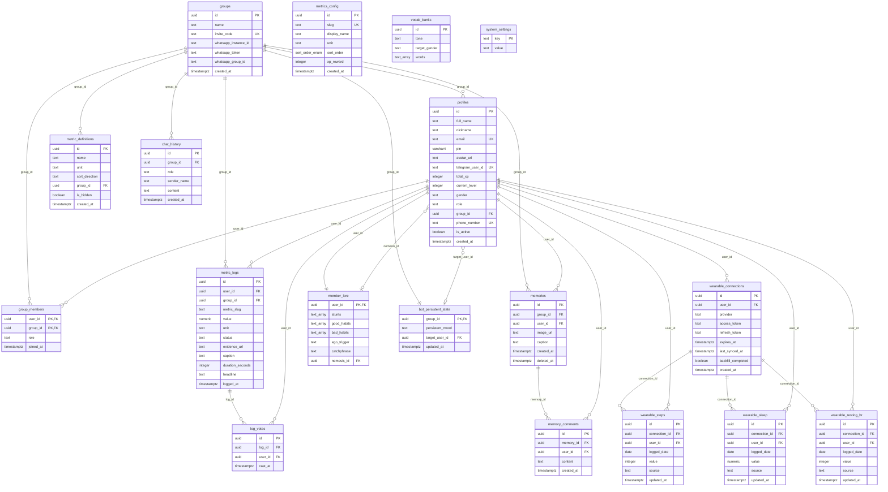

# 07 — Data Modelling & Database Schema

> **Last updated:** 2026-07-19
> **Database**: Supabase (PostgreSQL 15+)
> **Schema Source**: [sql/consolidated_schema.sql](../sql/consolidated_schema.sql)
> **Active Tables**: 17 distinct tables (incl. Challenges Module + `push_subscriptions`)
> **Isolation Pattern**: Header-based Row Level Security (RLS)

### Revision Log
| Date | Commit | Sections Touched | Summary |
|---|---|---|---|
| 2026-07-18 | fa4c8bb | §1 (added §1.15/§1.16), §4 (new), §5 (new), §6 (new), §7 (new) | Add missing tables `system_settings` and `bot_persistent_state` (§1.15/§1.16); add verbatim CREATE TABLE DDL blocks (§4); add CREATE POLICY / GRANT statements (§5); add synthesized sample INSERT rows (§6); add Mermaid ERD (§7). Per Part 4.6 spec. |
| 2026-07-18 | (post-fa4c8bb) | §1.16, §4.16, §6.9, §6.11 | `bot_persistent_state.persistent_mood` CHECK reduced to `('Normal','Angry','Sad','Arrogant','Sarcastic')` per new migration `0021_remove_deprecated_moods_and_vocab.sql`. `vocab_banks` sample INSERT replaced with a note that the table ships empty. Sample `chat_history` assistant row rewritten to remove Telugu content. |
| 2026-07-18 | (QA audit) | §1.2, §2.3 | QA-01/QA-02 (Findings_and_Recommendations.md): `profiles.pin` is bcrypt-hashed, not plaintext (doc was out of sync with the earlier SEC-04 fix). `profiles_group_pin_key` UNIQUE constraint and the `trg_check_unique_pin_*` triggers no longer functionally enforce PIN-per-group uniqueness now that PINs are salted hashes (every hash differs even for identical PINs) — enforcement moved to an application-layer check (`isPinTakenInGroup()` in `lib/security.ts`). `profiles.group_id`/`profiles.role` promoted from the ad-hoc `sql/00_emergency_schema_cleanup.sql` script into ordered migration `0033_profiles_group_id_and_role.sql`. |
| 2026-07-19 | (Dashboard & Challenges spec decomposition) | §8 (new) | Added §8 documenting the **planned** (not yet implemented) schema for 9 new tables (`daily_goals`, `daily_goal_completions`, `challenge_progression`, `challenge_history`, `league_assignments`, `league_challenges`, `league_matches`, `league_match_logs`, and the still-undecided `group_stats`) — see `Findings_and_Recommendations.md` DASH-01..DASH-09 for full status/evidence per table. |
| 2026-07-19 | (Streaks/Profile/PWA spec) | §1.1 | Migration `0039_add_streak_to_profiles.sql` adds `profiles.streak_count`/`profiles.last_reset_month` and a new `push_subscriptions` table; new `/profile/[userId]` route and monthly cron routes (`reset-monthly-streaks`, `monthly-summary`) consume this schema. Not yet applied to the live DB. |
| 2026-07-19 | (Documentation audit) | §1.2, §1.17 (new), §8 | Corrected `profiles.pin` column-type note (widened to `text` by migration `0034`, doc previously said it was never widened). Added §1.17 `push_subscriptions` table (previously only in the revision log, not the table listing). Updated §8 from "planned" to **implemented** — all 8 Dashboard & Challenges tables shipped in migrations `0036`-`0038`; DASH-06's `league_challenges.group_id` decision resolved (per-group). |
| 2026-07-22 | (Database Integrity) | §1.6 | Added migration `0041_metric_logs_unique_index.sql` documenting the composite UNIQUE index `metric_logs_unique_per_user_time_value` on `(user_id, metric_slug, (logged_at AT TIME ZONE 'UTC')::date, value) WHERE deleted_at IS NULL` to prevent duplicate activity logs on double-click or network retry. |

---

## 1. Table Specifications & Fields

All tables reside within the `public` schema. All IDs are UUIDs.

### 1.1 Table: `groups`
Stores training group contexts.
- **PK**: `id` (uuid, default `uuid_generate_v4()`)
- **Constraints**: `invite_code` UNIQUE
- **Columns**:
  - `id` (uuid, PK)
  - `name` (text, NOT NULL)
  - `invite_code` (text, UNIQUE)
  - `whatsapp_instance_id` (text, NULL)
  - `whatsapp_token` (text, NULL)
  - `whatsapp_group_id` (text, NULL)
  - `created_at` (timestamptz, NOT NULL, default `now()`)

### 1.2 Table: `profiles`
Athlete profile records. Does NOT relate to `auth.users`.
- **PK**: `id` (uuid, default `uuid_generate_v4()`)
- **Constraints**:
  - `email` UNIQUE (`profiles_email_key`)
  - `(group_id, pin)` UNIQUE (`profiles_group_pin_key`) — **retained in schema but no longer functionally enforces PIN-per-group uniqueness**: `pin` now stores a bcrypt hash (random salt per row), so two members with the identical 4-digit PIN produce different `pin` values and never collide at this constraint. Uniqueness is now checked in application code before hashing (`isPinTakenInGroup()` in `lib/security.ts`, called from `signUpAction` and `adminResetPin`).
- **Columns**:
  - `id` (uuid, PK)
  - `full_name` (text, NOT NULL) - must contain no spaces (validated by signup action)
  - `nickname` (text, NULL)
  - `email` (text, UNIQUE)
  - `pin` (text — widened from `varchar(4)` by migration `0034_widen_profiles_pin_column.sql`; stores a bcrypt hash, ~60 chars) - bcrypt-hashed, never stored as plaintext (`hashPin()`/`verifyPin()` in `lib/security.ts`)
  - `avatar_url` (text, NULL)
  - `telegram_user_id` (text, UNIQUE) — unused/dead column, kept harmless since the Telegram ingestion channel was removed (see `docs/03_Ingestion_and_AI_Pipelines.md` revision log)
  - `total_xp` (integer, NOT NULL, default `0`)
  - `current_level` (integer, NOT NULL, default `1`)
  - `streak_count` (integer, NOT NULL, default `0`) — migration `0039_add_streak_to_profiles.sql`; reset monthly by `app/api/cron/reset-monthly-streaks/route.ts`
  - `last_reset_month` (text, NULL, `YYYY-MM`) — migration `0039_add_streak_to_profiles.sql`; last month this profile's streak was reset
  - `gender` (text, NULL)
  - `role` (text, default `'member'`)
  - `group_id` (uuid, FK → groups(id) ON DELETE CASCADE)
  - `is_active` (boolean, default `true`)
  - `created_at` (timestamptz, NOT NULL, default `now()`)

### 1.3 Table: `group_members`
Links profiles to groups.
- **PK**: Composite key `(user_id, group_id)`
- **Columns**:
  - `user_id` (uuid, FK → profiles(id) ON DELETE CASCADE)
  - `group_id` (uuid, FK → groups(id) ON DELETE CASCADE)
  - `role` (text, default `'member'`)
  - `joined_at` (timestamptz, NOT NULL, default `now()`)
- **Indexes**: `group_members_group_id_idx`

### 1.4 Table: `metrics_config`
System-wide metrics catalogue.
- **PK**: `id` (uuid, default `uuid_generate_v4()`)
- **Constraints**: `slug` UNIQUE
- **Columns**:
  - `id` (uuid, PK)
  - `slug` (text, UNIQUE, NOT NULL)
  - `display_name` (text, NOT NULL)
  - `unit` (text, NOT NULL)
  - `sort_order` (sort_order_enum, NOT NULL, default `'desc'`) - enum has values `'asc'`, `'desc'`
  - `xp_reward` (integer, NOT NULL, default `25`)
  - `created_at` (timestamptz, NOT NULL, default `now()`)

### 1.5 Table: `metric_definitions`
Group-scoped dynamic custom metrics.
- **PK**: `id` (uuid, default `uuid_generate_v4()`)
- **Columns**:
  - `id` (uuid, PK)
  - `name` (text, NOT NULL)
  - `unit` (text, NOT NULL)
  - `sort_direction` (text, CHECK `IN ('asc','desc')`)
  - `group_id` (uuid, FK → groups(id) ON DELETE CASCADE)
  - `is_hidden` (boolean, default `false`)
  - `created_at` (timestamptz, NOT NULL, default `now()`)
- **Indexes**: `metric_definitions_group_id_idx`

### 1.6 Table: `metric_logs`
Chronological training performance logs.
- **PK**: `id` (uuid, default `uuid_generate_v4()`)
- **Constraints**: Composite UNIQUE index `metric_logs_unique_per_user_time_value` on `(user_id, metric_slug, (logged_at AT TIME ZONE 'UTC')::date, value) WHERE deleted_at IS NULL` (migration `0041_metric_logs_unique_index.sql`). Prevents duplicate activity logs from double-clicks or network retries while allowing intentional re-logging of the same metric on different days or with different values.
- **Columns**:
  - `id` (uuid, PK)
  - `user_id` (uuid, FK → profiles(id) ON DELETE CASCADE)
  - `group_id` (uuid, FK → groups(id) ON DELETE CASCADE)
  - `metric_slug` (text, NOT NULL) - matches standard slug OR custom definition UUID
  - `value` (numeric, NOT NULL)
  - `unit` (text, NOT NULL, default `''`)
  - `status` (text, NOT NULL, default `'pending'`, CHECK `status IN ('pending','verified','rejected')`)
  - `evidence_url` (text, NULL)
  - `caption` (text, NULL)
  - `duration_seconds` (integer, NULL)
  - `headline` (text, NULL)
  - `logged_at` (timestamptz, NOT NULL, default `now()`)
  - `deleted_at` (timestamptz, NULL)

### 1.7 Table: `log_votes`
Peer approvals for verification of pending logs.
- **PK**: `id` (uuid, default `uuid_generate_v4()`)
- **Constraints**: UNIQUE `(log_id, user_id)`
- **Columns**:
  - `id` (uuid, PK)
  - `log_id` (uuid, FK → metric_logs(id) ON DELETE CASCADE)
  - `user_id` (uuid, FK → profiles(id) ON DELETE CASCADE)
  - `cast_at` (timestamptz, default `now()`)
- **Indexes**: `log_votes_log_id_idx`

### 1.8 Table: `memories`
Shared community photo records.
- **PK**: `id` (uuid, default `uuid_generate_v4()`)
- **Columns**:
  - `id` (uuid, PK)
  - `group_id` (uuid, FK → groups(id) ON DELETE CASCADE)
  - `user_id` (uuid, FK → profiles(id) ON DELETE CASCADE)
  - `image_url` (text, NOT NULL)
  - `caption` (text, NULL)
  - `created_at` (timestamptz, default `now()`)
  - `deleted_at` (timestamptz, NULL) - soft delete support

### 1.9 Table: `memory_comments`
Comments on shared memories.
- **PK**: `id` (uuid, default `uuid_generate_v4()`)
- **Columns**:
  - `id` (uuid, PK)
  - `memory_id` (uuid, FK → memories(id) ON DELETE CASCADE)
  - `user_id` (uuid, FK → profiles(id) ON DELETE CASCADE)
  - `content` (text, NOT NULL)
  - `created_at` (timestamptz, default `now()`)

### 1.10 Table: `chat_history`
Fisky WhatsApp conversation window.
- **PK**: `id` (uuid, default `uuid_generate_v4()`)
- **Columns**:
  - `id` (uuid, PK)
  - `group_id` (uuid, FK → groups(id) ON DELETE CASCADE)
  - `role` (text, CHECK `role IN ('user', 'assistant', 'system')`)
  - `sender_name` (text, NULL)
  - `content` (text, NOT NULL)
  - `created_at` (timestamptz, default `now()`)

### 1.11 Table: `member_lore`
Athlete specific features for LLM generation context.
- **PK**: `user_id` (uuid, FK → profiles(id) ON DELETE CASCADE)
- **Columns**:
  - `user_id` (uuid, PK)
  - `stunts` (text[], default `'{}'`)
  - `good_habits` (text[], default `'{}'`)
  - `bad_habits` (text[], default `'{}'`)
  - `ego_trigger` (text, NULL)
  - `catchphrase` (text, NULL)
  - `nemesis_id` (uuid, FK → profiles(id) ON DELETE SET NULL)

### 1.12 Table: `vocab_banks`
Slang routing vocabulary database.
- **PK**: `id` (uuid, default `gen_random_uuid()`)
- **Constraints**: UNIQUE `(tone, target_gender)`
- **Columns**:
  - `id` (uuid, PK)
  - `tone` (text, NOT NULL)
  - `target_gender` (text, NOT NULL)
  - `words` (text[], NOT NULL)

### 1.13 Table: `wearable_connections`
Tokens authorizing fitbit/whoop/google API updates.
- **PK**: `id` (uuid, default `uuid_generate_v4()`)
- **Constraints**: UNIQUE `(user_id, provider)`
- **Columns**:
  - `id` (uuid, PK)
  - `user_id` (uuid, FK → profiles(id) ON DELETE CASCADE)
  - `provider` (text, NOT NULL)
  - `access_token` (text, NOT NULL)
  - `refresh_token` (text, NOT NULL)
  - `expires_at` (timestamptz, NOT NULL)
  - `last_synced_at` (timestamptz, NULL)
  - `backfill_completed` (boolean, default `false`)
  - `created_at` (timestamptz, default `now()`)

### 1.14 Tables: `wearable_steps`, `wearable_sleep`, `wearable_resting_hr`
Wearable metrics ledger tables. Share the same schema format:
- **PK**: `id` (uuid, default `uuid_generate_v4()`)
- **Constraints**:
  - UNIQUE `(connection_id, logged_date)`
  - UNIQUE `(user_id, logged_date)`
- **Columns**:
  - `id` (uuid, PK)
  - `connection_id` (uuid, FK → wearable_connections(id) ON DELETE CASCADE)
  - `user_id` (uuid, FK → profiles(id) ON DELETE CASCADE)
  - `logged_date` (date, NOT NULL)
  - `value` (integer for steps/hr, numeric for sleep, NOT NULL)
  - `source` (text, NULL)
  - `updated_at` (timestamptz, default `now()`)

### 1.15 Table: `system_settings`
Global key/value config store (bot mute switch, feature flags).
- **PK**: `key` (text)
- **Columns**:
  - `key` (text, PK)
  - `value` (text, NOT NULL)

(source: `supabase/migrations/0012_system_settings_fix.sql`)

### 1.16 Table: `bot_persistent_state`
Group-scoped persistent mood/target directive that the WhatsApp handler injects into every Fisky reply.
- **PK**: `group_id` (uuid)
- **Constraints**: CHECK `persistent_mood IN ('Normal','Angry','Sad','Arrogant','Sarcastic')` (per migrations `0017` + `0021`)
- **Columns**:
  - `group_id` (uuid, PK, FK → groups(id) ON DELETE CASCADE)
  - `persistent_mood` (text, NOT NULL, default `'Normal'`, CHECK above)
  - `target_user_id` (uuid, FK → profiles(id) ON DELETE SET NULL)
  - `updated_at` (timestamptz, NOT NULL, default `now()`)

(source: `supabase/migrations/0017_bot_persistent_state.sql`)

### 1.17 Table: `push_subscriptions`
Web Push (PWA) subscriptions — one row per browser/device a member has opted into push notifications on.
- **PK**: `id` (uuid, default `uuid_generate_v4()`)
- **Constraints**: UNIQUE `(endpoint)`
- **Columns**:
  - `id` (uuid, PK)
  - `group_id` (uuid, FK → groups(id) ON DELETE CASCADE)
  - `user_id` (uuid, FK → profiles(id) ON DELETE CASCADE)
  - `endpoint` (text, NOT NULL)
  - `p256dh` (text, NOT NULL)
  - `auth` (text, NOT NULL)
  - `created_at` (timestamptz, NOT NULL, default `now()`)
- **RLS**: `push_subscriptions_group_isolation`, group-scoped via `x-group-id` header (see `docs/04_Security_and_Gap_Analysis.md` §3).

(source: `supabase/migrations/0039_add_streak_to_profiles.sql`)

---

## 2. Trigger Logic

### 2.1 Auto-Verify Trigger (`trg_auto_verify`)
- **Source**: AFTER INSERT on `log_votes`
- **Function**: `auto_verify_on_votes()`
- **Logic**:
  ```sql
  select count(*) into v_vote_count from public.log_votes where log_id = NEW.log_id;
  if v_vote_count >= 3 then
    update public.metric_logs set status = 'verified' where id = NEW.log_id and status = 'pending';
  end if;
  ```

(source: [sql/consolidated_schema.sql L140-163](../sql/consolidated_schema.sql#L140-L163))

### 2.2 Award/Deduct XP Trigger (`trg_award_xp`)
- **Source**: AFTER INSERT OR UPDATE OR DELETE on `metric_logs`
- **Function**: `award_xp_on_verify()`
- **Logic**:
  - Awards XP if status changes from non-verified to `'verified'`.
  - Deducts XP if status changes from `'verified'` to non-verified.
  - XP amount is loaded from `metrics_config.xp_reward` based on matching `metric_slug`. Falls back to `25` XP if NULL (e.g. for custom metrics).
  - Updates target user's `total_xp` in `profiles`.
  - Updates target user's `current_level` using formula:
    `current_level = floor(1 + sqrt(greatest(0, total_xp + v_xp)::float / 500)) + 1`

(source: [sql/consolidated_schema.sql L177-241](../sql/consolidated_schema.sql#L177-L241))

### 2.3 Unique PIN per Group Checks
- **Triggers**:
  - `trg_check_unique_pin_per_group` (AFTER INSERT OR UPDATE on `group_members`)
  - `trg_check_unique_pin_on_profile_update` (AFTER INSERT OR UPDATE OF pin on `profiles`)
- **Logic**: Both trigger functions compare `p1.pin = new.pin` directly (source: [supabase/migrations/0001_initial_schema.sql L299-306](../supabase/migrations/0001_initial_schema.sql#L299-L306)). **This comparison no longer catches real collisions** now that `profiles.pin` stores a bcrypt hash — two identical PINs hash to different salted values, so the trigger's `raise exception 'This PIN is already taken in this group.'` effectively never fires anymore. The triggers are harmless no-ops left in place for schema-history continuity; the real check now lives in application code (`isPinTakenInGroup()` in `lib/security.ts`, enforced by `signUpAction` and `adminResetPin` before hashing/persisting a PIN).

(source: [sql/consolidated_schema.sql L281-332](../sql/consolidated_schema.sql#L281-L332))

---

## 3. Seed Catalog (`metrics_config`)

System standard metrics configured in database bootstrap:

| Slug | Display Name | Unit | Sort Order | XP Reward |
|---|---|---|---|---|
| `top_golf` | Top Golf Shot | Yards | `desc` | 50 |
| `deadlift` | Deadlift | lbs | `desc` | 75 |
| `top_speed` | Top Speed | mph | `desc` | 60 |
| `weight` | Weight | lbs | `asc` | 40 |
| `calories` | Calories | kcal | `desc` | 30 |
| `beers` | Beers | cans | `desc` | 10 |
| `squat` | Squat | lbs | `desc` | 60 |
| `bench_press` | Bench Press | lbs | `desc` | 60 |
| `push_ups` | Push-ups | reps | `desc` | 20 |
| `pull_ups` | Pull-ups | reps | `desc` | 25 |
| `cycling_distance` | Cycling Distance | mi | `desc` | 40 |
| `longest_swim` | Longest Swim | m | `desc` | 45 |
| `sleep` | Sleep | hrs | `desc` | 15 |
| `5k_time` | 5K Time | min | `asc` | 55 |

(source: [sql/consolidated_schema.sql L388-407](../sql/consolidated_schema.sql#L388-L407))

---

## 4. DDL — Verbatim `CREATE TABLE` Blocks

All blocks reproduced from the migration files that established the columns as of commit `fa4c8bb`. Columns added by later `ALTER TABLE` migrations are noted inline in each block header.

### 4.1 `groups`

Base: migration 0001; `whatsapp_*` columns added by migration 0008.

```sql
create table if not exists public.groups (
  id          uuid        primary key default uuid_generate_v4(),
  name        text        not null,
  invite_code text        unique,
  created_at  timestamptz not null default now()
);

-- 0008_database_hardening_and_rls.sql
alter table public.groups add column if not exists whatsapp_instance_id text default null;
alter table public.groups add column if not exists whatsapp_token       text default null;
alter table public.groups add column if not exists whatsapp_group_id    text default null;
```

### 4.2 `profiles`

Base: migration 0001; extended by 0010 (phone_number, gender), 0014 (is_active), 0016 (NOT NULL enforcement + uniqueness).

```sql
create table if not exists public.profiles (
  id                uuid        primary key default uuid_generate_v4(),
  full_name         text        not null,
  nickname          text,
  email             text,
  pin               varchar(4),
  avatar_url        text,
  telegram_user_id  text        unique,
  total_xp          integer     not null default 0,
  current_level     integer     not null default 1,
  created_at        timestamptz not null default now()
);

-- 0010_profiles_phone_number.sql
alter table public.profiles add column if not exists phone_number text;
alter table public.profiles add column if not exists gender       text;
alter table public.profiles add constraint profiles_phone_number_unique unique (phone_number);

-- 0014_soft_delete_and_editor.sql
alter table public.profiles add column if not exists is_active boolean default true;
create index if not exists profiles_is_active_idx on public.profiles(is_active);

-- 0016_profiles_strictness.sql (enforced non-null on nickname, email, gender, phone_number after backfill)
alter table public.profiles alter column full_name    set not null;
alter table public.profiles alter column nickname     set not null;
alter table public.profiles alter column email        set not null;
alter table public.profiles alter column gender       set not null;
alter table public.profiles alter column phone_number set not null;
alter table public.profiles add constraint profiles_email_unique        unique (email);
alter table public.profiles add constraint profiles_phone_number_unique unique (phone_number);
```

### 4.3 `group_members`

```sql
create table if not exists public.group_members (
  user_id   uuid        not null references public.profiles (id) on delete cascade,
  group_id  uuid        not null references public.groups   (id) on delete cascade,
  joined_at timestamptz not null default now(),
  primary key (user_id, group_id)
);

create index if not exists group_members_group_id_idx on public.group_members (group_id);

-- 0011_admin_features.sql
alter table public.group_members add column if not exists role text default 'member';
```

### 4.4 `metrics_config`

```sql
do $$
begin
  if not exists (select 1 from pg_type where typname = 'sort_order_enum') then
    create type sort_order_enum as enum ('asc', 'desc');
  end if;
end
$$;

create table if not exists public.metrics_config (
  id           uuid            primary key default uuid_generate_v4(),
  slug         text            not null unique,
  display_name text            not null,
  unit         text            not null,
  sort_order   sort_order_enum not null default 'desc',
  xp_reward    integer         not null default 25,
  created_at   timestamptz     not null default now()
);
```

### 4.5 `metric_definitions`

Base: migration 0002; `group_id` added by 0008; `is_hidden` added by 0015.

```sql
create table if not exists public.metric_definitions (
  id             uuid        primary key default uuid_generate_v4(),
  name           text        not null,
  unit           text        not null,
  sort_direction text        not null check (sort_direction in ('asc','desc')),
  created_at     timestamptz not null default now()
);

-- 0008
alter table public.metric_definitions add column if not exists group_id uuid references public.groups (id) on delete cascade;
create index if not exists metric_definitions_group_id_idx on public.metric_definitions (group_id);

-- 0015
alter table public.metric_definitions add column if not exists is_hidden boolean not null default false;
create index if not exists metric_definitions_is_hidden_idx on public.metric_definitions(is_hidden);
```

### 4.6 `metric_logs`

Base: migration 0001; `caption`+`duration_seconds` from 0004; `headline` from 0006.

```sql
create table if not exists public.metric_logs (
  id           uuid        primary key default uuid_generate_v4(),
  user_id      uuid        not null references public.profiles (id) on delete cascade,
  group_id     uuid        not null references public.groups   (id) on delete cascade,
  metric_slug  text        not null,
  value        numeric     not null,
  unit         text        not null default '',
  status       text        not null default 'pending'
                           check (status in ('pending', 'verified', 'rejected')),
  evidence_url text,
  logged_at    timestamptz not null default now()
);

create index if not exists metric_logs_group_id_idx    on public.metric_logs (group_id);
create index if not exists metric_logs_user_id_idx     on public.metric_logs (user_id);
create index if not exists metric_logs_metric_slug_idx on public.metric_logs (metric_slug);
create index if not exists metric_logs_status_idx      on public.metric_logs (status);
create index if not exists metric_logs_logged_at_idx   on public.metric_logs (logged_at desc);

-- 0004
alter table public.metric_logs add column if not exists caption          text;
alter table public.metric_logs add column if not exists duration_seconds integer;

-- 0006
alter table public.metric_logs add column if not exists headline text;
```

### 4.7 `log_votes`

```sql
create table if not exists public.log_votes (
  id      uuid        primary key default uuid_generate_v4(),
  log_id  uuid        not null references public.metric_logs (id) on delete cascade,
  user_id uuid        not null references public.profiles    (id) on delete cascade,
  cast_at timestamptz not null default now(),
  unique (log_id, user_id)
);

create index if not exists log_votes_log_id_idx on public.log_votes (log_id);
```

### 4.8 `memories`

Base: migration 0004; `deleted_at` from 0007.

```sql
create table if not exists public.memories (
  id         uuid        primary key default uuid_generate_v4(),
  group_id   uuid        not null references public.groups   (id) on delete cascade,
  user_id    uuid        not null references public.profiles (id) on delete cascade,
  image_url  text        not null,
  caption    text,
  created_at timestamptz not null default now()
);

create index if not exists memories_group_id_idx  on public.memories (group_id);
create index if not exists memories_user_id_idx   on public.memories (user_id);

-- 0007
alter table public.memories add column if not exists deleted_at timestamptz default null;

-- 0008
create index if not exists memories_created_at_idx on public.memories (created_at desc);
create index if not exists memories_deleted_at_idx on public.memories (deleted_at);
```

### 4.9 `memory_comments`

```sql
create table if not exists public.memory_comments (
  id         uuid        primary key default uuid_generate_v4(),
  memory_id  uuid        not null references public.memories (id) on delete cascade,
  user_id    uuid        not null references public.profiles (id) on delete cascade,
  content    text        not null,
  created_at timestamptz not null default now()
);

create index if not exists memory_comments_memory_id_idx on public.memory_comments (memory_id);
create index if not exists memory_comments_user_id_idx   on public.memory_comments (user_id);
```

### 4.10 `chat_history`

```sql
create table if not exists public.chat_history (
  id          uuid        primary key default uuid_generate_v4(),
  group_id    uuid        not null references public.groups (id) on delete cascade,
  role        text        not null check (role in ('user', 'assistant', 'system')),
  sender_name text,
  content     text        not null,
  created_at  timestamptz not null default now()
);

create index if not exists chat_history_group_id_idx on public.chat_history (group_id);
create index if not exists chat_history_created_idx  on public.chat_history (created_at desc);
```

### 4.11 `member_lore`

```sql
create table if not exists public.member_lore (
  user_id     uuid  primary key references public.profiles(id) on delete cascade,
  stunts      text[] default '{}',
  good_habits text[] default '{}',
  bad_habits  text[] default '{}',
  ego_trigger text,
  catchphrase text,
  nemesis_id  uuid   references public.profiles(id) on delete set null
);
```

### 4.12 `vocab_banks`

```sql
create table if not exists public.vocab_banks (
  id            uuid   primary key default gen_random_uuid(),
  tone          text   not null,
  target_gender text   not null,
  words         text[] not null,
  unique(tone, target_gender)
);
```

### 4.13 `wearable_connections`

Base: migration 0003; `expires_at` renamed from `token_expires_at` by 0018; `backfill_completed` re-asserted by 0019.

```sql
create table if not exists public.wearable_connections (
  id                 uuid        primary key default uuid_generate_v4(),
  user_id            uuid        not null references public.profiles (id) on delete cascade,
  provider           text        not null,
  access_token       text        not null,
  refresh_token      text        not null,
  expires_at         timestamptz not null,
  last_synced_at     timestamptz,
  backfill_completed boolean     default false,
  created_at         timestamptz not null default now(),
  unique (user_id, provider)
);

create index if not exists wearable_connections_user_id_idx on public.wearable_connections (user_id);
```

### 4.14 `wearable_steps` / `wearable_sleep` / `wearable_resting_hr`

```sql
create table if not exists public.wearable_steps (
  id            uuid        primary key default uuid_generate_v4(),
  connection_id uuid        not null references public.wearable_connections (id) on delete cascade,
  user_id       uuid        references public.profiles (id) on delete cascade,
  logged_date   date        not null,
  value         integer     not null,
  source        text,
  updated_at    timestamptz not null default now(),
  unique (connection_id, logged_date),
  constraint wearable_steps_user_date_unique unique (user_id, logged_date)
);

create table if not exists public.wearable_sleep (
  id            uuid        primary key default uuid_generate_v4(),
  connection_id uuid        not null references public.wearable_connections (id) on delete cascade,
  user_id       uuid        references public.profiles (id) on delete cascade,
  logged_date   date        not null,
  value         numeric     not null,
  source        text,
  updated_at    timestamptz not null default now(),
  unique (connection_id, logged_date),
  constraint wearable_sleep_user_date_unique unique (user_id, logged_date)
);

create table if not exists public.wearable_resting_hr (
  id            uuid        primary key default uuid_generate_v4(),
  connection_id uuid        not null references public.wearable_connections (id) on delete cascade,
  user_id       uuid        references public.profiles (id) on delete cascade,
  logged_date   date        not null,
  value         integer     not null,
  source        text,
  updated_at    timestamptz not null default now(),
  unique (connection_id, logged_date),
  constraint wearable_resting_hr_user_date_unique unique (user_id, logged_date)
);
```

### 4.15 `system_settings`

```sql
create table if not exists public.system_settings (
  key   text primary key,
  value text not null
);
```

### 4.16 `bot_persistent_state`

```sql
create table if not exists public.bot_persistent_state (
  group_id        uuid        primary key references public.groups(id) on delete cascade,
  persistent_mood text        not null default 'Normal'
                              check (persistent_mood in ('Normal','Angry','Sad','Arrogant','Sarcastic')),
  target_user_id  uuid        references public.profiles(id) on delete set null,
  updated_at      timestamptz not null default now()
);
```

---

## 5. RLS Policies & GRANTs (Verbatim)

```sql
-- Extension + schema privileges (0001)
grant usage on schema public to postgres, anon, authenticated, service_role;
alter default privileges in schema public grant all on tables    to postgres, anon, authenticated, service_role;
alter default privileges in schema public grant all on sequences to postgres, anon, authenticated, service_role;
alter default privileges in schema public grant all on functions to postgres, anon, authenticated, service_role;

-- Blanket privilege grants applied by 0001 and 0008
grant all privileges on all tables    in schema public to postgres, anon, authenticated, service_role;
grant all privileges on all sequences in schema public to postgres, anon, authenticated, service_role;
grant all privileges on all functions in schema public to postgres, anon, authenticated, service_role;

-- ── groups ──
alter table public.groups enable row level security;
create policy "groups: anon can read"
  on public.groups for select
  to anon
  using (true);

-- ── metrics_config ──
alter table public.metrics_config enable row level security;
create policy "metrics_config: anon can read"
  on public.metrics_config for select
  to anon
  using (true);

-- ── Group-scoped isolation (0008) ──
alter table public.profiles           enable row level security;
alter table public.group_members      enable row level security;
alter table public.metric_logs        enable row level security;
alter table public.log_votes          enable row level security;
alter table public.memories           enable row level security;
alter table public.memory_comments    enable row level security;
alter table public.metric_definitions enable row level security;

create policy profiles_group_isolation on public.profiles
  for all
  to anon, authenticated
  using (
    id in (
      select user_id from public.group_members
      where group_id = nullif(current_setting('request.headers', true)::json->>'x-group-id', '')::uuid
    )
  );

create policy group_members_group_isolation on public.group_members
  for all
  to anon, authenticated
  using      (group_id = nullif(current_setting('request.headers', true)::json->>'x-group-id', '')::uuid)
  with check (group_id = nullif(current_setting('request.headers', true)::json->>'x-group-id', '')::uuid);

create policy metric_logs_group_isolation on public.metric_logs
  for all
  to anon, authenticated
  using      (group_id = nullif(current_setting('request.headers', true)::json->>'x-group-id', '')::uuid)
  with check (group_id = nullif(current_setting('request.headers', true)::json->>'x-group-id', '')::uuid);

create policy log_votes_group_isolation on public.log_votes
  for all
  to anon, authenticated
  using (
    log_id in (
      select id from public.metric_logs
      where group_id = nullif(current_setting('request.headers', true)::json->>'x-group-id', '')::uuid
    )
  )
  with check (
    log_id in (
      select id from public.metric_logs
      where group_id = nullif(current_setting('request.headers', true)::json->>'x-group-id', '')::uuid
    )
  );

create policy memories_group_isolation on public.memories
  for all
  to anon, authenticated
  using      (group_id = nullif(current_setting('request.headers', true)::json->>'x-group-id', '')::uuid)
  with check (group_id = nullif(current_setting('request.headers', true)::json->>'x-group-id', '')::uuid);

create policy memory_comments_group_isolation on public.memory_comments
  for all
  to anon, authenticated
  using (
    memory_id in (
      select id from public.memories
      where group_id = nullif(current_setting('request.headers', true)::json->>'x-group-id', '')::uuid
    )
  )
  with check (
    memory_id in (
      select id from public.memories
      where group_id = nullif(current_setting('request.headers', true)::json->>'x-group-id', '')::uuid
    )
  );

create policy metric_definitions_group_isolation on public.metric_definitions
  for all
  to anon, authenticated
  using      (group_id = nullif(current_setting('request.headers', true)::json->>'x-group-id', '')::uuid)
  with check (group_id = nullif(current_setting('request.headers', true)::json->>'x-group-id', '')::uuid);

-- ── chat_history (0009) ──
alter table public.chat_history enable row level security;
create policy "Allow service role full access on chat_history"
  on public.chat_history
  for all
  to service_role
  using (true)
  with check (true);

-- ── system_settings (0011 + 0012) ──
alter table public.system_settings enable row level security;
create policy "Allow service role full access on system_settings"
  on public.system_settings for all to service_role using (true) with check (true);
create policy "Allow select on system_settings to anonymous"
  on public.system_settings for select to anon using (true);
create policy "Allow read/write for authenticated users"
  on public.system_settings for all to authenticated using (true) with check (true);

-- ── member_lore + vocab_banks (0013) — OPEN policies, isolation only at service-role app layer ──
alter table public.member_lore  enable row level security;
create policy "Allow read/write for group members" on public.member_lore  for all using (true);
alter table public.vocab_banks  enable row level security;
create policy "Allow read/write for authenticated users" on public.vocab_banks for all using (true);

-- ── bot_persistent_state (0017) ──
alter table public.bot_persistent_state enable row level security;
create policy bot_persistent_state_group_isolation on public.bot_persistent_state
  for all
  to anon, authenticated
  using      (group_id = nullif(current_setting('request.headers', true)::json->>'x-group-id', '')::uuid)
  with check (group_id = nullif(current_setting('request.headers', true)::json->>'x-group-id', '')::uuid);
create policy "Allow service role full access on bot_persistent_state"
  on public.bot_persistent_state for all to service_role using (true) with check (true);
grant all privileges on table public.bot_persistent_state to postgres, service_role;

-- ── Wearable tables (0003) ──
alter table public.wearable_connections enable row level security;
alter table public.wearable_steps       enable row level security;
alter table public.wearable_sleep       enable row level security;
alter table public.wearable_resting_hr  enable row level security;
grant all privileges on all tables    in schema public to postgres, service_role;
grant all privileges on all sequences in schema public to postgres, service_role;
```

---

## 6. Sample Data (Synthesized — Not Production Rows)

All UUIDs are placeholders in the `00000000-…` namespace; PINs are illustrative.

```sql
-- 6.1 groups
insert into public.groups (id, name, invite_code, whatsapp_group_id) values
  ('00000000-0000-0000-0000-000000000001', 'Sample Buds',   'SAMPLEBUDS',   '12000000000@g.us'),
  ('00000000-0000-0000-0000-000000000002', 'Demo Riders',   'DEMORIDERS',   NULL);

-- 6.2 profiles
insert into public.profiles (id, full_name, nickname, email, pin, gender, phone_number, group_id, total_xp, current_level) values
  ('00000000-0000-0000-0000-0000000000a1', 'Sample',   'Sammy',   'sammy@example.com',   '1234', 'Male',   '+19995550101', '00000000-0000-0000-0000-000000000001',  350, 2),
  ('00000000-0000-0000-0000-0000000000a2', 'Demo',     'Demi',    'demi@example.com',    '4321', 'Female', '+19995550102', '00000000-0000-0000-0000-000000000001',  120, 1),
  ('00000000-0000-0000-0000-0000000000a3', 'Testing',  'Tester',  'tester@example.com',  '5678', 'Male',   '+19995550103', '00000000-0000-0000-0000-000000000002',    0, 1);

-- 6.3 group_members
insert into public.group_members (user_id, group_id, role) values
  ('00000000-0000-0000-0000-0000000000a1', '00000000-0000-0000-0000-000000000001', 'admin'),
  ('00000000-0000-0000-0000-0000000000a2', '00000000-0000-0000-0000-000000000001', 'member'),
  ('00000000-0000-0000-0000-0000000000a3', '00000000-0000-0000-0000-000000000002', 'member');

-- 6.4 metric_logs (mixes verified + pending)
insert into public.metric_logs (id, user_id, group_id, metric_slug, value, unit, status, logged_at) values
  ('00000000-0000-0000-0000-0000000000b1', '00000000-0000-0000-0000-0000000000a1', '00000000-0000-0000-0000-000000000001', 'top_golf',      215, 'Yards',  'verified', now() - interval '1 day'),
  ('00000000-0000-0000-0000-0000000000b2', '00000000-0000-0000-0000-0000000000a2', '00000000-0000-0000-0000-000000000001', 'push_ups',       40, 'reps',   'verified', now() - interval '3 hours'),
  ('00000000-0000-0000-0000-0000000000b3', '00000000-0000-0000-0000-0000000000a1', '00000000-0000-0000-0000-000000000001', 'car_top_speed', 105, 'mph',    'pending',  now());

-- 6.5 log_votes (approvals toward verified threshold)
insert into public.log_votes (id, log_id, user_id) values
  ('00000000-0000-0000-0000-0000000000c1', '00000000-0000-0000-0000-0000000000b3', '00000000-0000-0000-0000-0000000000a2');

-- 6.6 metric_definitions
insert into public.metric_definitions (id, name, unit, sort_direction, group_id, is_hidden) values
  ('00000000-0000-0000-0000-0000000000d1', 'Ping Pong Wins 🏓', 'wins', 'desc', '00000000-0000-0000-0000-000000000001', false);

-- 6.7 memories
insert into public.memories (id, group_id, user_id, image_url, caption) values
  ('00000000-0000-0000-0000-0000000000e1', '00000000-0000-0000-0000-000000000001', '00000000-0000-0000-0000-0000000000a1',
   'https://example.supabase.co/storage/v1/object/public/memories/00000000-0000-0000-0000-000000000001/sample.jpg',
   'Group golf outing on the range');

-- 6.8 memory_comments
insert into public.memory_comments (id, memory_id, user_id, content) values
  ('00000000-0000-0000-0000-0000000000f1', '00000000-0000-0000-0000-0000000000e1', '00000000-0000-0000-0000-0000000000a2', 'Big swing!');

-- 6.9 chat_history
insert into public.chat_history (group_id, role, sender_name, content) values
  ('00000000-0000-0000-0000-000000000001', 'user',      'Sammy', 'Message from Sammy: where should I come for the run?'),
  ('00000000-0000-0000-0000-000000000001', 'assistant', 'Fisky', 'Meet at the park entrance, everyone else is already warming up.');

-- 6.10 member_lore
insert into public.member_lore (user_id, stunts, good_habits, bad_habits, ego_trigger, catchphrase, nemesis_id) values
  ('00000000-0000-0000-0000-0000000000a1',
   array['5k under 25 min', 'benched bodyweight'],
   array['4am wakeup'],
   array['skips leg day'],
   'being called slow',
   'Just show up.',
   '00000000-0000-0000-0000-0000000000a2');

-- 6.11 vocab_banks
-- Intentionally empty per migration `0021_remove_deprecated_moods_and_vocab.sql`.
-- Populate per deployment via the Settings panel; no vocabulary ships in code.

-- 6.12 wearable_connections
insert into public.wearable_connections (id, user_id, provider, access_token, refresh_token, expires_at, backfill_completed) values
  ('00000000-0000-0000-0000-0000000000g1', '00000000-0000-0000-0000-0000000000a1', 'whoop', 'mock_whoop_token', 'mock_whoop_refresh', now() + interval '1 hour', false);

-- 6.13 wearable_steps
insert into public.wearable_steps (connection_id, user_id, logged_date, value, source) values
  ('00000000-0000-0000-0000-0000000000g1', '00000000-0000-0000-0000-0000000000a1', current_date, 8321, 'wearable_sync');

-- 6.14 wearable_sleep
insert into public.wearable_sleep (connection_id, user_id, logged_date, value, source) values
  ('00000000-0000-0000-0000-0000000000g1', '00000000-0000-0000-0000-0000000000a1', current_date, 7.4, 'wearable_sync');

-- 6.15 wearable_resting_hr
insert into public.wearable_resting_hr (connection_id, user_id, logged_date, value, source) values
  ('00000000-0000-0000-0000-0000000000g1', '00000000-0000-0000-0000-0000000000a1', current_date, 54, 'wearable_sync');

-- 6.16 system_settings
insert into public.system_settings (key, value) values
  ('bot_muted', 'false');

-- 6.17 bot_persistent_state
insert into public.bot_persistent_state (group_id, persistent_mood, target_user_id) values
  ('00000000-0000-0000-0000-000000000001', 'Sarcastic', '00000000-0000-0000-0000-0000000000a1');
```

---

## 7. Entity–Relationship Diagram




---

## 8. Dashboard & Challenges Module Schema (IMPLEMENTED)

> Shipped via migrations `0036_daily_goals.sql`, `0037_challenge_progression.sql`, `0038_leagues.sql`. **Requires human action**: these migrations exist as files but have not yet been applied to the live Supabase project (Vercel deploys never run Supabase migrations automatically) — see `Admin_to_do.md` §1. Full task history in `Findings_and_Recommendations.md` under "## Dashboard & Challenges Implementation" (DASH-01..DASH-30).

All tables follow the two conventions already proven across this schema:
- **RLS**: `USING (group_id = nullif(current_setting(''request.headers'', true)::json->>''x-group-id'', '''')::uuid)` — the exact policy shape used by `metric_logs`, `memories`, etc.
- **Soft-delete**: `deleted_at timestamptz` — the same column already used by `memories` (migration `0007`) and `groups` (migration `0024`).

### 8.1 `daily_goals` (migration `0036`)
| Column | Type | Notes |
|---|---|---|
| `id` | uuid PK | |
| `group_id` | uuid NOT NULL REFERENCES groups(id) ON DELETE CASCADE | |
| `title` | text NOT NULL | |
| `description` | text | |
| `created_at` | timestamptz NOT NULL DEFAULT now() | Immutable after creation per spec — no `updated_at`. |

### 8.2 `daily_goal_completions` (migration `0036`)
| Column | Type | Notes |
|---|---|---|
| `id` | uuid PK | |
| `group_id` | uuid NOT NULL REFERENCES groups(id) ON DELETE CASCADE | |
| `user_id` | uuid NOT NULL REFERENCES profiles(id) ON DELETE CASCADE | |
| `daily_goal_id` | uuid NOT NULL REFERENCES daily_goals(id) ON DELETE CASCADE | |
| `completed_at` | timestamptz NOT NULL DEFAULT now() | |
| `deleted_at` | timestamptz | Soft-delete — required so the 9PM/daily-whistle bot query and Recent Activities can both filter consistently. |

### 8.3 `challenge_progression` (migration `0037`)
| Column | Type | Notes |
|---|---|---|
| `id` | uuid PK | |
| `group_id` | uuid NOT NULL REFERENCES groups(id) ON DELETE CASCADE | |
| `user_id` | uuid NOT NULL REFERENCES profiles(id) ON DELETE CASCADE | |
| `challenge_type` | text NOT NULL | |
| `current_tier` | numeric NOT NULL | |
| `previous_tier` | numeric | **Must only be written by the trigger described in §8.4 — never independently by application code**, or it can drift from `challenge_history` after repeated deletes. |
| `updated_at` | timestamptz NOT NULL DEFAULT now() | |

`UNIQUE (user_id, challenge_type)` — one current tier per user per challenge type.

### 8.4 `challenge_history` (migration `0037`)
| Column | Type | Notes |
|---|---|---|
| `id` | uuid PK | |
| `group_id` | uuid NOT NULL REFERENCES groups(id) ON DELETE CASCADE | |
| `user_id` | uuid NOT NULL REFERENCES profiles(id) ON DELETE CASCADE | |
| `challenge_type` | text NOT NULL | |
| `entry_date` | timestamptz NOT NULL DEFAULT now() | |
| `tier_before` | numeric NOT NULL | |
| `tier_after` | numeric NOT NULL | |
| `deleted_at` | timestamptz | Soft-delete, not hard — a hard delete would make it impossible to recompute `previous_tier` correctly afterward. |

**Trigger** (`recompute_challenge_progression()`, migration `0037`): fires on INSERT and on soft-delete of `challenge_history`, recomputing `challenge_progression.current_tier`/`previous_tier` from the latest remaining non-deleted row — mirroring the existing `total_xp`/`current_level` recompute-on-verify trigger pattern already used for `metric_logs` (see §2.2 above). Application code (`app/actions/progression.ts`) never writes `current_tier`/`previous_tier` directly.

### 8.5 `league_assignments` (migration `0038`)
| Column | Type | Notes |
|---|---|---|
| `id` | uuid PK | |
| `group_id` | uuid NOT NULL REFERENCES groups(id) ON DELETE CASCADE | |
| `user_id` | uuid NOT NULL REFERENCES profiles(id) ON DELETE CASCADE | |
| `team_name` | text NOT NULL CHECK (team_name IN (''TITANS'',''REBELS'')) | |
| `assigned_at` | timestamptz NOT NULL DEFAULT now() | |

`UNIQUE (user_id, group_id)` — one team per user per group, enforced at the DB level.

### 8.6 `league_challenges` (migration `0038`)
| Column | Type | Notes |
|---|---|---|
| `id` | uuid PK | |
| `group_id` | uuid NOT NULL REFERENCES groups(id) ON DELETE CASCADE | **Resolved (DASH-06)**: per-group catalog, mirroring `metric_definitions` (not a global catalog like `metrics_config`) — each group can add its own challenge types independently. |
| `name` | text NOT NULL | |
| `description` | text | |
| `created_at` | timestamptz NOT NULL DEFAULT now() | |

### 8.7 `league_matches` (migration `0038`)
| Column | Type | Notes |
|---|---|---|
| `id` | uuid PK | |
| `group_id` | uuid NOT NULL REFERENCES groups(id) ON DELETE CASCADE | |
| `league_challenge_id` | uuid NOT NULL REFERENCES league_challenges(id) | |
| `titans_score` | numeric NOT NULL DEFAULT 0 | |
| `rebels_score` | numeric NOT NULL DEFAULT 0 | |
| `winner_team` | text CHECK (winner_team IN (''TITANS'',''REBELS'',''TIE'')) | |
| `completed_at` | timestamptz | Once set, scores/winner must become effectively immutable (enforced in the write path, DASH-25). |
| `deleted_at` | timestamptz | Soft-delete. |
| `created_at` | timestamptz NOT NULL DEFAULT now() | |

Note: no `titans_team_id`/`rebels_team_id` FK — team rosters are read live from `league_assignments` at render time, there is no separate "team" entity to reference.

### 8.8 `league_match_logs` (migration `0038`)
| Column | Type | Notes |
|---|---|---|
| `id` | uuid PK | |
| `group_id` | uuid NOT NULL REFERENCES groups(id) ON DELETE CASCADE | |
| `match_id` | uuid NOT NULL REFERENCES league_matches(id) ON DELETE CASCADE | |
| `action` | text NOT NULL CHECK (action IN (''create'',''complete'',''delete'')) | |
| `actor_id` | uuid NOT NULL REFERENCES profiles(id) | |
| `created_at` | timestamptz NOT NULL DEFAULT now() | |

### 8.9 `group_stats` / composite metrics (still UNDECIDED — see DASH-09)
Not designed and not implemented. The dashboard computes chart data and leaderboard rankings live from `metric_logs` joined with `metrics_config`/`metric_definitions` — no cached stats table exists or is required for the *current* single-metric graph/leaderboard, and the Challenges Module (§8.1-8.8) ships independently without needing one. A table would only be needed if a future unified Podium ranks on a composite "growth score" spanning daily goals + progression + leagues. Decision remains open, tracked in DASH-09.
