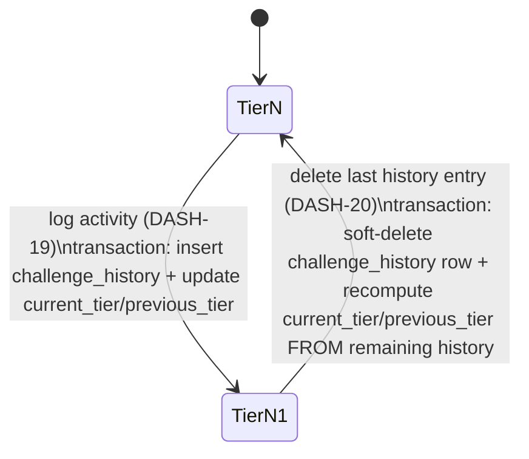
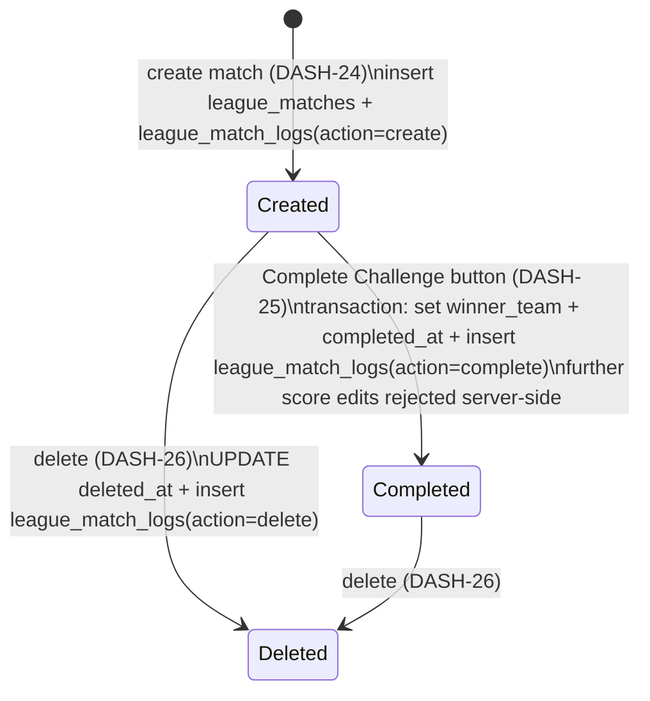

# 08 — Client-Side Architecture & UI Component Inventory

> **Last updated:** 2026-07-19
> **Style System**: Tailwind CSS v4 (configured via globals.css)
> **Base Styling**: Light mode, high-contrast, cyber-athletic design
> **Interactive Components**: Client components marked with `'use client'`
> **Source of Truth**: [globals.css](../app/globals.css), [components/](../components)

### Revision Log
| Date | Commit | Sections Touched | Summary |
|---|---|---|---|
| 2026-07-18 | fa4c8bb | §1 (expanded), §2 (typography table), §4 (new — screen table), §5 (new — component state matrix), §6 (new — interaction trace), §7 (new — edge case matrix) | Add Part 4.2 required tables: design tokens Token/Value/Tailwind/Used-For; typography table; screen-by-screen with auth guard & loading/empty/error; component state matrix (default/hover/active/disabled/loading/error); component & interaction trace with server action + optimistic-vs-revalidate note; edge case matrix. |
| 2026-07-19 | (Dashboard & Challenges spec decomposition) | §8 (new) | Added §8 — planned component interaction table for the Global Activity Slider (which not-yet-built components will listen to it) and per-module state-flow diagrams (Daily Goals completion→deletion→rollback, Progression tier update→rollback, League match creation→completion→deletion). Nothing in §8 is implemented yet — see `Findings_and_Recommendations.md` DASH-10..DASH-30. |
| 2026-07-19 | (Documentation audit) | §8, §9 (new) | Updated §8 from "planned" to **implemented** — Daily Goals/Progression/Leagues panels are built and mounted on `/dashboard`; only the podium/ranking-unification item (DASH-10/11/27) remains genuinely open, and is now labeled as such rather than lumped in with everything else as "not built". Added §9 documenting the Streak Badge, Profile page, and PWA service-worker-registration components (previously undocumented). |
| 2026-07-19 | (Structural refactor) | §5, §8 | DASH-10/11/27 resolved: `Podium`/`RankingsList` (new `components/dashboard/`) moved onto `/dashboard`, unified with the existing `activeMetric`/`activeRange` state (no more separate leaderboard-only pill selector). `ChallengesModule` moved to the new `/dashboard/challenges` route (renamed from `/dashboard/leaderboard`), gained Framer Motion fade-in/zoom-in-95 tab transitions. "Leaderboard" nav item renamed "Challenges" (Trophy icon). Command Center in Settings is no longer a collapsible accordion — always visible. Sidebar's user card now renders the real `profiles.avatar_url` photo via `UserAvatar` instead of initials-only.
| 2026-07-22 | (Daily Goals Redesign) | §8 | Redesigned `DailyGoalsPanel.tsx` to display predefined daily goal metrics ("10,000 steps", "50 Push-ups", "50 squads", "Gym streak", "Diet") defined in `lib/config/daily-goals.ts`. Added Date Navigation bar (`< Today >`) and interactive Calendar Date Picker modal. Checkbox state directly logs/un-logs completions in `daily_goal_completions` for the selected date. Removed Recent Activities section below the goals list. |
| 2026-07-22 | (Leagues Democratization) | §8 | Moved Leagues match initiation and team roster management from Settings/Command Center into the Challenges → Leagues section (`LeagueMatchPanel.tsx`). Created `CreateLeagueModal.tsx` accessible to all group members (no admin required) for picking challenges and assigning players to TITANS vs REBELS. Updated team cards with avatars, live score inputs, gold winner highlight, and Recent Matches history. |
| 2026-07-22 | (Consistency Heatmap) | §8, §10 | Added `ConsistencyHeatmap.tsx` inside the Daily Goals tab (`DailyGoalsPanel.tsx`). Renders a GitHub-inspired 30-day habit completion grid with dark navy background (`#0A1628`), dropdown metric selector ("ALL METRICS", "10,000 steps", "50 Push-ups", "50 squads", "Gym streak", "Diet"), completion intensity colors (`#111A0A`, `#2C4815`, `#6AA31A`, `#CEFF00`), month navigation controls, streak counter (`X Days 🔥`), and consistency rate (`X/31 Days`). |
| 2026-07-22 | (Challenge Progression System) | §8, §11 (new) | Implemented Clash of Clans-inspired tier progression UI in `ProgressionChallengePanel.tsx` with subcomponents (`MetricPillSelector.tsx`, `CurrentHighestCard.tsx`, `ChallengeTierList.tsx`, `LogValueInput.tsx`, `ChallengeHistory.tsx`). Seeding migration `0046_seed_challenge_tiers.sql` seeds 14 tiers per metric for Push-ups, Pull-ups, Squats, and Plank. |

---

## 1. Styling Tokens (Tailwind CSS v4 Standard)

The design system uses CSS custom variables mapped to Tailwind utilities.

| Token Name | Hex Value | CSS Variable Name | UI Usage |
|---|---|---|---|
| **Canvas Background** | `#F7F8FA` | `--canvas-bg` | Page container background (`bg-[#F7F8FA]`) |
| **Module Cards** | `#FFFFFF` | `--card-bg` | Content cards (`bg-white border border-slate-200 shadow-sm rounded-xl`) |
| **Primary Hero Accent** | `#CEFF00` | `--hero-accent` | Neon Lime-Yellow text highlights, active borders, buttons |
| **Main Heading Text** | `#111827` | `--text-primary` | Charcoal black (`text-[#111827] font-black uppercase`) |
| **Muted Text / Labels** | `#6B7280` | `--text-muted` | Medium gray labels (`text-[#6B7280] font-bold text-xs uppercase`) |
| **Destructive Actions** | `#D84315` | `--destructive` | Red borders/backgrounds for deletes (`bg-red-50 text-red-600 border border-red-200`) |
| **Success Actions** | `#4CAF50` | `--success` | Green borders/backgrounds for approvals (`bg-emerald-50 text-emerald-600 border border-emerald-200`) |

---

## 2. Typography & Layout Rules

- **Default Font Family**: Standard system sans-serif font stack. Loaded via Next.js `Geist` font configuration.
- **Main Headings**: Title Case or full UPPERCASE depending on layout hierarchy.
- **Metadata Labels**: Must be full UPPERCASE (e.g., `LIVE`, `GANG ROSTER`).
- **Responsive Layout Grid**:
  - Desktop: Left-anchored dark sidebar (`bg-[#0A0A0A]`, width `240px`).
  - Mobile: Horizontal bottom navigation bar (`MobileBottomNav.tsx`) with high-contrast accent highlight (`#CEFF00`).
- **Page Container Spacing**: Responsive mobile-first padding. Expressed as: `px-4 md:px-8 py-6`.

---

## 3. UI Component Inventory

### 3.1 Settings Tab Components (`/dashboard/settings` / `SettingsClient.tsx`)

Source: [SettingsClient.tsx](../components/SettingsClient.tsx)

- **Numeric Keypad Authenticator**:
  - Displays a 12-button lockpad overlay on initial load.
  - Intercepts clicks on numbers 0-9, backspace, and clear.
  - Compares the entered PIN against the master group admin PIN.
  - On match, sets `god_mode_unlocked` to `true` in `sessionStorage` and changes state to unlocked.
- **Bot Control Switch**:
  - Horizontal toggle button.
  - Invokes the `adminToggleBotMute` Server Action.
- **User Activation Control**:
  - Inline switch inputs rendered per-member.
  - Invokes `adminToggleUserActive` on value changes.
- **Member Removal Button**:
  - Trash icon button.
  - Triggers a confirmation dialog.
  - Invokes `adminRemoveMember` upon verification.
- **Keypad PIN Reset Form**:
  - Form field accepting 4-digit strings.
  - Validates format: `pin.length === 4 && !isNaN(Number(pin))`.
  - Submit button invokes `adminResetPin`.
- **Role Selection Dropdown**:
  - Dropdown containing options: `member`, `co-admin`, `admin`.
  - Selection changes invoke `adminUpdateMemberRole`.
- **Add Custom Metric Button**:
  - Dialog overlay modal.
  - Inputs: Name (must include emoji), Unit, Sort Direction (`asc`/`desc`).
  - Submit button invokes `createMetricDefinition`.
- **Metric Visibility Control**:
  - Hide/unhide toggle in custom definitions list.
  - Invokes `adminToggleMetricHidden`.
- **Banter Poke Form**:
  - Dropdowns: Target Member, Tone Vibe (`ragebait`, `motivate`, `flirt_tease`), Gender Override (`Male`, `Female`, `Gay`, `Neutral`, `Auto`).
  - Textarea: Custom situation context.
  - Submit button invokes `adminTriggerPoke`.
- **Lore Context Editor**:
  - Fields: Stunts array, Good Habits array, Bad Habits array, Catchphrase string, Ego Trigger string, Nemesis lookup.
  - Save button invokes `adminUpsertMemberLore`.
- **Slang Vocabulary Form**:
  - Inputs: Inline text array for slang words.
  - Save buttons invoke `adminUpsertVocabBank`.

### 3.2 Dashboard Components (`/dashboard`)

Source: [BreakingNewsFeed.tsx](../components/BreakingNewsFeed.tsx), [MetricChart.tsx](../components/MetricChart.tsx), [AddActivityModal.tsx](../components/AddActivityModal.tsx)

- **Metric Selector Pill Row**:
  - Horizontal scrolling pill container.
  - Combines 12 static configurations from [metrics.ts](../lib/metrics.ts) with dynamic non-hidden custom metrics from the database.
  - Selected pill highlights with accent color background (`#CEFF00`).
- **Date Range Selector**:
  - Options: `7d`, `30d`, `90d`, `all`.
  - Determines lookback range for calculations and chart points.
- **Metric Chart Container**:
  - Client component wrapping `echarts-for-react`.
  - Renders line series with custom primary color palette.
  - Downsamples x-axis markers based on range selection (`7d` raw, `30d` 3-day buckets, `90d` 7-day buckets).
  - Dynamically floats user avatar images at the final non-null point of each line.
- **Breaking News Feed**:
  - Vertically scrolling list showing recent verified and pending activities.
  - Fades in items using `animate-in fade-in slide-in-from-bottom-3`.
  - Item elements show athlete details, metric labels, values, duration metadata, and social comment links.
- **Add Activity Modal**:
  - Button toggled modal.
  - Submits textual descriptions to `ingestActivity` Server Action.
  - Tab switcher unlocks manual logging inputs.
  - Manual inputs: Numeric Value, Unit, Logged Date (restrictions: max today, min 30 days ago).
  - Endurance metrics render sub-fields: Hours, Minutes, Seconds. Computes and saves total seconds under `duration_seconds`.
- **Peer Review Modal**:
  - Renders list of logs with `status = 'pending'`.
  - Excludes logs authored by the current session user.
  - Approvals call `approveActivityAction` Server Action.
  - Rejections call `rejectActivityAction` Server Action.

### 3.3 Gang Components (`/dashboard/gang`)

Source: [GangClient.tsx](../app/dashboard/gang/GangClient.tsx)

- **Roster Cards Grid**:
  - Displays all active profiles linked to the current group.
  - Card fields: initials/photo via `<UserAvatar />`, current level, nickname/full name, total XP.
  - Ordered chronologically by total XP descending.
  - Transition: `animate-in fade-in zoom-in-95`.

### 3.4 Wearables Components (`/dashboard/wearables`)

Source: [WearablesClientPage.tsx](../components/WearablesClientPage.tsx)

- **Connection Status Section**:
  - Renders cards for supported providers (`google_fit`, `fitbit`, `whoop`).
  - Active connections display a "Connected" badge alongside the last synced timestamp.
- **Connect Trigger Button**:
  - Fitbit/Google Fit redirect to OAuth route.
  - Whoop triggers a call to `connectWearableAction` (simulated connection).
- **Disconnect Trigger Button**:
  - Destroys connections by calling `disconnectWearableAction`.

---

## 4. Screen-by-Screen Inventory

Every rendered route + notable modal, its render mode, and its loading/empty/error/auth affordances.

| Screen | Route / File | Render Mode | Purpose | Loading State | Empty State | Error State | Auth Guard |
|---|---|---|---|---|---|---|---|
| Landing (Login/Signup tabs) | `/` — `app/page.tsx` | Client | Group PIN login + invite-code signup | Full-page "Loading groups…" skeleton via `isLoadingGroups`; inline `<Loader2 />` spinner while pending | Group dropdown shows "Loading groups…" placeholder; if `loadError` set, red alert banner "Failed to load groups. Check database connection." | Red inline alert with `AlertCircle` icon in both login and signup forms; `error.mp3` audio ping | None (public route) |
| Signup redirect | `/signup` — `app/signup/page.tsx` | Client | Legacy path → `router.replace('/?tab=signup')` on mount | Full-page centered "Redirecting to The Growth Club..." | n/a | n/a | None (public) |
| Dashboard shell | `/dashboard` layout — `app/dashboard/layout.tsx` | RSC | Sidebar + mobile nav + auth fallback | (server-rendered; no client loading state) | n/a | Server-side `redirect('/')` if `decodeSession()` returns null | `proxy.ts` (primary) + `decodeSession()` in layout (fallback) |
| Dashboard home | `/dashboard` page — `app/dashboard/page.tsx` | RSC | Chart + metric pills + feed + peer review bell | `<Suspense>` skeleton on ticker (`w-full h-9 bg-[#0A0A0A]` with pulsing `LIVE` badge); Peer-review bell skeleton `w-11 h-11 animate-pulse` | Amber warning banner "⚠️ No data returned for your session group." with the current `groupId` when `series.length === 0 && feedRows.length === 0` | Console warnings only for query failures; UI silently falls back to empty feed/series | Inherits from layout |
| Leaderboard | `/dashboard/leaderboard` — `app/dashboard/leaderboard/page.tsx` | RSC | Per-metric ranked list | (no explicit loading; RSC blocks) | Empty roster message via `LeaderboardPage` render (see file) | Silent — logs to server console | Inherits from layout |
| Gang (roster) | `/dashboard/gang` — `page.tsx` server + `GangClient.tsx` client | Hybrid | Roster grid ordered by `total_xp desc` | Client-side `animate-in fade-in zoom-in-95` on cards | Empty list handled inside `GangClient` | Server returns `{ success: false, error }` from `fetchGangRoster`; error message rendered inline | Inherits from layout |
| Memories | `/dashboard/memories` — server + `MemoriesClientPage.tsx` | Hybrid | Photo gallery + upload dialog | Client dialog transitions; upload button shows `<Loader2 />` while `useTransition` is pending | "No memories yet" render inside client component | Inline alert on upload failure | Inherits from layout |
| Wearables | `/dashboard/wearables` — server + `WearablesClientPage.tsx` | Hybrid | Connect/disconnect providers | Client transitions; connect button spinner | Provider cards render always; badge missing until connected | Toast on OAuth `?error=<code>` query param (surface of upstream errors from `/api/wearables/callback/google` redirects) | Inherits from layout |
| Settings / God Mode | `/settings/metrics` — server + `SettingsClient.tsx` | Hybrid | Admin console (bot mute, PIN reset, poke, lore, vocab, log editor) | Sub-panel `<Loader2 />` per action; per-panel status banners | Panels render as-is with 0 rows if none | Per-panel `AlertCircle` inline banners; no global error boundary | `sessionStorage['god_mode_unlocked']` **client-only** gate; no server-side role check |
| AddActivityModal | `components/AddActivityModal.tsx` | Client (dialog) | Log a metric via NL or manual | `<Loader2 />` on the submit button while `useTransition` pending | Metric pill list guaranteed non-empty (12 static + N custom) | Result banner with `AlertCircle` on Server-Action error | Reads `userId`/`groupId` from props supplied by RSC parent |
| PeerReviewModal | `components/PeerReviewModal.tsx` | Client (dialog) | Vote on group members' pending logs | Per-row `<Loader2 />` while approve/reject transition pending | "Nothing to review right now." when count is 0 | Row-level error toast on Server-Action error | Reads `groupId`/`userId` from props |

---

## 5. Component State Matrix

Extracted verbatim from Tailwind class combinations in the components. `—` means the state uses the default or is not visually distinguished.

| Component | Default | Hover | Active (pressed / selected) | Disabled | Loading | Error |
|---|---|---|---|---|---|---|
| Primary CTA button (`.bg-[#CEFF00] text-[#0A0A0A]`) — e.g. landing Log In tab, "Create Account" | `bg-[#CEFF00] text-[#0A0A0A] font-black rounded-xl min-h-[44px]` | `hover:opacity-90` | `bg-[#CEFF00] text-black shadow-md` (tab-selected variant) | `disabled:opacity-40 disabled:cursor-not-allowed` | Swap label for `<Loader2 size={14} className="animate-spin" />` alongside "Creating Account…" or "Entering Room…" | Sibling `
` bg-red-50 text-red-600 border-red-200 with `AlertCircle` |
| Secondary tab button (login/signup toggle) | `bg-transparent text-[#6B7280]` | `hover:text-white` | `bg-[#CEFF00] text-black shadow-md` | `disabled:opacity-*` inherited from parent form pending state | — (parent form drives loading) | — |
| Metric pill (`MetricPillSelector`) | `bg-slate-100 text-slate-700 rounded-full px-3 py-1.5` | (subtle background lift) | `bg-[#CEFF00]` (accent bg + darker text) | Disabled during URL transition | — | — |
| Metric chart (echarts) | Rendered lines with `#FF3B30 / #007AFF / #AF52DE / #34C759 / #FFCC00` palette | Tooltip on hover | — | — | Suspense fallback: pulsing ticker | Console warn only; blank chart if no data |
| Vote button (`VoteButton`) | Approve = emerald, Reject = red outline | Slight bg lift | Pressed opacity | `disabled` while `useTransition` pending | `<Loader2 />` inline in button | Toast on server error |
| Cheer button (`CheerButton`) | Neutral outline | Opacity lift | Pressed animate | — | Optimistic toast "Sent 🔥 to <Name>!" | Toast on error |
| Peer review bell | `p-2.5 bg-white border border-[#E5E7EB] rounded-full` | Slight bg | Modal open | — | Skeleton: `w-11 h-11 animate-pulse` | — |
| Sidebar nav item | `text-[#9CA3AF]` | `hover:text-white hover:bg-white/5` | `text-[#CEFF00] border-l-2 border-[#CEFF00] pl-[10px] bg-white/5` | — | — | — |
| Mobile bottom nav item (`MobileBottomNav`) | Neutral icon | — | Accent highlight ring `#CEFF00` | — | — | — |
| Switch User button | `text-[#EF4444]` | `hover:bg-[#EF4444]/10` | Emoji rotates 180° via `group-hover:rotate-180` | — | — | — |
| Add Activity FAB (`AddActivityModal` trigger) | Dark rounded button with `<Plus />` icon | Slight bg lift | Modal open state | — | — | — |
| Skeleton (ticker) | `w-full h-9 bg-[#0A0A0A] border-b border-white/5` | — | — | — | `animate-pulse` | — |

---

## 6. Component & Interaction Trace

Table below lists every interactive element that mutates data, the Server Action it calls, the tables it touches, and whether the UI optimistically updates or waits for revalidation.

| Element | Trigger | Server Action / Route | Data Touched | Optimistic vs. Post-Revalidate UI |
|---|---|---|---|---|
| Landing "Log In" auto-submit on 4th PIN digit | Change event on PIN input (`app/page.tsx` L155-163) | `loginWithPersonalPinAction(groupId, pin)` | `profiles`, `group_members`, `groups`, sets `app_session` cookie + `kiosk_session` localStorage | Post-action: renders "Welcome, <Name>!" splash for 2500 ms then `router.push('/dashboard')` |
| Landing "Create Account" submit | Form submit | `signUpAction(...)` | `profiles`, `group_members`, cookie | Same splash+redirect flow |
| Sidebar "Switch User" | Click | `logoutAction()` + `localStorage.removeItem('kiosk_session')` | Clears `app_session` cookie (`maxAge: 0`) | Server-side `redirect('/')` |
| AddActivityModal — AI Assist | Submit form (mode `'ai'`) | `ingestActivity(text, userId, groupId)` | `metrics_config`, `metric_definitions`, INSERT into `metric_logs` (status `verified` unless `car_top_speed`/`most_beers`) | Post-action: dialog closes, toast "Log submitted!", `router.refresh()` (RSC re-fetch) |
| AddActivityModal — Manual | Submit form (mode `'manual'`) | `logActivityManual(...)` | INSERT into `metric_logs` (falls back on column-missing errors) | Post-action: same toast + `router.refresh()` |
| BreakingNewsFeed vote | Click `VoteButton` on a feed row | `approveActivityAction` / `rejectActivityAction` → `processVerificationVote({logId, vote})` | INSERT `log_votes`; UPDATE `metric_logs.status` at 3 unique votes; DELETE on reject | Optimistic vote count bump; then `revalidatePath('/', 'layout')` |
| PeerReviewModal approve/reject | Click | Same `processVerificationVote` | Same | Same |
| Delete own activity | Click (feed row menu) | `deleteActivityAction(logId, userId)` | DELETE cascade across `log_votes`, `approvals`, `comments`, `memory_comments`, `xp_transactions`, `metric_logs` | Post-revalidate |
| MetricPillSelector click | Click pill | (No SA — updates URL) | Reads DB via RSC re-render | Post-navigate (URL change triggers RSC re-fetch) |
| DateRangeSelector click | Click range | (No SA — updates URL) | Reads DB via RSC re-render | Post-navigate |
| Memories upload | File picker → dialog submit | `uploadAndCreateMemoryAction(base64, fileName, groupId, userId, caption)` | INSERT `memories`; upload to Supabase Storage `memories/` bucket; fire-and-forget WhatsApp broadcast via Green API | Post-action: dialog closes; `revalidatePath('/', 'layout')`; WhatsApp broadcast is fire-and-forget (no wait) |
| Memory comment | Submit comment form | `addMemoryComment(memoryId, content, userId)` | INSERT `memory_comments` | Post-revalidate |
| Memory delete | Click delete | `deleteMemoryAction(memoryId, userId)` | UPDATE `memories.deleted_at = now()` (soft delete) | Post-revalidate |
| Wearables Connect (Google/Fitbit) | Click | `GET /api/wearables/connect/google` (redirect to Google OAuth) | Redirects to Google; callback writes to `wearable_connections` under `provider = 'fitbit'` | Post-redirect: `?connected=true` query drives toast |
| Wearables Connect (Whoop) | Click | `connectWearableAction(userId)` | INSERT `wearable_connections` (provider `'whoop'`) with mock tokens | Post-revalidate `/dashboard/wearables` |
| Wearables Disconnect | Click | `disconnectWearableAction(userId)` | DELETE `wearable_connections` for user | Post-revalidate |
| Settings — Bot Mute | Toggle switch | `adminToggleBotMute(isMuted)` | UPSERT `system_settings` key `bot_muted` | Post-revalidate |
| Settings — Reset PIN | Submit form | `adminResetPin(userId, newPin, groupId)` | UPDATE `profiles.pin` | Inline success/error banner |
| Settings — Role change | Dropdown change | `adminUpdateMemberRole(userId, groupId, newRole)` | UPDATE `group_members.role` | Inline banner |
| Settings — Poke | Submit form | `adminTriggerPoke(userId, groupId, tone, gender, context?)` | Reads `member_lore`, `getSlangFor()` (in-memory); calls Gemini; POST to Green API `/sendMessage/` | Post-action inline banner; broadcast is awaited |
| Settings — Log Editor | Click row action | `adminEditLog` / `adminVerifyLog` / `adminDeleteLog` | UPDATE/DELETE `metric_logs`; `revalidatePath('/', 'layout')` | Post-revalidate |
| Settings — Toggle User Active | Toggle switch | `adminToggleUserActive(userId, isActive, groupId)` | UPDATE `profiles.is_active` | Post-revalidate |
| Settings — Hard Delete User | Confirm dialog | `adminHardDeleteUser(userId, groupId)` | DELETE `profiles` (cascades) | Post-revalidate |
| Settings — Add Custom Metric | Submit form | `createMetricDefinition(name, unit, sortDirection)` | INSERT `metric_definitions`; `revalidatePath('/settings/metrics')` + `('/dashboard')` + `('/dashboard/leaderboard')` | Post-revalidate |
| Settings — Toggle Metric Hidden | Click toggle | `adminToggleMetricHidden(id, isHidden)` | UPDATE `metric_definitions.is_hidden`; graceful error if column missing (returns migration hint) | Post-revalidate |
| Settings — Lore Upsert | Submit form | `adminUpsertMemberLore(userId, data, groupId)` | UPSERT `member_lore` | Inline banner |
| Settings — Vocab Bank Upsert / Delete | Submit / click | `adminUpsertVocabBank` / `adminDeleteVocabBank` | UPSERT / DELETE `vocab_banks` | Inline banner |
| Settings — Persistent Mood | Change dropdown | `adminUpdatePersistentMood(groupId, mood, targetUserId)` | UPSERT `bot_persistent_state` | Post-revalidate `/settings/metrics` |
| Settings — Avatar Upload | File picker | `adminUploadAvatarAction(userId, base64, fileName, groupId)` | Upload to Storage `avatars/`; UPDATE `profiles.avatar_url`; `revalidatePath('/', 'layout')` | Post-action: sets local `members` state optimistically to new URL; then revalidates |

---

## 7. Edge Case Matrix (UI-facing)

| Scenario | Trigger | User-visible outcome | Source |
|---|---|---|---|
| Invalid PIN | 4th PIN digit entered but doesn't match any profile in group | 1000 ms artificial delay, then red `AlertCircle` banner "Incorrect PIN. Try again." + `error.mp3` chime; input clears and refocuses | `app/actions/auth.ts` L146; `app/page.tsx` L144-152 |
| Signup email collision | Duplicate email OR phone_number found in `profiles` | Inline red banner "An account with this email already exists." (or phone-number equivalent); `who-are-you.mp3` chime | `app/actions/auth.ts` L243-263 |
| Signup composite Name+Nickname collision | Same `full_name` + `nickname` combo exists | Inline banner "An account with this Name and Nickname combination already exists. Please log in with your 4-digit PIN instead." | `app/actions/auth.ts` L272-282 |
| PIN uniqueness violation at DB layer | Profile insert or update raises trigger `check_unique_pin_per_group` | Server Action returns `{ success: false, error: 'This PIN is already taken in this group.' }`; surfaced inline in signup or PIN-reset banner | `sql/consolidated_schema.sql` (0001) + `supabase/migrations/0011_admin_features.sql` |
| Admin log edit (God Mode) | `adminEditLog(logId, newValue, groupId)` | Server updates `metric_logs.value`; RSC re-fetch shows new value in feed and chart; no visual undo | `app/actions/admin.ts` L293-306; `SettingsClient.tsx` Log Editor panel |
| Retroactive log outside 30-day window | User picks a `loggedDate` older than 30 days in `AddActivityModal` | HTML5 `min` attribute on the date input (`dateLimits.min`) prevents selection; if submitted anyway (bypassed), server accepts it and normalizes to `${date}T12:00:00Z` | `components/AddActivityModal.tsx` L49-54; `app/actions/logDirect.ts` L96-100 |
| Soft-deleted user | `adminToggleUserActive(userId, false)` | User row remains in DB; `fetchGangRoster` (`.neq('profiles.is_active', false)`) hides them from Gang and Leaderboard; their historical logs still count toward group aggregates | `app/actions/admin.ts` L323-337; `app/actions/gang.ts` L38-46 |
| Hard-deleted user | `adminHardDeleteUser(userId)` | DB `DELETE FROM profiles WHERE id = userId` cascades across `group_members`, `metric_logs`, `log_votes`, `memories`, `memory_comments`, `member_lore`; no undo | `app/actions/admin.ts` L339-353 |
| No wearable data returned | `sync-wearables` cron's Google Health call succeeds but returns 0 datapoints | `[Wearables Sync] Empty-Data Gate triggered.` console warn; `wearable_connections.last_synced_at` is still updated; `backfill_completed` is NOT flipped to true | `app/api/cron/sync-wearables/route.ts` L370-378 |
| Missing metric column at insert | Manual log INSERT hits error containing substring `'column'` | Server retries INSERT omitting `caption` + `duration_seconds`; success returned to client — user does not see the retry | `app/actions/logDirect.ts` L106-131 |
| Voting on own log | Author clicks approve on their own pending log | `processVerificationVote` returns `{ success:false, error: 'You cannot verify your own activity.' }`; UI surfaces error toast | `app/actions/vote.ts` L94-96 |
| Double vote | Same user votes twice on a pending log | Returns `{ success:false, error: 'You already verified this activity.' }` — DB `UNIQUE (log_id, user_id)` constraint on `log_votes` is the ultimate guard | `app/actions/vote.ts` L108-113 |
| Bot muted | Admin sets `system_settings.bot_muted = 'true'` | All WhatsApp inbound webhooks short-circuit with `{ status: 'muted' }` HTTP 200; no reply is sent | `app/api/webhooks/whatsapp/route.ts` L47-56 |
| WhatsApp `/clear` command | User sends `/clear` in the WhatsApp group | Server DELETEs all `chat_history` rows for that group and sends `🧹 Memory Cleared!` reply | `app/api/webhooks/whatsapp/route.ts` L112-124 |

---

## 8. Challenges Module — Interaction & State-Flow (IMPLEMENTED)

> Daily Goals, Progression Challenges, and Leagues are built and mounted on `/dashboard` via `components/ChallengesModule.tsx` (tabbed). The **podium/ranking unification with a shared filter slider is still not implemented** (tracked as DASH-10/11/27, open) — the ranking view remains on its own route (`/dashboard/leaderboard`). Full task history in `Findings_and_Recommendations.md` "## Dashboard & Challenges Implementation".

### 8.1 Global Activity Slider / Shared Filter — Component Interaction Table (still not unified)

| Component | Listens to a shared slider/filter? | Current state |
|---|---|---|
| MetricGraph (`components/MetricChart.tsx`) | N/A — reads its own `?range=` on `/dashboard` | Unchanged; own page, own filter |
| Podium / Ranking List (`app/dashboard/leaderboard/page.tsx`) | No — still a separate route, server-computed, no shared state with MetricGraph | Open item, not yet unified (DASH-10/11/27) |
| Recent Activities Feed (`components/BreakingNewsFeed.tsx`) | No (not required by spec) | Independent query, own limit/order |
| ChallengesModule (`components/ChallengesModule.tsx`) | No — tabbed, each panel (Daily Goals / Progression / Leagues) fetches its own data independently | Implemented, mounted on `/dashboard` below the feed |

### 8.2 Daily Goals — State Flow (implemented)

```mermaid
stateDiagram-v2
    [*] --> Incomplete
    Incomplete --> Completed: checkbox click (DASH-15)\ninsert daily_goal_completions
    Completed --> Deleted: delete button (DASH-16)\nUPDATE deleted_at
    Deleted --> Incomplete: (no re-complete path in spec; new completion row would be a new day)
    Completed --> BotSummary: daily-whistle bot query (DASH-17)\nWHERE deleted_at IS NULL
    Deleted --> BotSummary: excluded by WHERE deleted_at IS NULL
```

### 8.3 Progression Challenges — State Flow (implemented)

Note: `previous_tier` is never written independently of this trigger/transaction — it is always derived from `challenge_history`, to avoid drift across repeated deletes (see docs/07 §8.4).

### 8.4 Leagues — State Flow (implemented)

## 9. Streaks, Profile Page & PWA — Components (IMPLEMENTED)

| Component | Purpose | Trigger → Server Action / Route | Notes |
|---|---|---|---|
| `components/StreakBadge.tsx` | Small circle badge, bottom-right of avatar, showing `formatStreakBadge(streak_count)` (`"N 🔥"` or `"0 😂"`) | Pure display, no interaction | Used in `GangClient.tsx` and `app/profile/[userId]/page.tsx`. Pre-existing level-number badge moved to bottom-left to make room. |
| Avatar tap (Gang roster) | Navigate to a member's profile | `onClick` → `router.push('/profile/'+id)` | `app/dashboard/gang/GangClient.tsx` — avatar wrapped in a `<button>`. |
| `app/profile/[userId]/page.tsx` | Personal profile screen: photo, name, level/streak badges, personal-bests table | Server Component, no client interaction | Group-scoped — 404-style "not found" render if the target isn't in the caller's group. |
| `components/ServiceWorkerRegistration.tsx` | Registers `public/sw.js` on mount | `useEffect` → `navigator.serviceWorker.register('/sw.js')` | Mounted in `app/layout.tsx`; silently no-ops if unsupported. |

### 9.1 Screen addition (extends §4's table)

| Screen | Route / File | Render Mode | Purpose | Auth Guard |
|---|---|---|---|---|
| Profile | `/profile/[userId]` — `app/profile/[userId]/page.tsx` | RSC | Personal bests + streak/level badges | Session check + group-membership check on the target `userId` |

---

## 10. Consistency Heatmap Component (IMPLEMENTED)

### 10.1 Overview
The `ConsistencyHeatmap` component ([`components/challenges/ConsistencyHeatmap.tsx`](file:///d:/Nithinkotha6-Git/The-Growth-Hub-App/thegrowthclub/components/challenges/ConsistencyHeatmap.tsx)) visualizes 30-day habit completion patterns inside the Daily Goals tab (`DailyGoalsPanel.tsx`).

### 10.2 Features & Palette
- **Card Design**: Dark Navy background (`#0A1628`), neon lime border (`#CEFF00`), rounded corners (`rounded-3xl`).
- **Metric Filter Selector**:
  - `ALL METRICS` (`'all'`): Composite view (0 to 5 completed habits).
  - Individual Metric Options: `10,000 steps`, `50 Push-ups`, `50 squads`, `Gym streak`, `Diet`.
- **30-Day Grid Layout**: Arranged in calendar week rows (Sun–Sat) with date labels (1–31 inside rounded squares) and tooltips.
- **Color Mapping**:
  - `None` (0%): White / Light Gray (`#E8E8E8`)
  - `Partial` (1-2 habits): Cream (`#F5E6D3`) / Light Yellow (`#FFE082`)
  - `Good` (4 habits): Neon Lime (`#CCFF00`)
  - `Perfect` (5 habits or single metric completed): Dark Green (`#4CAF50`)
- **Stats Row**:
  - `Current Streak`: `X Days 🔥` (consecutive days satisfied up to today/yesterday).
  - `Consistency Rate`: `X/31 Days` (days attended in selected month).

---

## 11. Challenge Progression Components (IMPLEMENTED)

### 11.1 Overview
The Clash of Clans-inspired tier progression interface is mounted inside `ProgressionChallengePanel.tsx` under the Challenges tab ([`components/challenges/ProgressionChallengePanel.tsx`](file:///d:/Nithinkotha6-Git/The-Growth-Hub-App/thegrowthclub/components/challenges/ProgressionChallengePanel.tsx)).

### 11.2 Component Breakdown
1. `MetricPillSelector.tsx`: Horizontal scrollable metric pills (`Push-ups`, `Pull-ups`, `Squats`, `Plank (sec)`) with hidden scrollbar. Active pill has `#0F1F3C` background with `#CEFF00` text.
2. `CurrentHighestCard.tsx`: Hero card displaying personal best record value with `🔥` animation and `CURRENT HIGHEST [METRIC]` label.
3. `ChallengeTierList.tsx`: Displays 14 progressive challenge tiers per metric. Checkboxes enable when `currentHighest >= targetValue`. Completed tiers reorder to the bottom.
4. `LogValueInput.tsx`: Numeric value input with neon lime `LOG` button.
5. `ChallengeHistory.tsx`: History list displaying previous values, entry dates, and soft-delete trash button.

