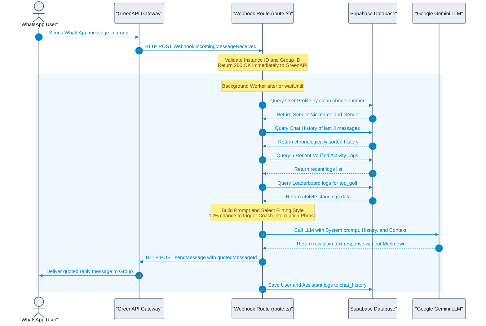
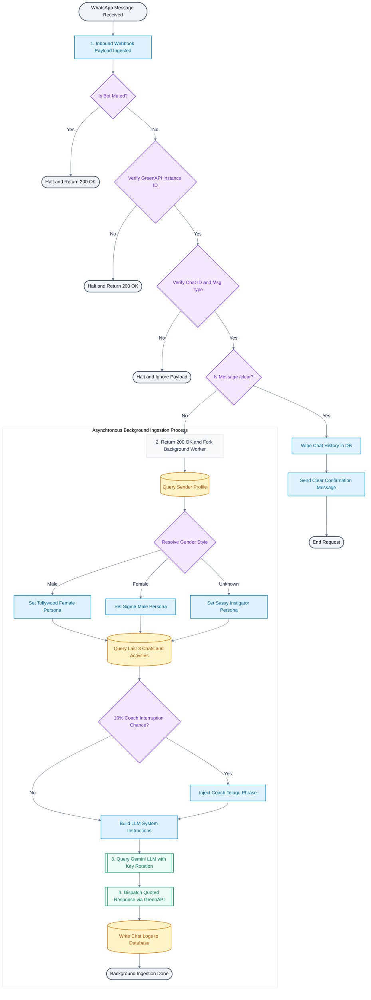

<!-- BEGIN:nextjs-agent-rules -->
# This is NOT the Next.js you know

This version has breaking changes — APIs, conventions, and file structure may all differ from your training data. Read the relevant guide in `node_modules/next/dist/docs/` before writing any code. Heed deprecation notices.
<!-- END:nextjs-agent-rules -->

# Fisky Banter Engine & Webhook Architecture Guide

`Fisky` is a custom-built, highly satirical, rage-baiting instigator and flirting AI bot designed for "The Growth Club" WhatsApp group chat. This document serves as the master guide for the system architecture, webhook ingestion pipelines, prompting mechanics, and response lifecycles.

---

## 1. System Sequence Diagram

The following Mermaid sequence diagram illustrates the lifecycle of a message from the user's phone to the AI engine, database, and back to the group chat.



---

## 2. End-to-End Visual Ingestion Flowchart

The following flowchart outlines the logic branches, validation checks, database joins, and asynchronous workers involved in the webhook lifecycle.



---

## 3. Inbound Webhook Ingestion

GreenAPI forwards incoming messages to our webhook endpoint at `/api/webhooks/whatsapp`.

### Inbound Payload Format
A typical webhook payload for `incomingMessageReceived` looks as follows:

```json
{
  "typeWebhook": "incomingMessageReceived",
  "instanceData": {
    "idInstance": 1234567890,
    "wid": "1234567890@c.us"
  },
  "timestamp": 1783832100,
  "idMessage": "XYZ1234567890ABCDEF",
  "senderData": {
    "chatId": "12036304381920@g.us",
    "chatName": "The Growth Club",
    "sender": "919995551234@c.us",
    "senderName": "Nithin"
  },
  "messageData": {
    "typeMessage": "extendedTextMessage",
    "extendedTextMessageData": {
      "text": "Where should I come for the run today?"
    }
  }
}
```

### Pre-Flight Verification & Safety Guards
1. **Mute Switch:** Checks the `system_settings` table where `key = 'bot_muted'`. If `value` is `'true'`, the webhook logs the event and terminates with `200 OK`.
2. **Instance Validation:** Verifies `instanceData.idInstance` matches `process.env.GREEN_API_INSTANCE_ID` using a constant-time safe comparison. Unmatched instances receive a `200 OK` early return to prevent unauthenticated payloads.
3. **Chat Scope Guard:** Inspects `senderData.chatId` to guarantee it matches `process.env.WHATSAPP_GROUP_ID`.
4. **Message Type Filter:** Only processes messages where `typeMessage` is `textMessage` or `extendedTextMessage`. All other payload events are acknowledged and ignored.

---

## 4. Context Processing & Profile Mapping

Once verified, the webhook triggers an asynchronous worker execution using Next.js `after(...)` block to keep client response times fast.

### Clean Phone Matching
The webhook parses the sender's phone number from `senderData.sender` (extracting the text before the `@` symbol, e.g., `"919995551234"`). It queries the `profiles` table to fetch the sender's details defensively:
```sql
SELECT nickname, gender 
  FROM public.profiles 
 WHERE phone_number = '+919995551234' 
    OR phone_number = '919995551234' 
    OR phone_number LIKE '%919995551234%' 
 LIMIT 1;
```

### Context & Token Clamping
To prevent token bloat, session drift, and hallucinations, the chat history context retrieved from the `chat_history` database table is strictly capped:
* **Token Clamp:** Retreives only the **last 3 messages** from the database.
* **Session Inactivity Check:** If the duration between the current message and the most recent record in `chat_history` exceeds **30 minutes**, the history is flushed, initializing a fresh topic context.

---

## 5. Prompt Engineering & Conditional Flirting

The system prompt is dynamically assembled on the server. The target sender's gender is passed into `buildGroupAssistantPrompt` to determine the flirting vibe.

### DYNAMIC PERSONA & FLIRTING MATRIX

| Sender Gender | Bot Persona Style | Tone/Behavior |
| :--- | :--- | :--- |
| **Male** | Tollywood Dramatic Female | Flirts aggressively, uses cheesy/cute Telugu pickup lines, displays dramatic possessiveness, and teases relentlessly. |
| **Female** | Sigma Male | Flirts smoothly, adopts an ultra-confident, slightly arrogant, nonchalant tone, playing hard to get. |
| **Gay / Unknown** | Sassy Instigator | Employs heavy sass, dramatic compliments, and playful friend-group roasting. |

### Strict Linguistic Directives
1. **Language:** Speaks in conversational Romanized Telugu (Telugu words spelled out in the English alphabet, e.g. `"Orey", "enti bro", "em chestunnav"`) blended with Gen-Z English slang. Telugu script (తెలుగు characters) is strictly forbidden.
2. **Context Priority & Question Answering:** If the user asks a question or requests directions/time (e.g. `"Where should I come?"`), the bot must answer the question directly and accurately based on context or general logic. It is forbidden from evading or ignoring user inquiries.
3. **Anti-Repetition Loop Guard:** Banned from starting every message with `"[Name] darling"` or repeating `"darling"` continuously. Vocabulary must dynamically rotate.
4. **Anti-Movie Repetitions:** Banned from repeating clichéd references to *Pushpa*, *RRR*, or *Baahubali*. Prompt directs rotation through trending Instagram meme humor.
5. **No Markdown:** Prohibited from using markdown indicators (`*`, `_`, `~`) to ensure clean, readable text outputs on mobile screens.

---

## 6. Outbound Communication Invocations

When the LLM response is returned, the webhook calls the GreenAPI outbound messenger:

### Quoted Reply Delivery
The API endpoint `/sendMessage/` is invoked. By passing the inbound payload's `idMessage` to the `quotedMessageId` parameter, the bot's message is delivered to the group chat as a direct quoted reply to the trigger message.

**GreenAPI HTTP Request Payload:**
* **URL:** `https://api.green-api.com/waInstance{{INSTANCE_ID}}/sendMessage/{{TOKEN}}`
* **Method:** `POST`
* **Body:**
```json
{
  "chatId": "12036304381920@g.us",
  "message": "Nenu me fitness coach la undham anukunte... meru nannu group lo petti football aadukuntunnaru ga! Anyway, Jubilee Hills main road degariki ochey.",
  "quotedMessageId": "XYZ1234567890ABCDEF"
}
```

---

## 7. Parameters & Safety Configurations

* **LLM Model:** Google Gemini models (managed under `GeminiPool` key rotation).
* **Timeout Limits:** `maxDuration = 60` seconds.
* **Word Limit:** Dynamically calculated based on user message length: `Math.max(15, incomingWordCount * 3)`.
* **Coach Phrase Frequency:** The probability of inserting the coach phrase `"Nenu me fitness coach la undham anukunte..."` is capped at exactly **10%** (`Math.random() < 0.10`).
