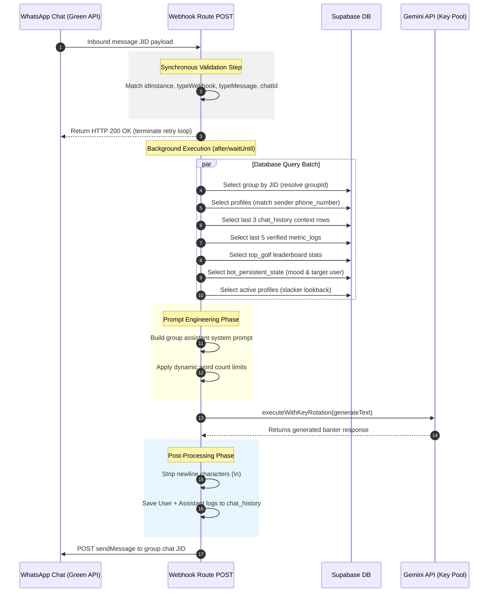

# 05 — WhatsApp Agent

> **Service**: Conversational AI Banter Engine ("Fisky")
> **Integration Gateway**: Green API (JID-based message routing)
> **Asynchronous Process**: Executed via Next.js `after()` background execution
> **Source of Truth**: [app/api/webhooks/whatsapp/route.ts](file:///c:/Users/nithi/Downloads/Beyond-Yesterday/beyond-yesterday-app/app/api/webhooks/whatsapp/route.ts), [lib/ai/prompts.ts](file:///c:/Users/nithi/Downloads/Beyond-Yesterday/beyond-yesterday-app/lib/ai/prompts.ts), [lib/whatsapp.ts](file:///c:/Users/nithi/Downloads/Beyond-Yesterday/beyond-yesterday-app/lib/whatsapp.ts)

---

## 1. Webhook Ingestion & Validation Execution Trace

The endpoint `POST /api/webhooks/whatsapp` processes incoming WhatsApp payloads. The sequential validation steps are executed as follows:

1. **Environment Integrity Check**:
   - The handler evaluates environmental keys: `GEMINI_API_KEY`, `GREEN_API_INSTANCE_ID`, `GREEN_API_TOKEN`, `WHATSAPP_GROUP_ID`, and `SUPABASE_SERVICE_ROLE_KEY`.
   - If any key is missing, logs the missing keys and terminates with HTTP `200 OK` (to halt gateway retries).

2. **Instance ID Match**:
   - Extracts the incoming instance ID from `body.instanceData.idInstance`.
   - Compares it with `process.env.GREEN_API_INSTANCE_ID` using timing-safe `safeCompare()`.
   - Rejects mismatching instances immediately with HTTP `200 OK`.

3. **Webhook and Message Type Filtering**:
   - Asserts that `body.typeWebhook` exactly matches `'incomingMessageReceived'`.
   - Asserts that `body.messageData.typeMessage` matches either `'textMessage'` or `'extendedTextMessage'`.
   - Returns HTTP `200 OK` for all other event types (e.g., status updates, delivery receipts).

4. **Group Chat Scope Check**:
   - Extracts target group identifier from `body.senderData.chatId`.
   - Verifies it matches `process.env.WHATSAPP_GROUP_ID`.
   - Mismatches return HTTP `200 OK` immediately.

5. **Message Content Extraction**:
   - Parses text message content using `extractMessageText(body)`.
   - If no text content is extracted, ignores the webhook and returns HTTP `200 OK`.

6. **Clear Memory Wipe Command (`/clear`)**:
   - Checks if message matches `/clear` (case-insensitive).
   - If matched, executes a hard DELETE on the `chat_history` table for the group.
   - Dispatches confirmation message `🧹 Memory Cleared!` to the WhatsApp group and terminates with HTTP `200 OK`.

(source: [webhooks/whatsapp/route.ts L60-136](file:///c:/Users/nithi/Downloads/Beyond-Yesterday/beyond-yesterday-app/app/api/webhooks/whatsapp/route.ts#L60-L136))

---

## 2. Asynchronous Pipeline Sequence Diagram



---

## 3. Outgoing Messaging Payload Specifications

Outbound communications target the Green API HTTP endpoints directly.

### 3.1 Plain Text Dispatch (`sendMessage`)

- **Endpoint**: `https://api.green-api.com/waInstance{instanceId}/sendMessage/{token}`
- **Headers**:
  ```http
  Content-Type: application/json
  ```
- **Body JSON shape**:
  ```json
  {
    "chatId": "1203632971203@g.us",
    "message": "Atluntadi manatho! Nuvvu log chesinadhi scale level daatipoindi ra mama!"
  }
  ```

### 3.2 Multimodal Media Dispatch (`sendFileByUrl`)

- **Endpoint**: `https://api.green-api.com/waInstance{instanceId}/sendFileByUrl/{token}`
- **Headers**:
  ```http
  Content-Type: application/json
  ```
- **Body JSON shape**:
  ```json
  {
    "chatId": "1203632971203@g.us",
    "urlFile": "https://xxxxx.supabase.co/storage/v1/object/public/memories/group-uuid/image.jpg",
    "fileName": "photo.jpg",
    "caption": "📸 *Athlete nickname just added a new Memory!*\n\n💬 \"Fun image caption generated by multimodal AI!\""
  }
  ```

(source: [app/actions/memories.ts L163-174](file:///c:/Users/nithi/Downloads/Beyond-Yesterday/beyond-yesterday-app/app/actions/memories.ts#L163-L174))

---

## 4. Gemini Prompt Architecture

### 4.1 System Rules Configuration (`CUSTOM_SYSTEM_RULES`)

The LLM is constrained by standard rules compiled in [prompts.ts](file:///c:/Users/nithi/Downloads/Beyond-Yesterday/beyond-yesterday-app/lib/ai/prompts.ts):
1. **Instigator Role**: Sarcastic, instigating friend-group persona. Borderline roasts and playful rizz.
2. **Linguistic Constraint**: Speaks in conversational Romanized Telugu (spelled in Latin script, e.g., `"enti mama"`). Telugu alphabet characters are strictly forbidden.
3. **Local Address Terms**: Uses tags: *Orey, Mama, Macha, Guru, Chief, Bhai, Kaka*.
4. **Sentence Endings**: Appends endings: *...anta kadha, ...em chestham cheppu, ...lite le ra, ...scene ledu, ...chills kottochu ga*.
5. **No Cinematic Cliches**: Banned from mentioning *Baahubali, RRR, Pushpa, or "Thaggedhele"*. Rotates modern pop culture context instead.
6. **Data Guardrail**: Under normal chat conditions, do NOT output workout statistics, rankings, or decimal numbers unless the user's message is a direct question about standings.
7. **Flirting Rizz Matrix**:
   - Target Male: Tollywood heroine persona. Flirts aggressively, acts possessive and dramatic.
   - Target Female: Sigma male persona. Flirts with cool, arrogant, and smooth rizz.
   - Unknown/Neutral: Heavy sarcasm, friend roasts.

### 4.2 Lore and Slang Context Merging

- **Vocabulary Injection**: Resolves word arrays dynamically at prompt assembly time. Evaluates chosen tone and sender gender mapping through `getSlangFor(tone, gender)` to supply localized slag terms.
- **Lore Context Integration**: If `member_lore` exists for the target user, lists of stunts, habits, ego triggers, and catchphrases are concatenated as system text:
  ```
  === ATHLETE PROFILE LORE ===
  Athlete Nickname: "Chief"
  Stunts: "underwater breath hold 2 mins"
  Bad habits: "late sleeper, wakes up at noon"
  Nemesis: "Kaushik"
  ```
  The LLM is instructed to reference this lore to customize its response.

### 4.3 Output Clamping & Formatting

- **Dynamic Word Count Clamp**: Calculates the word limit budget dynamically before invoking Gemini:
  $$\text{Target Word Limit} = \max(15, \text{Incoming Word Count} \times 3)$$
- **Newline Stripping**: Gemini is instructed to return the text on a single line. The response is processed through replacement filters:
  ```typescript
  const cleanReply = generatedText.trim().replace(/\n/g, ' ');
  ```
  This removes all paragraph breaks to keep message delivery within a single bubble container.

---

## 5. Fallback Chain & Resilience Engine

### 5.1 Key Rotation and Degradation Chain

The utility `executeWithKeyRotation()` maintains operations across failures:

```
+--------------------------------------------------------+
|              API Request Execution Loop                |
+--------------------------------------------------------+
                           │
                           ▼
          [Resolve next API Key in Pool]
                           │
                           ▼
        [Select highest Model: gemini-2.0-flash-lite]
                           │
                           ▼
                 [Execute API Request]
                           │
            ┌──────────────┴──────────────┐
         Success                       Failure
            │                             │
            ▼                             ▼
     [Return Result]             [Evaluate Error Code]
                                          │
            ┌─────────────────────────────┼─────────────────────────────┐
        Rate Limit (429)           Key Invalidation (400)          Other Error
            │                             │                             │
            ▼                             ▼                             ▼
[Downgrade Model to 3.1]       [Mark Key Blocked]               [Halt Execution]
            │                             │                             │
            ▼                             ▼                             ▼
    [Retry Request]            [Move to Next Key Pool]           [Throw Error]
```

### 5.2 Error Containment (Fail-Safe)

- If key pool rotation is exhausted, or the generation fails, the background processor catches the error.
- The webhook handler returns a standard HTTP `200 OK` with JSON payload `{ ok: true, error: '...' }` to the Green API gateway.
- Prevents Green API from triggering a retry storm that could exhaust resources or trigger server limits.
