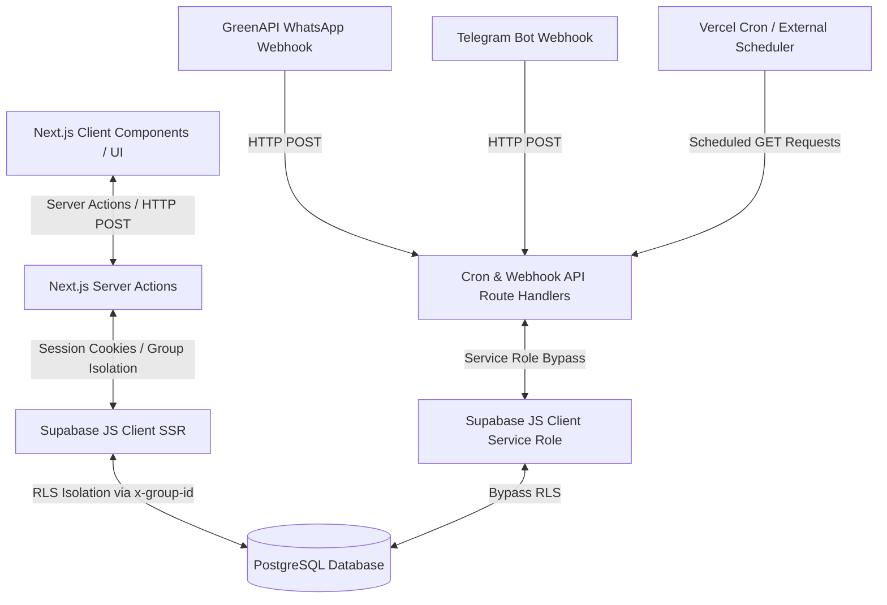
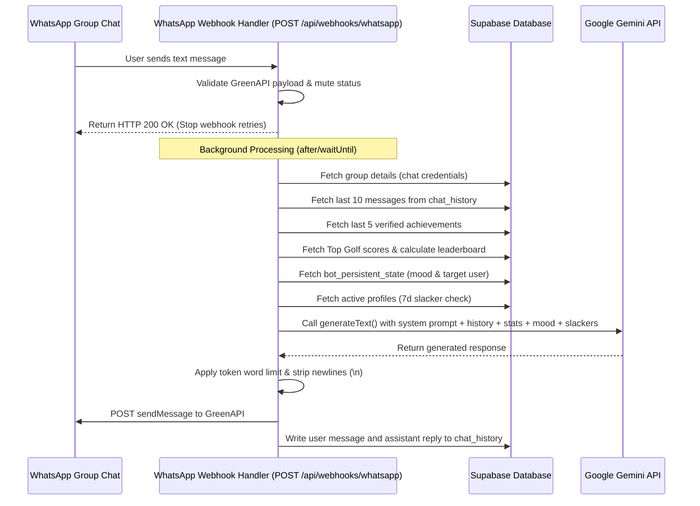
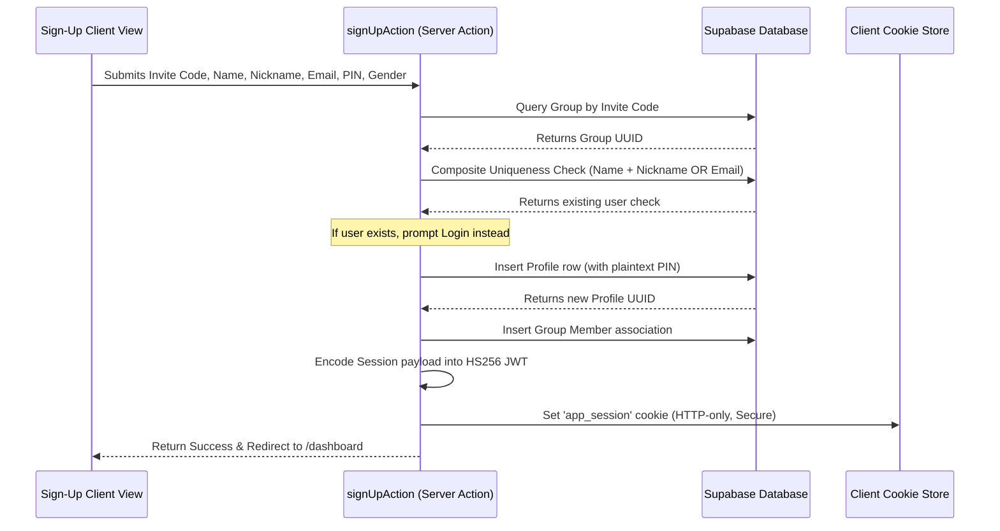
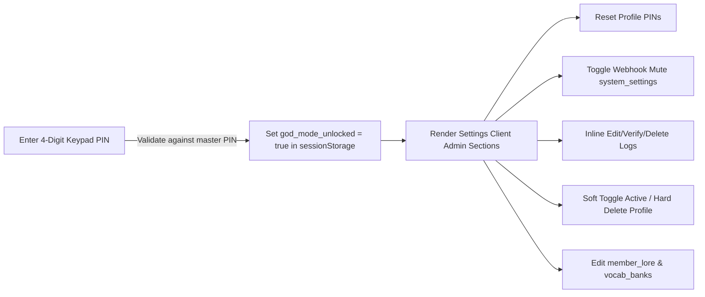

# Beyond Yesterday — Master System Reference Manual

This document serves as the definitive, exhaustive technical encyclopedia for the Growth Club dashboard application. It provides a complete, file-by-file blueprint of the architecture, database schema, RLS policies, UX tokens, AI logic, webhook routes, and core platform workflows.

---

## SECTION 1: SYSTEM ARCHITECTURE & TECH STACK

### 1.1 High-Level Architecture
The application is built using the **Next.js App Router (v16.2)** framework, using a hybrid rendering strategy that mixes React Server Components (RSC) and Client Components.



#### Rendering Strategies & Data Lifecycle
- **Server Components (RSC):** Utilized for layout structures, navigation frames, and the main pages (e.g., `/dashboard/page.tsx`, `/dashboard/leaderboard/page.tsx`). They query the database directly using `createServerClient` to fetch page-load states, reducing bundle size and client latency.
- **Client Components ('use client'):** Used for interactive modals (e.g., `AddActivityModal.tsx`, `PeerReviewModal.tsx`), charting canvases (`MetricChart.tsx` wrapping Apache ECharts), the SWR-backed Gang roster (`GangPage.tsx`), and the God Mode admin console (`SettingsClient.tsx`).
- **Rendering Directives:**
  - Pages use dynamic data resolving: they pull search parameters (e.g., `?metric=...`, `?range=...`) as reactive triggers to parallelize Supabase fetching.
  - Page-level cache invalidation is driven by Server Action mutations using Next.js `revalidatePath('/', 'layout')` or `revalidatePath('/settings/metrics')`. This immediately purges the Next.js router cache and prompts fresh renders upon logging activities, casting votes, or updating settings.

### 1.2 External Integrations
1. **Supabase (Backend-as-a-Service):**
   - **Auth:** Not tied to `auth.users`. Rather, a lightweight **Kiosk Authentication Model** is implemented where user identities are verified via group-scoped 4-digit PINs.
   - **Database:** PostgreSQL instance storing profiles, metric logs, peer reviews, lore data, and slang vocabulary.
   - **Storage:** Public `memories` bucket for shared photos, organized in folder paths structured as `${groupId}/${fileName}`.
   - **Connection Pooler:** Serves database connections to Next.js Serverless functions securely, using PgBouncer for transaction pooling.
2. **GreenAPI (WhatsApp API Gateway):**
   - Serves as the webhook receiver for incoming group chat banter (`incomingMessageReceived`).
   - Serves as the outbound message dispatcher via the `/sendMessage/` and `/sendFileByUrl/` endpoints.
3. **Google Gemini LLM:**
   - Generates natural language responses for WhatsApp group banter.
   - Parses incoming activities from natural language strings into structured JSON objects.
   - Generates contextual image captions for shared memories.
4. **Vercel Serverless Deployment:**
   - Hosts the Next.js application, executing Server Actions and webhook/cron route handlers as serverless functions.
   - Configured with `maxDuration = 60` for LLM route processing.
5. **Google Health API v4:**
   - Provides sync engines to retrieve steps, resting heart rate, and sleep metrics.
6. **Telegram Bot Webhook Integration:**
   - Ingests textual activity updates from a Telegram bot.

### 1.3 Environment Variables (`.env.local`)

| Variable Name | Exposure Scope | Operational Purpose |
|---|---|---|
| `NEXT_PUBLIC_SUPABASE_URL` | Client & Server | The endpoint URL of the Supabase project. Used by SSR and browser clients to resolve database requests. |
| `NEXT_PUBLIC_SUPABASE_ANON_KEY` | Client & Server | The public client API key. Subject to Row Level Security (RLS) constraints. |
| `SUPABASE_SERVICE_ROLE_KEY` | Server-Only | High-privilege API key used to bypass RLS policies for administrative actions (PIN resets, user deactivations). |
| `GEMINI_API_KEY` | Server-Only | API key for Gemini LLM. Used for structured logging extraction and group banter. |
| `GEMINI_API_KEYS` | Server-Only | Optional comma-separated list of multiple Gemini API keys. Enables pool rotation to prevent rate limiting. |
| `GOOGLE_GENERATIVE_AI_API_KEY` | Server-Only | Alternative environment key fallback for the Gemini API. |
| `GREEN_API_INSTANCE_ID` | Server-Only | Unique instance identifier for the GreenAPI WhatsApp gateway. |
| `GREEN_API_TOKEN` | Server-Only | API access token for the GreenAPI WhatsApp gateway. |
| `WHATSAPP_GROUP_ID` | Server-Only | Target WhatsApp group JID (`xxxx@g.us`) to filter incoming messages and dispatch outbound replies. |
| `GOOGLE_CLIENT_ID` | Server-Only | Client ID for Google Health OAuth integration. |
| `GOOGLE_CLIENT_SECRET` | Server-Only | Client Secret for Google Health OAuth integration. |
| `SESSION_SECRET` | Server-Only | Secret key (min 32 characters) used to sign and encrypt the `app_session` JWT. |
| `CRON_SECRET` | Server-Only | Bearer token verified in request headers (`Authorization: Bearer <secret>`) to authorize cron trigger endpoints. |
| `NEXT_PUBLIC_APP_URL` | Client & Server | The public root URL of the deployment (e.g. `https://beyond-yesterday-app.vercel.app`). Used for OAuth redirects. |
| `TELEGRAM_WEBHOOK_SECRET` | Server-Only | Secret verification token sent in the `X-Telegram-Bot-Api-Secret-Token` header by Telegram webhook requests. |

---

## SECTION 2: COMPLETE DATABASE SCHEMA & RLS POLICIES

### 2.1 Database Schema Reference

#### Table: `groups`
Stores isolated training clusters.
- **PK:** `id` (uuid)
- **Constraints & Indexes:** `invite_code` (unique)
- **SQL Structure:**
| Column Name | Data Type | Constraints | Default Value | Description |
|---|---|---|---|---|
| `id` | `uuid` | PK | `uuid_generate_v4()` | Unique group ID |
| `name` | `text` | NOT NULL | None | Group name (e.g., 'Texas Buds') |
| `invite_code` | `text` | UNIQUE | None | Join code used during signup |
| `whatsapp_instance_id` | `text` | None | NULL | Group-specific GreenAPI instance id |
| `whatsapp_token` | `text` | None | NULL | Group-specific GreenAPI token |
| `whatsapp_group_id` | `text` | None | NULL | Group-specific WhatsApp JID |
| `created_at` | `timestamptz` | NOT NULL | `now()` | Timestamp when the group was created |

#### Table: `profiles`
Represents individual athletes. Identities are resolved using the `app_session` cookie containing the profile's UUID.
- **PK:** `id` (uuid)
- **Constraints & Indexes:** `email` UNIQUE (`profiles_email_unique`), `phone_number` UNIQUE (`profiles_phone_number_unique`), `(group_id, pin)` UNIQUE (`profiles_group_pin_key`), index on `is_active`
- **SQL Structure:**
| Column Name | Data Type | Constraints | Default Value | Description |
|---|---|---|---|---|
| `id` | `uuid` | PK | `uuid_generate_v4()` | Unique profile ID |
| `full_name` | `text` | NOT NULL | None | First name (no spaces) |
| `nickname` | `text` | NOT NULL | None | Display nickname |
| `email` | `text` | UNIQUE, NOT NULL | None | Email address |
| `pin` | `varchar(4)` | None | None | 4-character personal PIN |
| `avatar_url` | `text` | None | NULL | URL to profile picture |
| `telegram_user_id` | `text` | UNIQUE | NULL | Telegram user JID for bot extraction |
| `total_xp` | `integer` | NOT NULL | `0` | Cumulative XP awarded for verified logs |
| `current_level` | `integer` | NOT NULL | `1` | Calculated level |
| `gender` | `text` | NOT NULL | None | Profile gender ('Male' or 'Female') |
| `role` | `text` | None | `'member'` | App role ('member', 'co-admin', 'admin') |
| `group_id` | `uuid` | FK references `groups(id)` ON DELETE CASCADE | NULL | Primary group context |
| `phone_number` | `text` | UNIQUE, NOT NULL | None | WhatsApp user JID/Phone number |
| `is_active` | `boolean` | None | `true` | Soft-delete active flag |
| `created_at` | `timestamptz` | NOT NULL | `now()` | Registration timestamp |

#### Table: `group_members`
A join table resolving member groupings.
- **PK:** composite `(user_id, group_id)`
- **Constraints & Indexes:** Index on `group_id`
- **SQL Structure:**
| Column Name | Data Type | Constraints | Default Value | Description |
|---|---|---|---|---|
| `user_id` | `uuid` | PK, FK references `profiles(id)` ON DELETE CASCADE | None | User profile reference |
| `group_id` | `uuid` | PK, FK references `groups(id)` ON DELETE CASCADE | None | Group reference |
| `role` | `text` | None | `'member'` | Role within the group ('admin', 'member') |
| `joined_at` | `timestamptz` | NOT NULL | `now()` | Association timestamp |

#### Table: `metrics_config`
Static, system-wide metrics catalog.
- **PK:** `id` (uuid)
- **Constraints & Indexes:** `slug` (unique)
- **SQL Structure:**
| Column Name | Data Type | Constraints | Default Value | Description |
|---|---|---|---|---|
| `id` | `uuid` | PK | `uuid_generate_v4()` | System ID |
| `slug` | `text` | UNIQUE, NOT NULL | None | Identifier (e.g. 'top_golf', 'weight') |
| `display_name` | `text` | NOT NULL | None | Display title |
| `unit` | `text` | NOT NULL | None | Measurement unit |
| `sort_order` | `sort_order_enum` | NOT NULL | `'desc'` | Sorting direction ('asc' or 'desc') |
| `xp_reward` | `integer` | NOT NULL | `25` | XP awarded upon log verification |
| `created_at` | `timestamptz` | NOT NULL | `now()` | Configuration timestamp |

#### Table: `metric_logs`
Chronological activity ledger.
- **PK:** `id` (uuid)
- **Constraints & Indexes:** FK constraints to `profiles` and `groups`, indexes on `group_id`, `user_id`, `metric_slug`, `status`, and `logged_at desc`
- **SQL Structure:**
| Column Name | Data Type | Constraints | Default Value | Description |
|---|---|---|---|---|
| `id` | `uuid` | PK | `uuid_generate_v4()` | Log ID |
| `user_id` | `uuid` | FK references `profiles(id)` ON DELETE CASCADE | None | Athlete who logged the metric |
| `group_id` | `uuid` | FK references `groups(id)` ON DELETE CASCADE | None | Group scope context |
| `metric_slug` | `text` | NOT NULL | None | Config slug or custom metric UUID |
| `value` | `numeric` | NOT NULL | None | Logged numeric performance |
| `unit` | `text` | NOT NULL | `''` | Measurement unit |
| `status` | `text` | CHECK ('pending', 'verified', 'rejected') | `'pending'` | Ingestion state |
| `evidence_url` | `text` | None | NULL | Optional media attachment |
| `caption` | `text` | None | NULL | Optional description or duration string |
| `duration_seconds` | `integer` | None | NULL | Compressed time duration in seconds |
| `headline` | `text` | None | NULL | Custom display header |
| `logged_at` | `timestamptz` | NOT NULL | `now()` | Log validation/timestamp date |

#### Table: `log_votes`
Peer review database for logging verification.
- **PK:** `id` (uuid)
- **Constraints & Indexes:** UNIQUE `(log_id, user_id)`, index on `log_id`
- **SQL Structure:**
| Column Name | Data Type | Constraints | Default Value | Description |
|---|---|---|---|---|
| `id` | `uuid` | PK | `uuid_generate_v4()` | Vote ID |
| `log_id` | `uuid` | FK references `metric_logs(id)` ON DELETE CASCADE | None | Log under verification |
| `user_id` | `uuid` | FK references `profiles(id)` ON DELETE CASCADE | None | Reviewer profile ID |
| `cast_at` | `timestamptz` | NOT NULL | `now()` | Voting timestamp |

#### Table: `metric_definitions`
Group-scoped custom dynamic metrics.
- **PK:** `id` (uuid)
- **Constraints & Indexes:** FK references `groups(id)`, index on `group_id`, index on `is_hidden`
- **SQL Structure:**
| Column Name | Data Type | Constraints | Default Value | Description |
|---|---|---|---|---|
| `id` | `uuid` | PK | `uuid_generate_v4()` | Metric definition ID |
| `name` | `text` | NOT NULL | None | Dynamic label (must contain emoji) |
| `unit` | `text` | NOT NULL | None | Custom measurement unit |
| `sort_direction` | `text` | CHECK ('asc', 'desc') | None | Custom ranking sort direction |
| `group_id` | `uuid` | FK references `groups(id)` ON DELETE CASCADE | NULL | Scope isolation key |
| `is_hidden` | `boolean` | NOT NULL | `false` | soft-hide toggle |
| `created_at` | `timestamptz` | NOT NULL | `now()` | Registration timestamp |

#### Table: `bot_persistent_state`
Stores group-scoped persistent mood and active targeted user roasts/rizz directives for the AI chatbot.
- **PK:** `group_id` (uuid)
- **Constraints & Indexes:** FK references `groups(id)` ON DELETE CASCADE, FK references `profiles(id)` ON DELETE SET NULL
- **SQL Structure:**
| Column Name | Data Type | Constraints | Default Value | Description |
|---|---|---|---|---|
| `group_id` | `uuid` | PK, FK references `groups(id)` ON DELETE CASCADE | None | Target group reference |
| `persistent_mood` | `text` | CHECK IN ('Normal', 'Angry', 'Sad', 'Horny', 'Happy', 'Flirting', 'Romantic', 'Arrogant', 'Sarcastic') | `'Normal'` | The active emotional vibe of the bot |
| `target_user_id` | `uuid` | FK references `profiles(id)` ON DELETE SET NULL | NULL | Profile ID of targeted member |
| `updated_at` | `timestamptz` | NOT NULL | `now()` | Last settings update date |

#### Table: `wearable_connections`
Wearable account tokens.
- **PK:** `id` (uuid)
- **Constraints & Indexes:** UNIQUE `(user_id, provider)`, index on `user_id`
- **SQL Structure:**
| Column Name | Data Type | Constraints | Default Value | Description |
|---|---|---|---|---|
| `id` | `uuid` | PK | `uuid_generate_v4()` | Connection ID |
| `user_id` | `uuid` | FK references `profiles(id)` ON DELETE CASCADE | None | Athlete profile |
| `provider` | `text` | NOT NULL | None | Provider name (e.g., 'whoop', 'google_health_v4') |
| `access_token` | `text` | NOT NULL | None | Google Health Access Token |
| `refresh_token` | `text` | NOT NULL | None | Google Health Refresh Token |
| `expires_at` | `timestamptz` | NOT NULL | None | Token expiration timestamp |
| `last_synced_at` | `timestamptz` | None | NULL | Date/time of last sync |
| `backfill_completed` | `boolean` | NOT NULL | `false` | Backfill completed flag |
| `created_at` | `timestamptz` | NOT NULL | `now()` | Record creation date |

#### Tables: `wearable_steps`, `wearable_sleep`, `wearable_resting_hr`
Internal caching ledger for wearable sync.
- **PK:** `id` (uuid)
- **Constraints & Indexes:** UNIQUE `(connection_id, logged_date)`, UNIQUE `(user_id, logged_date)`
- **SQL Structure:**
| Column Name | Data Type | Constraints | Default Value | Description |
|---|---|---|---|---|
| `id` | `uuid` | PK | `uuid_generate_v4()` | Row ID |
| `connection_id` | `uuid` | FK references `wearable_connections(id)` ON DELETE CASCADE | None | Parent wearable connection |
| `user_id` | `uuid` | FK references `profiles(id)` ON DELETE CASCADE | None | Target athlete profile |
| `logged_date` | `date` | NOT NULL | None | Target sync date |
| `value` | `integer` / `numeric` | NOT NULL | None | Synced steps, resting bpm, or sleep hours |
| `source` | `text` | None | `'wearable_sync'` | Ingestion source label |
| `updated_at` | `timestamptz` | NOT NULL | `now()` | Cache update timestamp |

#### Table: `memories`
Shared community photo album.
- **PK:** `id` (uuid)
- **Constraints & Indexes:** FK constraints, indexes on `group_id`, `user_id`, `created_at desc`, `deleted_at`
- **SQL Structure:**
| Column Name | Data Type | Constraints | Default Value | Description |
|---|---|---|---|---|
| `id` | `uuid` | PK | `uuid_generate_v4()` | Memory ID |
| `group_id` | `uuid` | FK references `groups(id)` ON DELETE CASCADE | None | Isolation group scope |
| `user_id` | `uuid` | FK references `profiles(id)` ON DELETE CASCADE | None | Uploader profile |
| `image_url` | `text` | NOT NULL | None | Public Supabase Storage URL |
| `caption` | `text` | None | NULL | Situational text / AI caption |
| `created_at` | `timestamptz` | NOT NULL | `now()` | Upload timestamp |
| `deleted_at` | `timestamptz` | None | NULL | Soft-delete timestamp |

#### Table: `memory_comments`
Discussion threads on shared memories.
- **PK:** `id` (uuid)
- **Constraints & Indexes:** FK constraints, indexes on `memory_id`, `user_id`
- **SQL Structure:**
| Column Name | Data Type | Constraints | Default Value | Description |
|---|---|---|---|---|
| `id` | `uuid` | PK | `uuid_generate_v4()` | Comment ID |
| `memory_id` | `uuid` | FK references `memories(id)` ON DELETE CASCADE | None | Target memory ID |
| `user_id` | `uuid` | FK references `profiles(id)` ON DELETE CASCADE | None | Commenter profile ID |
| `content` | `text` | NOT NULL | None | Comment string |
| `created_at` | `timestamptz` | NOT NULL | `now()` | Creation timestamp |

#### Table: `chat_history`
Short-term WhatsApp bot conversation memory.
- **PK:** `id` (uuid)
- **Constraints & Indexes:** FK references `groups(id)`, CHECK on `role`, indexes on `group_id`, `created_at desc`
- **SQL Structure:**
| Column Name | Data Type | Constraints | Default Value | Description |
|---|---|---|---|---|
| `id` | `uuid` | PK | `uuid_generate_v4()` | History row ID |
| `group_id` | `uuid` | FK references `groups(id)` ON DELETE CASCADE | None | Group chat context |
| `role` | `text` | CHECK ('user', 'assistant', 'system') | None | Message author |
| `sender_name` | `text` | None | NULL | Sender nickname |
| `content` | `text` | NOT NULL | None | Text content |
| `created_at` | `timestamptz` | NOT NULL | `now()` | Ingestion timestamp |

#### Table: `member_lore`
Inside jokes and personality modifiers for LLM context.
- **PK:** `user_id` (uuid)
- **Constraints & Indexes:** FK references `profiles(id)`, FK references `profiles(id)` for nemesis
- **SQL Structure:**
| Column Name | Data Type | Constraints | Default Value | Description |
|---|---|---|---|---|
| `user_id` | `uuid` | PK, FK references `profiles(id)` ON DELETE CASCADE | None | Target athlete profile |
| `stunts` | `text[]` | None | `'{}'` | Memorable events or stunts |
| `good_habits` | `text[]` | None | `'{}'` | Workout routines / behaviors |
| `bad_habits` | `text[]` | None | `'{}'` | Funny slacker routines |
| `ego_trigger` | `text` | None | NULL | What prompts them to react |
| `catchphrase` | `text` | None | NULL | Personal signature line |
| `nemesis_id` | `uuid` | FK references `profiles(id)` ON DELETE SET NULL | NULL | Roster nemesis reference |

#### Table: `vocab_banks`
Slang routing arrays for targeted roasts.
- **PK:** `id` (uuid)
- **Constraints & Indexes:** UNIQUE `(tone, target_gender)`
- **SQL Structure:**
| Column Name | Data Type | Constraints | Default Value | Description |
|---|---|---|---|---|
| `id` | `uuid` | PK | `gen_random_uuid()` | ID |
| `tone` | `text` | NOT NULL | None | Target vibe (e.g., 'ragebait', 'motivate') |
| `target_gender` | `text` | NOT NULL | None | Gender alignment ('Male', 'Female', 'Gay', 'Neutral') |
| `words` | `text[]` | NOT NULL | None | Routed Romanized Telugu terms |

#### Table: `system_settings`
Global system-level settings parameters.
- **PK:** `key` (text)
- **SQL Structure:**
| Column Name | Data Type | Constraints | Default Value | Description |
|---|---|---|---|---|
| `key` | `text` | PK | None | Setting configuration slug |
| `value` | `text` | NOT NULL | None | Configuration setting value |

---

### 2.2 Soft Delete vs. Hard Delete Engines

#### User Accounts (Profiles)
- **Soft Delete:** Driven by the `profiles.is_active` boolean flag. In normal application routing, when an administrator toggles a member inactive, the database record remains intact. However, frontend actions (e.g., `fetchGangRoster`, `LeaderboardPage` query) exclude inactive accounts by appending `.neq('profiles.is_active', false)`. This keeps their history while hiding them from active UI rosters.
- **Hard Delete:** Triggered in the Settings screen via the "Hard Delete" button. This invokes `adminHardDeleteUser()`, running a `DELETE` command on `profiles` where `id = targetUserId`. Since the schema declares foreign key relationships on `group_members`, `metric_logs`, `log_votes`, `memories`, and `member_lore` as `ON DELETE CASCADE`, this completely purges the user's data from the system.

#### Custom Metrics (`metric_definitions`)
- **Soft Hide:** Modifies `metric_definitions.is_hidden` to `true` via `adminToggleMetricHidden()`. This prevents the metric from rendering in the primary metric selector pills on `/dashboard` and `/dashboard/leaderboard`.
- **Hard Purge:** Handled via `adminDeleteMetricDefinition()`, deleting the definition row. Any logged entries referencing this metric ID are cascading-deleted if they rely on dynamic keys.

---

### 2.3 Row Level Security (RLS) Policies
Row Level Security is enabled on all tables in the `public` schema.

#### Isolation Mechanism: PostgREST request headers
The application does not authenticate users via standard Supabase Auth sessions. Instead, the server client (`lib/supabase/server.ts`) extracts the `groupId` from the `app_session` JWT cookie and appends it as a custom HTTP header `x-group-id` to every outgoing PostgREST request.

In the database, RLS policies enforce isolation by reading this header value dynamically:
```sql
nullif(current_setting('request.headers', true)::json->>'x-group-id', '')::uuid
```
This isolates data so that a request can only fetch or modify rows matching the group context in the session cookie.

#### Policy Matrix

| Table Name | Operation Scope | Allowed Role(s) | Isolation Predicate / Condition |
|---|---|---|---|
| `groups` | `SELECT` | `anon` | `true` (Dropdown lookup is public) |
| | `ALL` | `service_role` | Bypasses all RLS checks |
| `profiles` | `ALL` | `anon`, `authenticated` | `id IN (SELECT user_id FROM public.group_members WHERE group_id = x-group-id)` |
| `group_members` | `ALL` | `anon`, `authenticated` | `group_id = x-group-id` |
| `metrics_config` | `SELECT` | `anon` | `true` (Standard metrics are public) |
| `metric_logs` | `ALL` | `anon`, `authenticated` | `group_id = x-group-id` |
| `log_votes` | `ALL` | `anon`, `authenticated` | `log_id IN (SELECT id FROM public.metric_logs WHERE group_id = x-group-id)` |
| `memories` | `ALL` | `anon`, `authenticated` | `group_id = x-group-id` |
| `memory_comments` | `ALL` | `anon`, `authenticated` | `memory_id IN (SELECT id FROM public.memories WHERE group_id = x-group-id)` |
| `metric_definitions`| `ALL` | `anon`, `authenticated` | `group_id = x-group-id` |
| `chat_history` | `ALL` | `service_role` | `true` (Accessed only via background webhooks) |
| `system_settings` | `SELECT` | `anon` | `true` (Mute check is public) |
| | `ALL` | `service_role`, `authenticated` | `true` (Writable via admin operations) |
| `bot_persistent_state`| `ALL` | `anon`, `authenticated` | `group_id = x-group-id` |
| | `ALL` | `service_role` | `true` (Bypasses all RLS checks) |
| `member_lore` | `ALL` | `anon`, `authenticated` | `true` (Managed at app layer via admin actions) |
| `vocab_banks` | `ALL` | `authenticated` | `true` (Managed at app layer via admin actions) |

---

## SECTION 3: UI/UX DESIGN LANGUAGE & COMPONENT INVENTORY

### 3.1 Styling Tokens (Tailwind CSS v4 Standard)
The interface is designed with a premium, light-mode, cyber-athletic look. Global styles are defined in [globals.css](file:///c:/Users/nithi/Downloads/Beyond-Yesterday/beyond-yesterday-app/app/globals.css) using Tailwind v4 CSS variables.

- **Canvas Backgrounds:** `#F7F8FA` (Warm light gray canvas. Layout container uses `bg-[#F7F8FA]`).
- **Module Cards:** `#FFFFFF` (Solid white cards styled with `@apply bg-white border border-slate-200 shadow-sm rounded-xl`).
- **Primary Hero Accent:** `#CEFF00` (Neon Lime-Yellow. Toggled text: `text-[#CEFF00]`, border accents: `border-[#CEFF00]`, active background highlights: `bg-[#CEFF00]`).
- **Destructive Actions:** Red `#d84315` (Used for deletes, locks, and deactivations. Standard styles: `bg-red-50 text-red-600 border border-red-200`).
- **Success Actions:** Green `#4caf50` (Used for approvals, saves, and validations. Standard styles: `bg-emerald-50 text-emerald-600 border border-emerald-200`).
- **Main Heading Text:** `#111827` (Charcoal Black. Heading text: `text-[#111827] font-black uppercase`).
- **Muted text / Subtitles:** `#6B7280` (Medium gray. Subtitle text: `text-[#6B7280] font-bold text-xs uppercase`).

### 3.2 Typography & Layout Rules
- **Typography:** The app defaults to standard sans-serif system typefaces loaded dynamically. Heading elements use strict Title Case formats (`h1`, `h2`) or full UPPERCASE formats for metadata labels (e.g., `LIVE`, `GANG ROSTER`).
- **Spacing:** Responsive mobile-first padding is enforced (e.g., `px-4 md:px-8 py-6`).
- **Responsive Layout:**
  - On desktop, a left-hand dark sidebar (`bg-[#0A0A0A]`, width `240px`) anchors navigation.
  - On mobile, navigation shifts to a bottom navigation bar (`MobileBottomNav.tsx`) with a high-contrast accent ring (`#CEFF00`).

### 3.3 Component & Button Inventory

#### Settings Tab (`/settings/metrics`)
- **Keypad Authenticator:** 12-button lockpad overlay. Tapping a numeric PIN checks it against the master PIN via the `setUnlocked` state, setting `god_mode_unlocked` in `sessionStorage` on success.
- **Bot Muted Toggle:** Switch button. Invokes `adminToggleBotMute` Server Action on click.
- **User Activation Toggle:** Switch input. Invokes `adminToggleUserActive` Server Action.
- **User Hard Delete Button:** Trash icon button. Opens confirmation dialog, then fires `adminHardDeleteUser`.
- **Keypad PIN Reset Form:** Form with input and "Reset PIN" submit button. Calls `adminResetPin`.
- **Role Selection Dropdown:** Select dropdown. Invokes `adminUpdateMemberRole`.
- **Add Custom Metric Button:** Dialog button. Form fields trigger `createMetricDefinition`.
- **Metric Hide Toggle:** Toggle button in definitions list. Calls `adminToggleMetricHidden`.
- **Poke Dispatcher Form:** Button that triggers `adminTriggerPoke`. Submits the selected member, tone style, gender style override, and custom context.
- **Brain Editor Upsert Form:** Forms for stunts, good habits, bad habits, catchphrase, ego trigger, and nemesis. Submits payload to `adminUpsertMemberLore`.
- **Vocab Bank Upsert Row:** Inline text inputs and save buttons. Submit slang arrays to `adminUpsertVocabBank`.

#### Gang Tab (`/dashboard/gang`)
- **Roster Member Cards:** Interactive user profile cards. Each card displays initials or a photo via `<UserAvatar />`, current level, name details, and XP. Fades in using `animate-in fade-in zoom-in-95`.

#### Wearables Tab (`/dashboard/wearables`)
- **Connect Device Button:** Trigger button. Calls `connectWearableAction` to link a simulated wearable device (Whoop) and populate the database with mock step logs.
- **Disconnect Device Button:** Deletes active connection by calling `disconnectWearableAction`.

---

## SECTION 4: AI ARCHITECTURE & TONE DISPATCHER ENGINE

### 4.1 The Prompt Engineering Pipeline
The conversational AI flow operates as an asynchronous, non-blocking pipeline inside the WhatsApp webhook route.



### 4.2 System Rules & Guardrails
System configurations defined in [prompts.ts](file:///c:/Users/nithi/Downloads/Beyond-Yesterday/beyond-yesterday-app/lib/ai/prompts.ts) instruct the LLM on behavior and guardrails:
1. **Linguistic Constraints:** Speaks strictly in **conversational "Urban Hyderabadi Telugu"** (a stylish mix of English/Hindi and Telugu written ONLY in the Latin/English alphabet). Telugu characters (తెలుగు) are strictly forbidden.
2. **Identity Vibe:** "Fisky" is a sarcastic, Gen Z, witty close friend hanging out in Jubilee Hills / Gachibowli. He is NOT a life coach or referee.
3. **Slang Address:** Uses natural address terms: *Orey, Mama, Macha, Guru, Chief, Bhai, Kaka*.
4. **Sentence Endings:** Uses local sentence tags: *...anta kadha, ...em chestham cheppu, ...lite le ra, ...scene ledu, ...chills kottochu ga, ...atla untadi manatho*.
5. **Forbidden Tropes:** Strictly forbidden from referencing cinematic cliches like *Baahubali, RRR, Pushpa, or "Thaggedhele"*. Instead, the engine dynamically rotates through four curated cultural buckets:
   - **NEW-AGE HYDERABADI COOL:** (DJ Tillu, Ee Nagaraniki Emaindi vibes). catchphrase: *"Atluntadi manatho"*, *"Radhika level deception"*, *"Kaushik gaadi laga overaction cheyaku"*.
   - **CLASSIC COMEDY EXPRESSIONS:** (Brahmanandam, Sunil style). *"Evadra nuvvu intha talented ga unnav?"*, *"Antha scene ledu"*, *"Arey babu entra ee daridram"*.
   - **PUNCH DIALOGUE PARODIES:** (Balayya, Trivikram style). Dramatic punch dialogues applied to mundane routines (e.g., *"Evadu kodithe dimma thirigi... andaru 5k run ki ravali!"*).
   - **EVERYDAY desihood:** IT job fatigue, biryani obsessions, mothers' scolding patterns, horoscope jokes, Dallas/Texas NRI desi tropes.
6. **Information Guardrail:** Do not mention stats, metrics, or leaderboards unless explicitly asked. Casually joke and roast instead. No website URLs or fake stats.
7. **Flirting Rizz Matrix:**
   - **Target Male:** Tollywood heroine persona. Flirts aggressively, acts possessive, jealous, and dramatic.
   - **Target Female:** Sigma male persona. Flirts with cool, arrogant, and smooth rizz.
   - **Unknown/Neutral:** Heavy sarcasm, friend roasts.

### 4.3 Dynamic Lore, Mood, & Vocab Routing
- **Vocab Banks Routing:** Slang words are dynamically resolved in `getSlangFor(tone, gender)` inside [slangRouter.ts](file:///c:/Users/nithi/Downloads/Beyond-Yesterday/beyond-yesterday-app/utils/slangRouter.ts). The UI-selected tone and the user's gender mapped from database records determine which array of Romanized Telugu terms to select.
- **Lore Context Integration:** When a poke broadcast is triggered, `member_lore` (stunts, habits, ego trigger, catchphrase, nemesis) is queried. These traits are compiled into direct instructions:
  - *Example:* `stunts` -> `"Inside joke stunts/events: underwater breath hold 2 mins"`
  - *Example:* `nemesis` -> `"Their gang nemesis: Kaushik"`
- **Persistent Mood Directive:** If the bot's mood is set to something other than `'Normal'` (e.g. `'Angry'`, `'Sad'`, `'Horny'`, `'Flirting'`, etc.) in `bot_persistent_state`, the system prompt injects a directive to maintain this emotional tone. If a `target_user_id` is specified, this mood is directed specifically at that member; otherwise, it is applied globally.
- **Inactivity Slacker Shaming:** The webhook fetches active members who logged 0 verified activities in the past 7 days. If slackers are identified, the prompt lists their names and instructs the LLM to actively roast them for laziness using funny Romanized Telugu terms (e.g. *adavi manishi, waste fellow*).

### 4.4 Output Clamping & Formatting
To prevent verbose, paragraphs-heavy responses that disrupt WhatsApp group formatting:
1. **Dynamic Length Clamp:** The system calculates a dynamic word budget based on the length of the incoming message:
   $$\text{Limit} = \max(15, \text{Input Word Count} \times 3)$$
2. **Single-Line Formatting Rule:** The LLM is instructed to return its output as a single, continuous line. Post-generation filters strip all newline characters (`\n`), replacing them with spaces to force a clean, single-bubble message formatting.

### 4.5 God Mode Tone Dispatcher
Administrators can trigger a manual broadcast in settings via the **AI Tone Dispatcher**:
1. Selects target member from dropdown.
2. Selects active Tone Vibe (*ragebait, motivate, flirt_tease*).
3. Overrides Gender Style if needed (*Male, Female, Gay, Neutral, or Auto*).
4. Enters custom text in the situation context box (e.g., "Woke up at 12 PM, missed 5 AM run").
5. Clicking "Poke" compiles the system prompt, calls Gemini, and dispatches the response to the WhatsApp group chat via GreenAPI.

---

## SECTION 5: GREENAPI (WHATSAPP) & TELEGRAM BOT INTEGRATION WORKFLOWS

### 5.1 Webhook Processing
The endpoint `/api/webhooks/whatsapp/route.ts` processes incoming events from the group chat.

1. **Webhook Validation:**
   - Extracts `instanceData.idInstance` from the incoming payload and compares it with `GREEN_API_INSTANCE_ID` using constant-time evaluation to ensure authenticity.
2. **Filtering Payload Types:**
   - Evaluates `typeWebhook` (must be `incomingMessageReceived`) and `messageData.typeMessage` (accepts only `textMessage` and `extendedTextMessage`). All other events return HTTP 200 immediately.
3. **Group Scope Check:**
   - Verifies `senderData.chatId` matches `WHATSAPP_GROUP_ID`.
4. **Payload Resolution:**
   - Extracts incoming text. It resolves sender identities by looking up profiles in the database where `phone_number` matches `senderData.sender` (wiping the trailing `@c.us` suffix).
   - If `/clear` is received, it deletes all rows in `chat_history` matching the group ID, sends a verification response, and terminates.

### 5.2 Outgoing Messaging

#### Text Messaging
Dispatches POST requests to the GreenAPI gateway:
- **Endpoint:** `https://api.green-api.com/waInstance{instanceId}/sendMessage/{token}`
- **Headers:** `Content-Type: application/json`
- **Body:**
```json
{
  "chatId": "1203632971203@g.us",
  "message": "Orey Macha! 5k run complete chesava ledha? Scene ledhu ra neeku!"
}
```

#### Media Messaging
Used in the Memories tab when a photo is uploaded. It dispatches a request using `sendFileByUrl`:
- **Endpoint:** `https://api.green-api.com/waInstance{instanceId}/sendFileByUrl/{token}`
- **Body:**
```json
{
  "chatId": "1203632971203@g.us",
  "urlFile": "https://xxxxx.supabase.co/storage/v1/object/public/memories/group-uuid/image.jpg",
  "fileName": "photo.jpg",
  "caption": "📸 *Kaushik just added a new Memory!*\n\n💬 \"Leg day completes!\""
}
```

### 5.3 Telegram Webhook Ingestion
The endpoint `/api/telegram/route.ts` acts as the ingestion handler for activities submitted via the Telegram Bot.

1. **Security Hook Verification:**
   - Evaluates the header `x-telegram-bot-api-secret-token` against the environment variable `TELEGRAM_WEBHOOK_SECRET` using timing-safe constant-time string comparison (`safeCompare`). If it does not match, rejects the request immediately with HTTP `401 Unauthorized`.
2. **User Identity & Group Membership Resolution:**
   - Extracts the incoming text and the Telegram user ID from `message.from.id`.
   - Resolves the athlete profile by looking up the unique natural key `telegram_user_id` in the database.
   - Resolves the profile's active group membership via the `group_members` junction table.
   - If user or membership lookup fails, the handler returns HTTP `200 OK` (silently acknowledging to Telegram to halt webhook retry loops).
3. **Structured AI Extraction Pipeline:**
   - Dispatches a prompt to Google Gemini via `executeWithKeyRotation()` to parse the text.
   - Constrains output to a strict Zod schema (`metric_slug` as lowercase snake_case, `value` as positive number, and `unit` as text) using `generateObject` with `SYSTEM_PROMPT`.
   - Remaps display names to slugs or custom definitions dynamically.
4. **Log Insertion & Status Logic:**
   - Inserts the activity record into `metric_logs`.
   - Sets `status` to `'pending'` for `'car_top_speed'` or `'most_beers'`.
   - Sets `status` to `'verified'` for all other metrics, triggering database XP adjustments.

### 5.4 Error Handling & Rate Limiting
- **API Key Rotation Pool:** The utility [geminiPool.ts](file:///c:/Users/nithi/Downloads/Beyond-Yesterday/beyond-yesterday-app/utils/geminiPool.ts) intercepts `429 / RESOURCE_EXHAUSTED` errors from the Gemini API. It catches these failures, switches to the next configured API key in `GEMINI_API_KEYS`, cascades down model fallback tiers (`gemini-2.0-flash-lite`, `gemini-3.1-flash-lite`), and retries the request.
- **Fail-Safe Webhook Acknowledgements:** The webhook returns a standard `200 OK` response to GreenAPI even if LLM parsing fails or rate limits are hit. This prevents GreenAPI from retrying the request and spamming the server.

---

## SECTION 6: CORE APPLICATION WORKFLOWS & STATE MANAGEMENT

### 6.1 User Sign-Up & Authentication
Authentication is managed via Next.js Server Actions and standard JWT session cookie headers.



- **Uniqueness Check:** Before creating a profile, the system checks for existing profiles with the same `full_name` combined with either the same `nickname` or `email` using an OR query:
  `profiles.select().eq('full_name', name).or('nickname.ilike.nick,email.ilike.mail')`.
- **PIN Verification:** PINs are stored as plain 4-digit strings in `profiles.pin`. They are verified using `safeCompare` (constant-time comparison) in `loginWithPersonalPinAction` to protect against timing side-channel attacks.
- **JWT Session:** The cookie `app_session` is configured with `httpOnly: true`, `sameSite: 'strict'`, `path: '/'`, and a 24-hour lifetime.

### 6.2 Activity Logging & Retroactive Dates
- **NLP Ingestion:** The input text from the dashboard modal is submitted to `ingestActivity()`. It queries standard metric configurations and dynamic group definitions, then prompts Gemini to extract the metric slug, numeric value, and unit in a structured JSON payload.
- **Manual Logging:** Bypasses AI extraction. It parses the numeric input and unit from the manual form.
- **Retroactive Logs:** The form restricts logged dates to the last 30 days (`loggedDate` is limited by `max = today` and `min = 30 days ago`). Submitting a manual log for a custom date appends `T12:00:00Z` to the date string, inserting the record with a noon UTC timestamp.
- **Endurance Computations:** Logging endurance metrics (e.g., underwater swim) displays fields for hours, minutes, and seconds. These inputs are aggregated into a single integer `durationSeconds` (e.g., `(hh * 3600) + (mm * 60) + ss`) stored in the DB, while a formatted duration string (e.g., `(Duration: 00:02:45)`) is appended to the log caption.
- **Leaderboard Aggregation Logic:**
  - **Weight Delta:** Weight leaderboards calculate progress by comparing an athlete's earliest weight log within the query range against their most recent log:
    $$\Delta \text{Weight} = \text{Value}_{\text{newest}} - \text{Value}_{\text{oldest}}$$
    The leaderboard then ranks users by this delta value.
  - **Standard Metrics:** Calculates the single highest verified log value (using `Math.max` for standard asc logs and `Math.min` for desc logs like marathon times).
  - **Cumulative Metrics:** Calculates the sum of all verified log values within the selected date range.
  - **Total Activities:** Calculates the total count of verified logs.

### 6.3 God Mode Administration



- **Mute Bot Switch:** Toggling this updates the `system_settings` table, upserting `key = 'bot_muted'` with the value `'true'` or `'false'`. Webhooks check this setting first, returning early if muted.
- **Roster Controls:** Administrators can update active roles (`admin`, `co-admin`, `member`) in the `group_members` table or toggle `is_active` to soft-delete an account.
- **Log Editor:** Dynamically lists recent activity logs. Supports text search and filtering by athlete or metric. Allows inline value updates, status overrides (`verified`), or deletion.
- **Dynamic Lore & Brain Editor:** Enables editing arrays of stunts, habits, and text strings for ego triggers and catchphrases inside the `member_lore` table, as well as managing Romanized Telugu words inside `vocab_banks`.

---

## SECTION 7: AUTOMATED CRON SERVICES & SYNC PIPELINES

### 7.1 Wearables Sync Engine (`/api/cron/sync-wearables`)
Invoked periodically via GET requests containing a bearer `Authorization: Bearer <secret>` header.

1. **Authorization Token Refresh:**
   - Queries all connections from `wearable_connections`.
   - Checks connection token expiry: compares current time against `expires_at`.
   - If the token has expired or will expire within 5 minutes (300,000ms), dispatches a POST request to token refresh endpoint `https://oauth2.googleapis.com/token` and updates `access_token` and `expires_at` in the database.
2. **OAuth Scope Verification Audit:**
   - Resolves active token scopes by querying `https://www.googleapis.com/oauth2/v3/tokeninfo?access_token=...`.
   - Audits that user has granted permissions for `googlehealth.activity_and_fitness.readonly` and `googlehealth.health_metrics_and_measurements.readonly`. Logs warnings if the token lacks required scopes.
3. **Data Sync logic (Google Health API v4):**
   - **Determine Sync Window:**
     - **Tier 1 (Historical Backfill):** If `backfill_completed` is `false`, synchronizes historical logs starting from `2026-01-01T00:00:00.000Z` to the current time.
     - **Tier 2 (Routine Daily Sync):** If `backfill_completed` is `true`, routine sync targets only today (start of today to now).
   - **Chunk Windows:**
     - Chunks target query range into 30-day windows to prevent `INVALID_ROLLUP_QUERY_DURATION` API errors (Google Health v4 limits rollup queries to 90 days).
   - **Fetch Steps & Heart Rate:**
     - Dispatches POST requests to `:dailyRollUp` endpoints: `https://health.googleapis.com/v4/users/me/dataTypes/steps/dataPoints:dailyRollUp` and `https://health.googleapis.com/v4/users/me/dataTypes/daily-resting-heart-rate/dataPoints:dailyRollUp`.
   - **Fetch Sleep:**
     - Dispatches GET requests to list data points: `https://health.googleapis.com/v4/users/me/dataTypes/sleep/dataPoints?filter=...` filtering by interval end time. Hours of sleep are aggregated per calendar day.
4. **Mock Sync Simulation (Whoop):**
   - **Tier 1 Backfill:** Generates mock daily rows from `2026-01-01` to today if `backfill_completed` is `false`.
   - **Tier 2 Sync:** Generates a single mock row for the current day if `backfill_completed` is `true`.
   - **Generated Ranges:** Steps (1,500 - 5,500), sleep (6.0 - 9.0 hours), resting heart rate (48 - 63 bpm).
5. **Database Persistence & De-duplication:**
   - Compiles parsed steps, sleep, and heart rate payloads containing `user_id`, `connection_id`, `logged_date`, `value`, and `source` (`'google_health_v4'` or `'wearable_sync'`).
   - Uses `UPSERT` to write records to `wearable_steps`, `wearable_sleep`, and `wearable_resting_hr` targeting the constraint `(user_id, logged_date)`.
   - If sync is successful and data is non-empty, updates `backfill_completed = true` (marking backfill complete) and sets `last_synced_at` to the current timestamp.

### 7.2 Daily Streak Whistle Briefing (`/api/cron/daily-whistle`)
Runs daily to generate a morning briefing for each group with active WhatsApp credentials.

1. **Query Last 24 Hours:** Fetches all verified logs submitted in the last 24 hours.
2. **Resolve yesterday's MVP:** Identifies the member with the single highest value log logged yesterday.
3. **Resolve Slackers:** Identifies members who logged exactly zero verified activities in the last 24 hours.
4. **Streak Calculation:** Evaluates log history over the last 14 days. Consecutive days are checked backwards starting from today (or yesterday). If a user has a logging streak of 2 or more days, they are included in the streak list.
5. **AI Briefing Prompt:** Prompts Gemini 3.5 Flash to write a high-energy morning briefing. The prompt instructs the LLM to acknowledge the MVP, roast the slackers, and set a challenge. The output must be under 100 words and exclude hashtags or markdown formatting.
6. **WhatsApp Dispatch:** Appends the dashboard link (`https://beyond-yesterday-app.vercel.app`) to the bottom of the briefing and sends it to the group chat via GreenAPI.

### 7.3 Monday Prop Bet Bookie (`/api/cron/ai-bookie`)
Runs weekly on Mondays. It queries leaderboard standings, analyzes weekly trends, and calls Gemini to generate a list of playful fitness challenges and "prop bets" for the upcoming week. The generated challenges are sent directly to the group chat via GreenAPI.

### 7.4 WhatsApp Digest (`/api/cron/whatsapp-digest`)
Runs daily to compile a summary of verified achievements logged across the group. It formats the list of achievements and sends a daily digest message to the group chat via GreenAPI.

---

## SECTION 8: GIT ACTIONS & DEPLOYMENT PIPELINES

### 8.1 Verification Hook (Pre-commit/Push)
- Standard pre-commit scripts trigger TypeScript builds to ensure build integrity before commits are pushed:
  ```bash
  npm run build
  ```
- Any TypeScript errors, lint issues, or compile failures block the commit to keep the main branch clean and build-ready.

### 8.2 Build and Optimization Pipeline
- Next.js compiles page routes, tree-shakes dead code, and optimizes bundles using Next.js Turbopack.
- Supabase schema migrations are maintained as SQL scripts in `supabase/migrations/` (from `0001_initial_schema.sql` to `0020_wearable_tables_constraints.sql`), matching the consolidated schema defined in `sql/consolidated_schema.sql` and `sql/BASELINE_SCHEMA.sql`.
